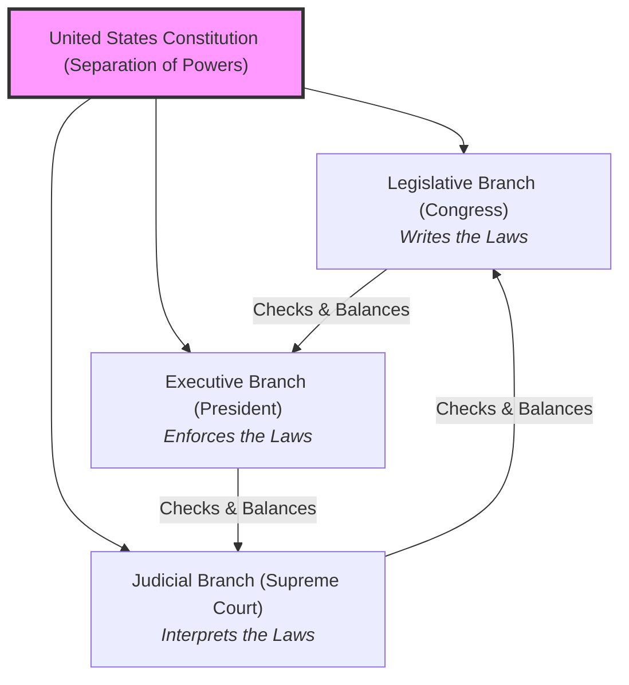

# American History 101: The Ideological Experiment 🇺🇸

Most nations are born out of a shared ancient ethnicity, language, or geography. But the United States was born out of an **idea**. 

In 1776, a group of colonies declared independence based on a set of philosophical principles: *"that all men are created equal, that they are endowed by their Creator with certain unalienable Rights, that among these are Life, Liberty and the pursuit of Happiness."*

American history is the story of an ongoing experiment: a struggle to build a nation on these ideals, while continuously wrestling with the deep contradictions—such as slavery and the displacement of indigenous peoples—built into its foundation.

---

## The Pre-Columbian Blueprint: Before 1492 🏹

Before European contact, the Americas were not a wilderness waiting to be discovered. They were home to tens of millions of people organized into complex societies:
*   **The Empires:** The Aztecs in Mesoamerica and Incas in the Andes built massive cities, roads, and agricultural terrace systems.
*   **The Confederacies:** In North America, groups like the **Haudenosaunee (Iroquois) Confederacy** developed advanced democratic systems with constitutions and checks on power that later inspired the US Constitution.

European contact introduced smallpox and other diseases to which native populations had no immunity, wiping out up to 90% of the indigenous population in what is known as the **Great Dying**.

---

## Compiling the American OS: Revolution and Constitution 📝

In 1776, thirteen British colonies rebelled against King George III, sparking the **American Revolution**. Inspired by European Enlightenment writers, they rejected monarchy and built a new government:

*   **Checks and Balances:** To prevent a new king from rising, the US divided power into three equal branches. Each branch has "check" power over the others.
*   **The Unresolved Bug:** The new nation proclaimed "liberty," but kept the institution of chattel slavery. This fundamental contradiction between the nation's ideals and its reality eventually tore the country apart.

---

## The Existential Crash: The Civil War (1861–1865) ⚔️

By the mid-19th century, the United States was split between the industrial North and the slave-holding agrarian South. When Abraham Lincoln was elected president, southern states seceded to form the Confederacy, sparking the **American Civil War**.

The war resolved two foundational questions:
1.  **Slavery was Abolished:** The 13th Amendment ended slavery, freeing 4 million people.
2.  **The Union is Perpetual:** It decided that individual states do not have the right to leave the United States.

---

## Rise to a Global Superpower 🚀

After the Civil War, the US industrialized rapidly, powered by railroads, steel, and a massive influx of global immigrants. 

In the 20th century, the US moved from isolationism to global leadership. After defeating fascism in World War II, the US emerged as one of the world's two superpowers, locked in an ideological struggle with the Soviet Union (the Cold War). When the Soviet Union collapsed in 1991, the US became the world's dominant military and economic power.

---

## Why American History Matters Today

*   **Global Influence:** As the world's largest economy and dominant military power, the decisions made within the US political system affect markets, security, and technology worldwide.
*   **The Struggle for Equality:** The Civil Rights Movement of the 1950s and 60s, led by Martin Luther King Jr., was a continuation of the founding struggle: forcing the nation to live up to the promise that "all men are created equal."

---

## Further Reading

*   **The Global Picture:** Read [World Wars 101](WorldWars101.md) and [Cold War 101](ColdWar101.md) to see how the US became a global superpower.
*   **The Colonial Era:** Read [Colonialism 101](Colonialism101.md) to understand the European race for North America.
*   **The Constitution Explained:** Visit the [National Constitution Center](https://constitutioncenter.org/the-constitution) to read the interactive text of the US Constitution and its amendments.
