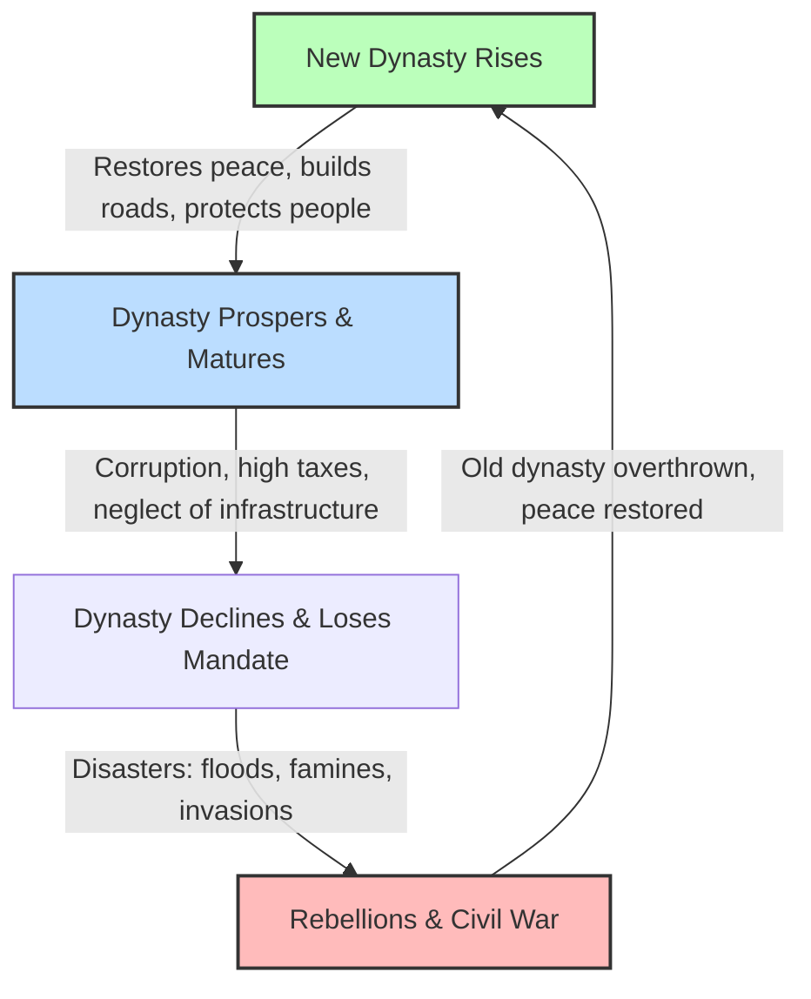

# Asian History 101: Dynasties, Silk, and Oceans 🌏

For most of written history, Asia was the economic, technological, and demographic center of the world. Long before the rise of modern Europe, Asian empires ruled over millions of people, developed advanced sciences, and manufactured goods—like silk, porcelain, paper, and spices—that the rest of the world desperately wanted.

To understand Asian history, we must look at the deep cultural trade networks and political philosophies that connected this massive continent.

---

## The Mandate of Heaven & The Dynastic Cycle 🔄

In Chinese history, dynasties rose and fell according to a political and spiritual doctrine known as the **Mandate of Heaven**:

*   **The Idea:** Heaven (the cosmos) granted the right to rule to a just leader. If a ruler became corrupt, selfish, or failed to protect the people, Heaven withdrew its mandate. 
*   **The Signs:** Famines, earthquakes, floods, and successful peasant rebellions were seen as proof that the ruling dynasty had lost the Mandate of Heaven, justifying their overthrow.

---

## The Great Web: Silk Road and Indian Ocean 🐫⛵

Asia's history was shaped by two massive trade networks that acted as the internet of the pre-modern world:

1.  **The Silk Road (Land):** A network of caravan tracks across Central Asia connecting China, India, Persia, and Europe. It transported high-value luxury goods like silk and jade, but also ideas (like Buddhism moving from India to China) and diseases (like the Black Death).
2.  **The Indian Ocean Trade (Sea):** A maritime web connecting East Africa, the Middle East, India, Southeast Asia, and China. Powered by seasonal **monsoon winds**, merchants traded bulk commodities like spices, cotton, porcelain, and timber, creating multicultural port cities.

---

## Key Turning Points in Asian History

*   **The Mongol Unification (13th Century):** Genghis Khan and his successors created the largest contiguous land empire in history. The resulting **Pax Mongolica** (Mongol Peace) secured the entire Silk Road, allowing unprecedented travel and trade between East and West.
*   **The Islamic Influx:** Through trade and empires like the Mughals in India and the Ottomans in Western Asia, Islam became a unifying force across South and Southeast Asia.
*   **The Western Encounter & Meiji Restoration (19th Century):** As Western imperial powers pressed into Asia, countries responded differently. While China was carved into spheres of influence, Japan underwent the **Meiji Restoration**—transforming from a feudal society into a modern industrial power in just a few decades.

---

## Why Asian History Matters Today

*   **The Shift in Global Power:** The rapid economic rise of China, India, and East Asia in the 21st century is not a new phenomenon; it is a return to the historical norm where Asia was the core of global GDP.
*   **Cultural Values:** Confucian ideas of filial piety, respect for education, and social harmony still form the ethical foundation of family, business, and politics across East Asia.

---

## Further Reading

*   **Connecting Oceans:** Read [Global History 101](GlobalHistory101.md) to explore how Asian trade connected with global networks.
*   **The Mechanics of Trade:** Read [Medieval History 101](MedievalHistory101.md) for more details on the Silk Road and Indian Ocean routes.
*   **Mughal Architecture:** Search online for the [Taj Mahal](https://www.youtube.com/results?search_query=taj+mahal+history+and+architecture) to learn how Islamic and Indian design blended in the Mughal Empire.
