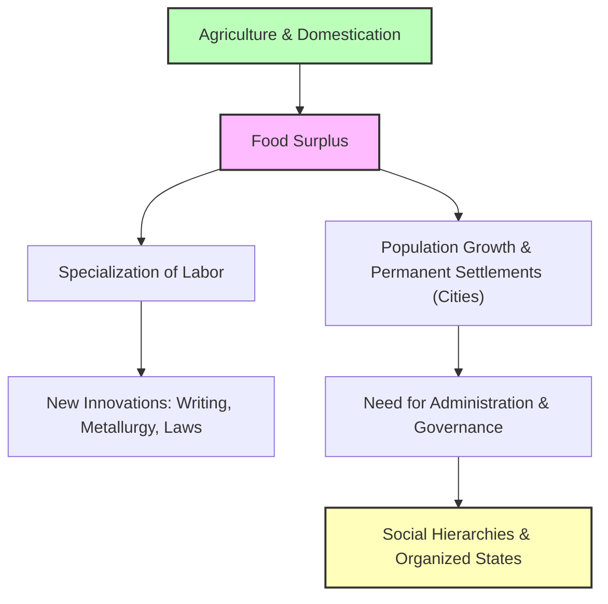

# Civilization 101: The Social Upgrade Package 🌾

For 99% of human history, if you wanted dinner, you had to find it. You wandered in small family groups, hunting animals and gathering wild berries. If the food moved or ran out, you moved too. You carried everything you owned on your back.

Then, about 10,000 years ago, everything changed. 

Humans discovered how to domesticate plants and animals. This transition—called the **Neolithic Revolution**—was the most important turning point in human history. It allowed us to settle in one place, grow more food than we could immediately eat, and build the very first **civilizations**.

---

## The Agricultural Feedback Loop 🔄

Agriculture didn't just change our diet; it changed our entire social structure. It created a feedback loop that made civilization possible:

1.  **Food Surplus:** When you farm, one family can produce enough food to feed three or four families.
2.  **Specialization of Labor:** Because not everyone has to farm, some people can become specialists. They can spend their lives learning how to bake bread, forge metal, build houses, write laws, or study the stars.
3.  **Cities & Order:** Millions of people living together need rules. This led to the creation of formal governments, written laws, armies for defense, and religious systems to hold society together.

---

## The Five Core Pillars of Civilization 🏛️

What separates a simple farming village from a "civilization"? Historians look for five core pillars:

1.  **Advanced Cities:** Large hubs of population where people trade, live, and interact.
2.  **Specialized Workers:** Artisans, merchants, soldiers, priests, and administrators.
3.  **Complex Institutions:** Formal governments, organized religions, and economic markets.
4.  **Record Keeping & Writing:** Systems to track taxes, store grain, and write down history (e.g., Cuneiform in Mesopotamia, Hieroglyphs in Egypt).
5.  **Improved Technology:** Inventions like the wheel, irrigation canals, and bronze tools.

---

## Cradle Case Studies: Where it Started

The earliest civilizations arose independently in river valleys where fertile soil made agriculture easy:

| Cradle | River System | Key Innovation |
| :--- | :--- | :--- |
| **Mesopotamia** (Sumer) | Tigris & Euphrates | Cuneiform writing, Code of Hammurabi, the wheel |
| **Ancient Egypt** | Nile | Monumental architecture (Pyramids), solar calendar |
| **Indus Valley** (Harappa) | Indus | Urban planning, grid-streets, advanced plumbing/sewer systems |
| **Shang China** | Yellow River | Bronze casting, oracle bone script (origin of Chinese writing) |

---

## Why Civilization Matters Today

We live inside the structure that early civilizations created:
*   **The Division of Labor:** You don't have to grow your own food, build your own house, or make your own clothes. You can specialize in coding, marketing, or design because of the system started 10,000 years ago.
*   **Urban Challenges:** The problems we face in modern cities—sewage, zoning, crime, taxes, and government—are the same problems Sumerian governors wrestled with in Uruk 5,000 years ago.

---

## Further Reading

*   **The Next Era:** Read [Ancient History 101](AncientHistory101.md) to see how early city-states expanded into massive, continental empires.
*   **How Empires Control:** Read [Empire 101](Empire101.md) to understand the mechanisms of large-scale rule.
*   **Read the Epic:** Look up the *Epic of Gilgamesh*, the world's oldest written story, to understand how Mesopotamians viewed civilization, mortality, and nature.
