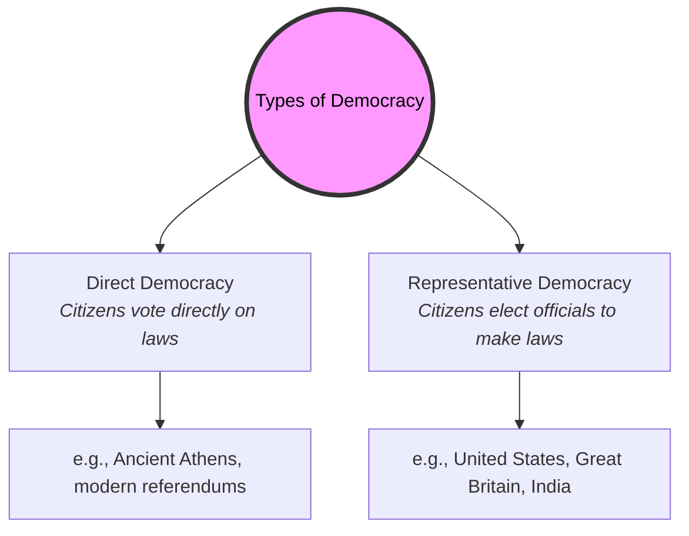

# Democracy History 101: The Open-Source Government Engine 🗳️

Today, we take it for granted that citizens should vote on their own leaders, speak their minds freely, and live under laws they helped create. But for most of human history, the idea of **Democracy** was considered bizarre, dangerous, and radical. For millennia, kings, pharaohs, and emperors ruled by divine right, and ordinary people were viewed as subjects, not citizens.

The word democracy comes from the Greek words *demos* (meaning the people) and *kratos* (meaning power or rule). Literally, it means **rule by the people**. 

Understanding how this radical concept went from a tiny, fragile experiment in ancient Athens to the world's most dominant political ideal is like reading the version history of a massive open-source software project.

---

## The Version History of Democracy 💻

Think of the history of democracy as a software development cycle:

```
┌────────────────────────────────────────────────────────┐
│             DEMOCRACY 1.0: ATHENS (Direct Rule)        │  ◄─── "The Alpha Build" (Sovereignty of citizens)
│  - Every citizen votes directly on every single law    │
└───────────────────────────┬────────────────────────────┘
                            │
                            ▼
┌────────────────────────────────────────────────────────┐
│             REPUBLIC 2.0: ROME (Representative)        │  ◄─── "The Structural Refactor"
│  - Citizens elect representatives to write the laws    │
└───────────────────────────┬────────────────────────────┘
                            │
                            ▼
┌────────────────────────────────────────────────────────┐
│         THE SOCIAL CONTRACT (18th Century)             │  ◄─── "The Philosophy Patch"
│  - Power comes from the consent of the governed        │
└───────────────────────────┬────────────────────────────┘
                            │
                            ▼
┌────────────────────────────────────────────────────────┐
│             DEMOCRACY 3.0: MODERN (Universal Suffrage) │  ◄─── "The Inclusivity Update"
│  - Representation, rule of law, and voting for all     │
└────────────────────────────────────────────────────────┘
```

### Democracy 1.0: Athenian Direct Democracy (5th Century BCE)
In ancient Athens, citizens did not elect representatives to vote for them. Instead, they met in a giant assembly to vote directly on laws, wars, and taxes.
*   **The Bug:** Only free, adult Athenian males could vote. Women, enslaved people, and foreigners were excluded. It was a democracy of a privileged minority.

### Republic 2.0: The Roman Republic (509–27 BCE)
Athens was a city; it could not scale direct voting to an entire empire. Rome solved this by building a **Republic** (from the Latin *res publica*, public affair). Instead of voting on laws directly, citizens elected representatives (like Tribunes and Consuls) to govern.
*   **The Check:** Rome introduced checks on power, including **Veto** power (from the Latin for "I forbid"), which allowed tribunes to block harmful laws.

### The Social Contract (17th–18th Century)
After the fall of Rome, democracy lay dormant as kings ruled Europe. But Enlightenment philosophers (like John Locke and Jean-Jacques Rousseau) rewrote the code. They argued that governments only have legitimate authority if they protect the natural rights of their citizens. This became known as the **Social Contract**.

### Democracy 3.0: Representative Democracies & Suffrage
The American and French Revolutions applied these ideas, creating modern representative democracies with written **Constitutions**. 

Over the next two centuries, the system received its most critical update: **Universal Suffrage** (the right to vote for all). Through social movements, property requirements were removed, women won the vote (suffragist movement), and racial minorities secured voting rights (like the Civil Rights Act of 1965 in the US).

---

## Direct vs. Representative Democracy

Today, democracies are structured in two main ways:



---

## Why Democracy History Matters Today

*   **Democratic Backsliding:** History teaches us that democracies are fragile. The Athenian democracy fell to demagogues and military defeat, and the Roman Republic collapsed into dictatorship under Julius Caesar. Without active citizen participation and respect for the rule of law, democratic systems can fail.
*   **The Digital Frontier:** The internet and social media are changing how we debate, vote, and receive information. Understanding how ancient forums managed debate can help us build better digital spaces for modern democracy.

---

## Further Reading

*   **The Classical Foundations:** Read [Ancient History 101](AncientHistory101.md) to explore the worlds of Athens and Rome.
*   **The Ideological Revolutions:** Read [Revolution 101](Revolution101.md) to see how monarchies were overthrown to make way for republics.
*   **The Magna Carta:** Look up the [Magna Carta of 1215](https://www.bl.uk/magna-carta/articles/magna-carta-an-introduction) to see how English barons first limited the absolute power of the King.
