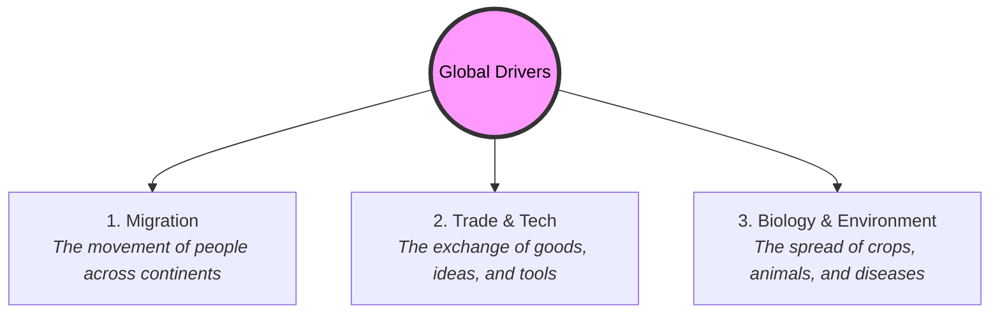

# Global History 101: The Shared Human Journey 🌍

If you look at the Earth from space, you don't see colored borders, flags, or national boundaries. You see a single blue planet hanging in the dark void, covered in swirling clouds, oceans, and continents.

This is the perspective of **Global History**. 

While traditional history focuses on the stories of individual nations or regions (like "French History" or "Chinese History"), global history steps back to look at the entire human species as a single, connected group. It focuses on the massive movements, exchanges, and challenges that have crossed borders, reshaped environments, and united our shared planetary destiny.

---

## The Great Exchanges: Redesigning the Biosphere 🌽🐎

The most famous example of global connection is the **Columbian Exchange**—the massive transfer of plants, animals, culture, populations, and diseases between the Americas (the New World) and Eurasia/Africa (the Old World) after 1492:

```
        ┌────────────────────────────────────────────────────────┐
        │                     THE OLD WORLD                      │
        │   - Horses, cows, wheat, rice, sugar, smallpox         │
        └───────┬────────────────────────────────────────▲───────┘
                │ [Columbian Exchange]                   │ [Columbian Exchange]
                ▼                                        │
        ┌────────────────────────────────────────────────┴───────┐
        │                     THE NEW WORLD                      │
        │   - Corn, potatoes, tomatoes, tobacco, cacao           │
        └────────────────────────────────────────────────────────┘
```

*   **Redesigning Diet:** Before 1492, there were no potatoes in Ireland, no tomatoes in Italy, no chili peppers in India, and no chocolate in Switzerland. The global exchange of crops revolutionized nutrition, leading to a massive surge in the global human population.
*   **Biological Shock:** The exchange was also biological, introducing Eurasian diseases (like smallpox and flu) to the Americas, which devastated indigenous populations who had no genetic resistance.

---

## The Anthropocene: Humans as a Geological Force 🌋

For millions of years, the Earth's environment was shaped by volcanic eruptions, shifting tectonic plates, and ice ages. But today, scientists argue we have entered a new geological epoch: the **Anthropocene** (the Age of Humans).

*   **The Mark:** Human activities—burning fossil fuels, manufacturing plastics, cutting down forests, and farming livestock—are now the dominant forces shaping the planet's climate, atmosphere, and biodiversity.
*   **Global Connection:** Global history shows that our environmental challenges are not local; they are the cumulative result of 250 years of industrialization and globalization.

---

## Core Pillars of the Global Approach 👁️

To think globally, historians look at three main drivers of human connection:



---

## Why Global History Matters Today

*   **Existential Risks:** The greatest challenges humanity faces in the 21st century—climate change, global recessions, cyberwarfare, and pandemics—do not respect national sovereignty. They are global problems that require coordinated global solutions.
*   **Shared Identity:** Global history reminds us that despite our different languages, cultures, and nations, all humans share a single history. We all originated in Africa, we all domesticate the same plants, and we are all facing the future on the same small planet.

---

## Further Reading

*   **Go Back to the Roots:** Read [History 101](History101.md) to explore the foundations of historical study.
*   **The Modern Integration:** Read [Modern History 101](ModernHistory101.md) to see how globalization built our hyper-connected world.
*   **The Big History Project:** Search online for the [Big History Project](https://www.bighistoryproject.com/) to explore the history of the universe from the Big Bang to the present.
