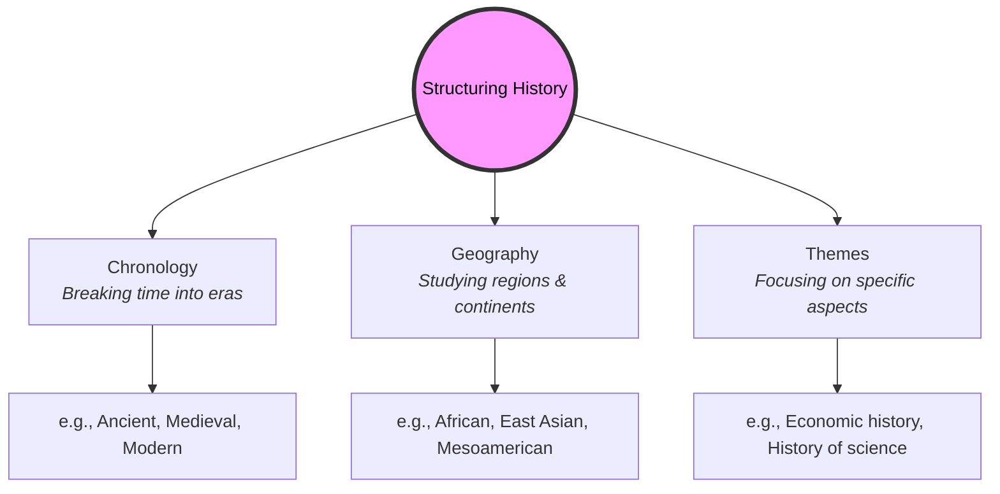

# History 101: The Collective Memory of Humanity 🌍

Think of a time you looked at an old family photograph. You saw faces, clothing, and backgrounds from decades ago. Even if you weren't alive then, that photo gives you a connection to the people and events that made your family who they are today. 

Now, scale that up to the entire human race. 

**History** is the collective memory of humanity. It is the record of our shared failures, triumphs, discoveries, and mistakes. Just as your personal memories decide how you act today, history determines how our societies, laws, and cultures behave. Without history, we would have social amnesia—waking up every day with no idea how we got here or where we are going.

---

## The Difference Between "The Past" and "History" 🕰️

Many people think these two words mean the same thing, but to historians, they are very different:

*   **The Past:** Everything that has ever happened to everyone, everywhere, since the beginning of time. This includes every leaf that fell, every word whispered, and every breath taken. The past is infinite and gone forever.
*   **History:** Our attempt to reconstruct, understand, and tell stories about select parts of the past. History is not the past itself; it is the *narrative* we build from the clues left behind.

```
┌────────────────────────────────────────────────────────┐
│                        THE PAST                        │  ◄─── Infinite, unrecorded events (everything)
│  (Every breath, whisper, leaf falling since time began) │
└───────────────────────────┬────────────────────────────┘
                            │
                  [ Reconstructed via ]
                            │
┌───────────────────────────▼────────────────────────────┐
│                        HISTORY                         │  ◄─── Structured narratives & verified clues
│    (Written documents, artifacts, oral stories)        │
└────────────────────────────────────────────────────────┘
```

Because history is a reconstruction, it is never "finished." As we discover new letters, dig up new ruins, or look at old sources with fresh questions, our understanding of history changes.

---

## Why Study History? The Source Code of Society 💻

If you want to modify a computer program, you first need to read its source code to see how it was written. Similarly, if you want to understand or change society, you must read its historical source code:

1.  **Understanding the Present:** Why do we speak the languages we do? Why are borders drawn where they are? Why do some countries use capitalism and others communism? The answers to these questions are not random; they are the direct results of historical events.
2.  **Developing Empathy:** History takes you inside the minds of people who lived in different times, wore different clothes, and held entirely different beliefs. It helps you see that our current way of life is just one of many ways humans have organized themselves.
3.  **Recognizing Patterns:** Human nature changes very slowly, but human scenarios repeat. By studying history, you can spot the warning signs of economic collapse, the rise of authoritarianism, or the spark of social revolutions before they happen.

---

## How History is Structured

To keep from getting overwhelmed by thousands of years of human events, historians break history down into manageable pieces:



---

## Why History Matters Today

We live in a fast-paced digital world focused on the future. But the future is built on foundations laid in the past:
*   **Decisions & Leadership:** Modern leaders look to historical crises (like the Cuban Missile Crisis or the Great Depression) to guide their decision-making in real-time.
*   **Identity:** History gives communities, nations, and cultures a shared story, helping individuals understand their heritage and roots.
*   **Media Literacy:** Knowing history helps you identify propaganda, fake news, and manipulated narratives by comparing modern claims with historical precedents.

---

## Further Reading

*   **How History is Built:** Read [Historical Methods 101](HistoricalMethods101.md) to see how historians act as detectives to solve past mysteries.
*   **Where it Began:** Read [Civilization 101](Civilization101.md) to explore how humans transitioned from wandering bands to the first cities.
*   **CrashCourse World History:** Watch the highly engaging [World History Series](https://www.youtube.com/results?search_query=crash+course+world+history) by John Green for a fast-paced overview of the human journey.
