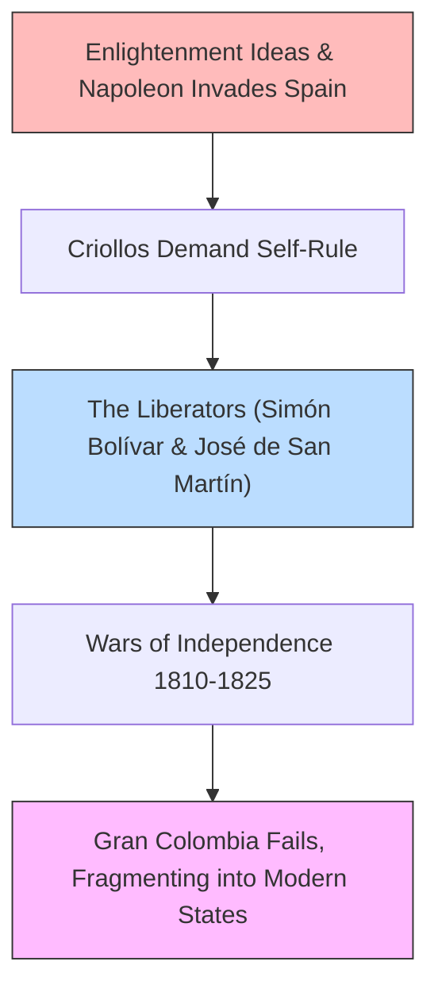

# Latin American History 101: The Clash and Synthesis of Worlds 🌋

High in the Andes Mountains of Peru sits **Machu Picchu**—a stone city built by the Incas without wheels, draft animals, or iron tools. In the jungles of Guatemala, massive stone pyramids built by the Mayas tower above the trees. 

These structures were the centers of advanced civilizations that flourished long before European contact.

Latin American history was shaped by the **Clash of Worlds**: the violent collision between these indigenous empires, European colonizers, and enslaved Africans. Out of this collision emerged a synthesized culture—blending languages, foods, and traditions—that defines South America, Central America, and Mexico today.

---

## 1. The Pre-Columbian Titans 🏹

Before 1492, three great civilizations dominated the region:

*   **The Mayas (Central America):** Known for their advanced hieroglyphic writing, complex astronomical calendars, and the invention of the mathematical concept of zero independently of India.
*   **The Aztecs (Mexico):** Builders of **Tenochtitlan**, a city built on a lake containing 200,000 people—larger than almost any European city of the time. They grew food on floating gardens called *chinampas*.
*   **The Incas (South America):** Builders of a 25,000-mile road network traversing the Andes. They kept records without writing, using a system of knotted colored strings called **quipu**.

---

## 2. The Conquest: Silver and Disease ⛵

In the 16th century, Spanish and Portuguese conquistadors (like Hernán Cortés and Francisco Pizarro) arrived. Equipped with steel armor, firearms, and horses, they conquered these vast empires in just a few decades. 

However, their deadliest weapon was invisible: European diseases (like smallpox) to which indigenous people had no immunity, wiping out up to 90% of the population.

The colonizers transformed Latin America into a resource extraction engine:
*   **Potosí (Silver):** The Spanish discovered a mountain of silver in Potosí (modern-day Bolivia). Enslaved indigenous people and Africans mined the silver, which flooded the global economy, making Spain the wealthiest nation in Europe and altering global trade.

---

## 3. Wars of Independence: The Liberators ⚔️

By the early 19th century, the descendants of Spanish settlers born in Latin America (called *criollos*) grew tired of Spanish taxes and trade restrictions. Inspired by Enlightenment ideas and the American Revolution, they rose in rebellion.

*   **Simón Bolívar (The Liberator):** A Venezuelan general who led the liberation of Venezuela, Colombia, Ecuador, Peru, and Bolivia. He dreamed of a unified South America (Gran Colombia) to counter the power of the United States, but local rivalries caused the union to fragment into separate nations.

---

## 4. The Legacy: Dictators and Bananas 🍌

Following independence, Latin American nations faced structural challenges:
*   **Caudillismo:** The vacuum of power left by Spain was filled by military strongmen (called *caudillos*) who ruled through personal charisma and force, leading to political instability.
*   **Economic Dependency:** Many countries became "banana republics"—economies dependent on exporting a single crop (like coffee, sugar, or bananas) to foreign companies, leaving them vulnerable to market crashes.

---

## Why Latin American History Matters Today

*   **Cultural Synthesis:** The language, music, food, and religious practices of Latin America are a unique blend of indigenous (Aztec/Inca/Maya), European (Spanish/Portuguese), and African traditions.
*   **Land Reform & Politics:** The unequal distribution of land established during the colonial era (massive estates owned by elites vs. landless peasants) remains the driving force behind modern Latin American politics, revolutions, and social movements.

---

## Further Reading

*   **The Global Impact:** Read [Colonialism 101](Colonialism101.md) to explore the general economics of colonial extraction.
*   **The Neighboring Story:** Read [American History 101](AmericanHistory101.md) to compare Latin American independence with the US model.
*   **Tenochtitlan Recreated:** Search online for [Tenochtitlan 3D reconstruction](https://www.youtube.com/results?search_query=tenochtitlan+3d+reconstruction) to see the Aztec capital at its height.
