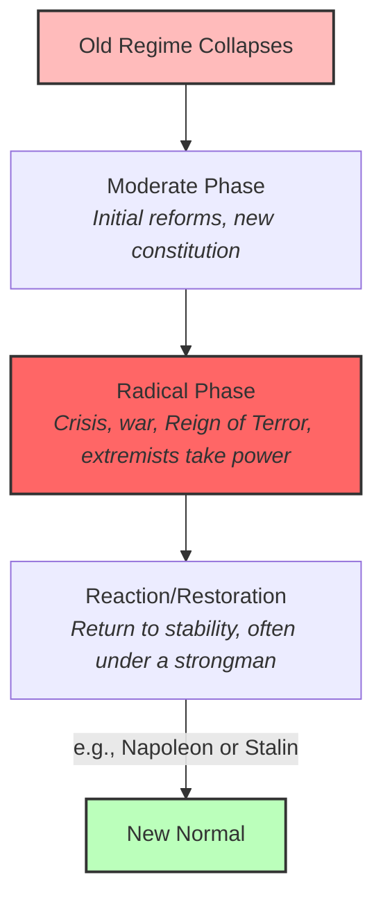

# Revolution 101: Flipping the Social Pyramid ⚖️

In most societies throughout history, power has been structured like a pyramid. A tiny elite—kings, nobles, or dictators—sat at the top, while the vast majority of people sat at the bottom, doing the work and paying the taxes. 

Normally, this structure is stable. But occasionally, a moment comes when the pyramid is flipped upside down in a flash of violence, protest, and hope.

This is a **Revolution**. 

A revolution is not just a change in leadership; it is a rapid, fundamental transformation of a society's entire political, social, and economic structure. Revolutions occur when the pressure inside a system builds to a point where the existing government can no longer contain it.

---

## The Recipe for Revolution: The Pressure Cooker 🍲

Revolutions rarely happen by accident. They are usually the result of three forces converging:

```
┌────────────────────────────────────────────────────────┐
│               1. ECONOMIC DISTRESS                     │
│  - Famine, inflation, taxes, or high food prices       │
└───────────────────────────┬────────────────────────────┘
                            │  +
┌───────────────────────────▼────────────────────────────┐
│               2. SOCIAL INEQUALITY                     │
│  - A locked elite class vs. an excluded majority       │
└───────────────────────────┬────────────────────────────┘
                            │  +
┌───────────────────────────▼────────────────────────────┐
│               3. NEW IDEAS (The Catalyst)              │
│  - Enlightenment rights, Liberty, Communism, Equality   │
└───────────────────────────┬────────────────────────────┘
                            │  =
┌───────────────────────────▼────────────────────────────┐
│              REVOLUTION (System Collapse)              │
└────────────────────────────────────────────────────────┘
```

1.  **Economic Distress:** When people cannot feed their children, they lose their fear of the government. Most revolutions are preceded by inflation, heavy taxation, or food shortages.
2.  **Social Inequality:** A system where the people at the bottom have no way to improve their lives or participate in government.
3.  **New Ideas (The Spark):** Discontent needs a language. New ideas (like Enlightenment philosophy or Socialism) give people a blueprint for a different world, convincing them that the current system is not just bad, but illegitimate.

---

## Four Revolutions That Rebuilt the World

Between 1776 and 1917, four major revolutions redrew the global political map:

### 1. The American Revolution (1776)
*   **The Cause:** British colonies rejected taxes imposed without representation.
*   **The Result:** A constitutional republic that applied Enlightenment concepts of checks and balances.

### 2. The French Revolution (1789)
*   **The Cause:** Bankruptcy, famine, and a corrupt three-tier estate system where commoners paid all the taxes.
*   **The Result:** Overthrew the absolute monarchy, declared the *Rights of Man*, but descended into the Reign of Terror, leading to the rise of Napoleon.

### 3. The Haitian Revolution (1791)
*   **The Cause:** Half a million enslaved people rebelled against French plantation owners.
*   **The Result:** The only successful slave revolt in history, defeating French, British, and Spanish armies to create the first free black republic.

### 4. The Russian Revolution (1917)
*   **The Cause:** World War I devastation, peasant starvation, and an absolute Tsar who refused to reform.
*   **The Result:** Overthrew the monarchy and established the Soviet Union, the world's first state built on Marxist communist ideas.

---

## The Classic Cycle of Revolutions 🔄

In his famous study *The Anatomy of Revolution*, historian Crane Brinton noted that major revolutions often follow a predictable cycle:



---

## Why Revolutions Matter Today

*   **The Origin of Rights:** The rights we enjoy today—free speech, voting, the weekend, the end of feudal obligations—were not handed down voluntarily by rulers. They were won through revolutions and the threat of revolution.
*   **Widespread Vigilance:** Governments today keep a close eye on inflation, food prices, and unemployment because they know that when the basic cost of living becomes unbearable, the pressure cooker of society can explode.

---

## Further Reading

*   **The Ideological Offspring:** Read [Cold War 101](ColdWar101.md) to see how the Russian Revolution created a global standoff.
*   **The American Experiment:** Read [American History 101](AmericanHistory101.md) to explore the origins of the United States.
*   **Revolutions Podcast:** Listen to the acclaimed [Revolutions Podcast](https://thehistoryofrome.info/revolutions.html) by Mike Duncan for detailed histories of the English, French, Haitian, and Russian revolutions.
