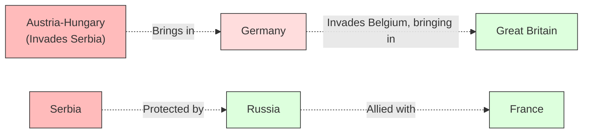

# World Wars 101: Total War and Industrial Destruction ⚔️

In the early 20th century, humanity experienced a terrible realization. The same forces that had built the modern world—factories, chemical engineering, assembly lines, and global trade networks—could be redirected toward destroying it.

The result was the era of the **World Wars** (1914–1945). 

These two conflicts were not just larger versions of past wars. They introduced the concept of **Total War**: conflicts where entire nations, including their civilians, factories, and economies, were fully mobilized. The battlefields were no longer isolated fields; they were entire continents, and the weapons were mass-produced in factories like consumer goods.

---

## World War I (1914–1918): The Industrial Stalemate 🕸️

World War I began as a political chain reaction. European powers had divided themselves into a complex web of mutual defense alliances. When a Serbian nationalist assassinated the heir to the Austro-Hungarian throne, the tripwires were triggered:

*   **The Trap:** Defensive technology (machine guns, barbed wire, heavy artillery) was far ahead of offensive technology. This led to **Trench Warfare**—two massive lines of trenches stretching across Europe, with neither side able to advance.
*   **The Outcome:** The war destroyed four empires (German, Russian, Austro-Hungarian, and Ottoman) and ended with the **Treaty of Versailles** in 1919. The harsh punishments imposed on Germany created deep resentment and economic collapse, laying the groundwork for the next war.

---

## World War II (1939–1945): The Global Cataclysm 🌐

World War II was the deadliest conflict in human history, claiming an estimated 70 to 85 million lives. It pitted the **Allies** (led by Great Britain, the Soviet Union, and the United States) against the **Axis** (led by Nazi Germany, fascist Italy, and Imperial Japan).

This war was characterized by several defining features:
1.  **Mobile Warfare (Blitzkrieg):** Using tanks, trucks, and airplanes in coordinated attacks, Germany quickly conquered continental Europe, breaking the stalemate of WWI.
2.  **Ideological Extremes:** The war was fought on deep racial and political ideologies. Nazi Germany carried out the **Holocaust**—the systematic, state-sponsored genocide of 6 million Jews and millions of others.
3.  **The Atomic Age:** The war ended in August 1945 when the United States dropped two newly developed atomic bombs on the Japanese cities of Hiroshima and Nagasaki, ushering in the nuclear era.

---

## What is "Total War"? 🏭

Before the 20th century, wars were fought by professional armies on designated battlefields. Civilians were affected, but they were not the targets. 

Total war changed the rules:
*   **Economic Mobilization:** Factories stopped making cars and began making tanks. Governments rationed food, gasoline, and metal for the civilian population.
*   **Targeting Infrastructure:** Because factories and workers supplied the front lines, cities became military targets. Both sides engaged in strategic bombing campaigns, destroying entire cities (like London, Dresden, and Tokyo) to break the enemy's economy and morale.

---

## Why the World Wars Matter Today

*   **The Global Architecture:** The United Nations (UN), the International Monetary Fund (IMF), and the World Bank were all created in the immediate aftermath of WWII to prevent another global conflict and stabilize the world economy.
*   **Nuclear Standoff:** The invention of nuclear weapons changed warfare forever. It made direct war between major superpowers too dangerous to fight, leading to the strategic standoff of the Cold War.

---

## Further Reading

*   **The Immediate Aftermath:** Read [Cold War 101](ColdWar101.md) to see how the Allied victory split the world into two new camps.
*   **The American Rise:** Read [American History 101](AmericanHistory101.md) to explore how the US transitioned into a global military leader.
*   **World War I Poetry:** Look up the poem *Dulce et Decorum Est* by Wilfred Owen to understand the brutal reality of trench warfare from a soldier's perspective.
