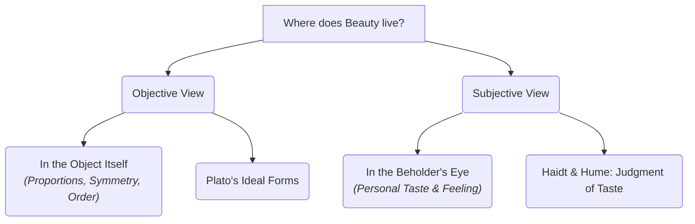

# Aesthetics 101: The Science of Beauty and Art 🎨

Imagine walking into a famous modern art museum. In the center of a pristine, white-walled room sits a neat pile of 120 loose red bricks on the floor. 

Two people walk in and look at it:
*   **Person A** rolls their eyes and says, *"This is ridiculous. It's just a pile of building materials. My six-year-old could do this. It's not art."*
*   **Person B** gazes at it in awe and says, *"Look at how the arrangement forces us to confront the industrial nature of our society. The symmetry represents modern labor. It is a masterpiece."*

Who is right? Can a pile of bricks actually be art? 

This debate is the heart of **Aesthetics**. Aesthetics is the branch of philosophy that explores the nature of beauty, art, and taste. It asks: *What makes something beautiful? Is art defined by the object itself, or does it exist only in the mind of the person looking at it?*

---

## What is Art? The Banana and the Mona Lisa 🍌

To understand how we define art, let's compare two famous works:
1.  **The Mona Lisa (Leonardo da Vinci):** Created in the 1500s. It required years of technical mastery, brushwork, and knowledge of anatomy. Almost everyone agrees it is art.
2.  **Comedian (Maurizio Cattelan):** Created in 2019. It consists of a real banana duct-taped to a gallery wall. It was sold for $120,000. Many people argued it was a prank, not art.

If both are presented in museums, what separates "real art" from a gimmick? Philosophers generally look at three ways to define it:
*   **The Intent of the Artist:** Did the creator mean for it to be art? (Cattelan intended to challenge how we value objects).
*   **The Reaction of the Audience:** Does it provoke emotion, thoughts, or debate? (The banana sparked massive global conversation).
*   **The Institutional Setting:** Is it placed in an art context (like a museum or gallery)? The institution itself acts as a frame, telling us, *"Look at this differently than you would in a supermarket."*

---

## The Great Debate: Objective Beauty vs. Subjective Taste

Where does "beauty" actually live? Is it a fact, like gravity, or is it just an opinion?

### 1. Objective Beauty: It's in the Object
Ancient philosophers like **Plato** and **Aristotle** believed that beauty is objective. 
*   **Core Idea:** An object is beautiful because it possesses specific physical qualities: **symmetry, proportion, harmony, and order**. 
*   **Example:** The Golden Ratio (a mathematical proportion found in seashells, flower petals, and human faces) has been used in architecture and art for centuries because our brains are naturally wired to find it satisfying. In this view, a messy, asymmetrical pile of bricks is objectively less beautiful than a perfectly proportioned Greek temple.

### 2. Subjective Beauty: It's in the Eye of the Beholder
Enlightenment philosophers, most notably **David Hume** and **Immanuel Kant**, shifted the focus to the observer.
*   **Core Idea:** Beauty does not exist inside the object. It is a feeling in the mind of the viewer. Hume famously wrote: *"Beauty is no quality in things themselves: It exists merely in the mind which contemplates them."*
*   **Kant's Disinterested Judgment:** Kant argued that when we call something beautiful, we make a unique kind of judgment. We aren't looking at what the object can *do* for us (e.g., we don't want to eat a painting of an apple), we are enjoying the pure, "disinterested" experience of looking at it.

---

## How do we acquire "Taste"?

If beauty is entirely subjective, does that mean all opinions are equal? If someone says a child's scribble is better than the Mona Lisa, are they correct?

David Hume argued that while beauty is subjective, some people have more refined **Taste** than others. He compared it to wine tasting:
> Two men are asked to taste a barrel of wine. One says the wine is excellent, but detects a faint taste of iron. The other agrees it is excellent, but detects a faint taste of leather. The crowd laughs at their snobbery. 
> 
> However, when the barrel is emptied, a key on an iron ring attached to a leather strap is found at the bottom. The tasters were vindicated.

In aesthetics, Hume argued, a "critic of taste" is someone who has practiced observing art, has compared many works, and can detect subtle qualities that others miss. We can improve our taste by exposure, comparison, and freeing ourselves from personal biases.

---

## Why Aesthetics Matters

Aesthetics isn't just about paintings. It shapes our daily life:
1.  **Product Design:** Why do people pay a premium for Apple products? It isn't just about their processors; it is because their sleek, minimalist aesthetic makes them a joy to look at and hold.
2.  **Urban Planning:** Living in a city with beautiful parks, trees, and historic architecture improves mental health, whereas living surrounded by gray, crumbling concrete blocks can increase stress.
3.  **Nature Preservation:** We protect forests, mountains, and coral reefs not just because they provide resources, but because we believe their natural beauty is valuable and must be preserved for its own sake.

---

## Ready to Explore More?

*   **Test Your Aesthetic Mind:** Visit the [Stanford Encyclopedia of Philosophy: Aesthetics](https://plato.stanford.edu/entries/aesthetics-aesthetic-judgments/) for a deep academic dive.
*   **Watch the Debate:** Watch YouTube explanations of [Kant's Critique of Judgment](https://www.youtube.com/results?search_query=kant+critique+of+judgment+aesthetics) to see how he structured the subjective experience.
*   **Explore Modern Art Conflicts:** Read about the story of Marcel Duchamp’s *Fountain* (a urinal submitted to an art exhibition in 1917) to see how it redefined modern art.
