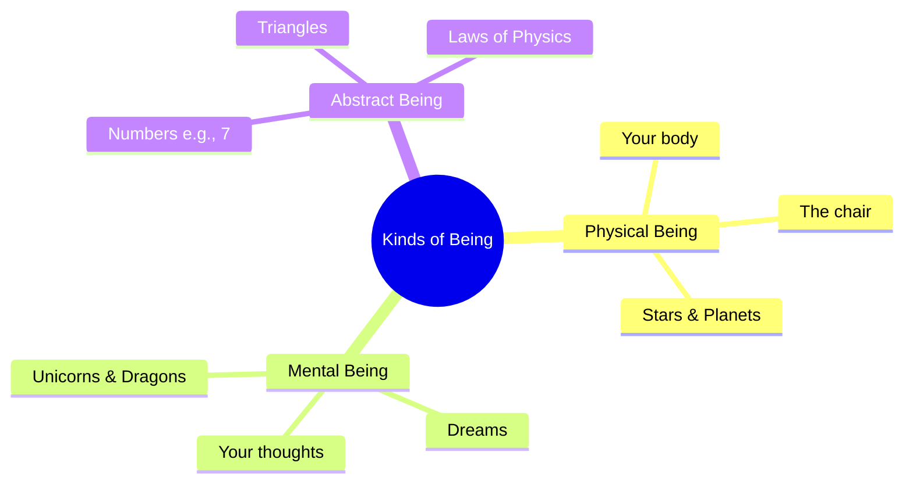

# Being 101: The Study of Existence 🌌

Close your eyes and think of a **unicorn**. You can picture its white coat, its golden horn, and see it running through a forest. 

Now, look at the chair you are sitting on. You can feel its solid weight beneath you, touch its texture, and see it in front of you.

Philosophically, both of these things "exist" in some way. But they do not exist in the *same* way. The chair exists physically, while the unicorn exists only as an idea in your mind. What about a round square? You cannot even picture that in your mind—it seems to have no existence at all.

What does it actually mean for something to **be**? 

This is the central question of **Ontology** (the study of *being*). It is the branch of metaphysics that explores what exists, what kinds of things exist, and how they relate to one another.

---

## Essence vs. Existence: The Recipe and the Cake 🍰

To understand being, philosophers split it into two concepts: **Essence** and **Existence**.

Think of a chocolate cake:
*   **Essence (What it is):** This is the recipe. It list the ingredients (flour, cocoa, sugar) and the instructions. The essence of "chocolate cake" exists even if nobody is currently baking one. It is the definition or identity of the thing.
*   **Existence (That it is):** This is the physical cake baked, sitting on your kitchen table, smelling delicious. It has left the world of pure ideas and entered the physical universe.

```
┌────────────────────────────────────────┐
│               RECIPE                   │  ◄─── ESSENCE (The Idea / "What it is")
│ - Cocoa, Flour, Sugar, Eggs            │
└──────────────────┬─────────────────────┘
                   │
                   ▼  [ Baking Process ]
┌────────────────────────────────────────┐
│                CAKE                    │  ◄─── EXISTENCE (The Reality / "That it is")
│          (Physical Object)             │
└────────────────────────────────────────┘
```

For most of history, philosophers believed that **essence precedes existence**. For example, a carpenter must have the idea (essence) of a chair in their mind before they can build (create the existence of) a physical chair. 

However, in the 20th century, existentialists like Jean-Paul Sartre flipped this on its head for humans. He argued that for humans, **existence precedes essence**. We are born first (we exist), and only through our choices, actions, and beliefs do we define who we are (our essence). We have no pre-written recipe.

---

## What is Reality Made Of? Materialism vs. Idealism

When we ask what exists at the most fundamental level, philosophers split into two main camps:

### 1. Materialism (Physicalism)
*   **Core Idea:** Only physical matter and energy exist. Everything else—your thoughts, feelings, memories, and love—is just a product of physical processes (like neurons firing in your brain).
*   **Example:** A materialist looks at a book and says, *"Only the paper, ink, and binding exist. The story inside is just a pattern of ink that triggers physical chemical reactions in a human brain."*

### 2. Idealism
*   **Core Idea:** The ultimate reality is mental, not physical. Physical things only exist because they are perceived by a mind.
*   **Example:** A famous idealist, George Berkeley, argued: *To be is to be perceived (Esse est percipi)*. If a tree falls in a forest and nobody is there to hear it, it doesn't just make no sound—it ceases to exist at all, unless observed by a mind (which Berkeley argued was the mind of God, keeping the universe in existence).

---

## Mapping the Kinds of "Being"

Ontologists organize existence into a hierarchy. We can categorize everything that "is" into three main buckets:



*   **Physical Being:** Things made of matter and energy that exist in space and time. (e.g., your body, a rock, a phone).
*   **Mental Being:** Subjective experiences that exist in a mind but have no physical shape or weight. (e.g., your feeling of happiness, a dream, the concept of a dragon).
*   **Abstract Being:** Things that don't exist in space or time, but are still true or real. (e.g., numbers like the number 7, geometric concepts like a perfect circle, or the laws of mathematics).

---

## Why "Being" Matters

It might seem abstract, but how you define being decides how you live:
1.  **AI & Personhood:** As artificial intelligence advances, we must ask: does a chatbot have "being" or consciousness? Is it a "person" with rights, or just a sophisticated mirror of human text?
2.  **Meaning of Life:** If existence precedes essence, you are not locked into a destiny. You are entirely free—and responsible—to write your own recipe and decide who you want to be.
3.  **Science vs. Spirituality:** If you are a strict materialist, you look to physics to explain everything. If you believe in abstract or mental beings, you leave room for spiritual, mathematical, or non-physical realities.

---

## Ready to Explore More?

*   **Stanford Encyclopedia of Philosophy:** Read about [Ontology](https://plato.stanford.edu/entries/logic-ontology/) and the philosophical debates surrounding existence.
*   **Existentialism Explained:** Watch video lectures on [Sartre's Existentialism](https://www.youtube.com/results?search_query=existence+precedes+essence+sartre) to understand the concept of "existence precedes essence."
*   **Read the Classics:** Look up Plato's *Allegory of the Cave* to see how he split reality into the physical world (shadows) and the world of ideal essences (the sun).
