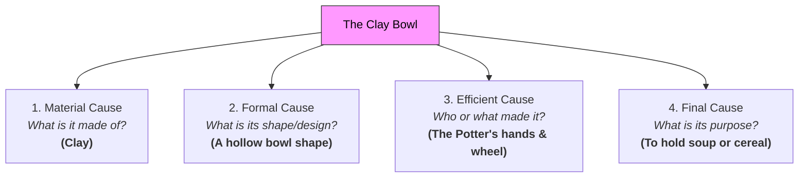

# Causality 101: The Links of Cause and Effect 🔗

Imagine setting up a line of 100 dominos. You tap the first one with your finger. It tips forward, hits the second, which hits the third, and a second later, the 100th domino falls flat. 

What **caused** the 100th domino to fall?
*   Was it your finger tapping the first domino?
*   Was it the 99th domino hitting it?
*   Was it the gravity pulling it down?
*   Was it the person who manufactured the dominos?

In everyday life, we take cause and effect for granted. If you drop a glass, it breaks. If you study, you pass the test. But when philosophers pull back the curtain, they discover that **Causality**—the relationship between an event (the cause) and a second event (the effect)—is one of the deepest mysteries of the universe.

---

## Aristotle's Four Causes: The Clay Bowl 🥣

To understand why something exists or behaves the way it does, the ancient Greek philosopher **Aristotle** argued that we must look at four different types of "causes." 

Let’s explain them using a simple **clay bowl**:



1.  **The Material Cause (The Matter):** What is the object made of? 
    *   *For the bowl:* The clay. Without the clay, the bowl cannot exist.
2.  **The Formal Cause (The Form):** What is the shape, design, or pattern of the object?
    *   *For the bowl:* The hollow, circular shape that allows it to hold liquids. A flat sheet of clay is not a bowl.
3.  **The Efficient Cause (The Force):** Who or what made the object? What force put it together?
    *   *For the bowl:* The potter’s hands spinning the wheel. This is what we typically mean by "cause" in modern science.
4.  **The Final Cause (The Purpose):** What is the ultimate purpose or goal of the object?
    *   *For the bowl:* To hold soup or cereal. Aristotle believed that everything in nature has an inherent goal or end purpose (which he called *Telos*).

---

## David Hume's Shocking Discovery: The Billiard Balls 🎱

In the 1700s, Scottish philosopher **David Hume** shook the foundations of science and philosophy by asking a simple question: *Have you ever actually seen a cause?*

Imagine watching a game of pool:
*   Billiard Ball A rolls across the table.
*   It collides with Billiard Ball B.
*   Billiard Ball B immediately starts moving.

We say Ball A *caused* Ball B to move. But Hume pointed out that if you look closely, you only see two things:
1.  **Contiguity:** The balls touch.
2.  **Priority:** Ball A moves first, then Ball B moves.
3.  **Constant Conjunction:** Every time you repeat this, the same sequence happens.

You see the movement of A, you see the contact, and you see the movement of B. **But you never actually see the "cause" itself.** There is no physical "glue" connecting them that is visible to your senses. Hume argued that "causality" is not a fact we observe in the physical world; it is a **mental habit**. Because our brains see event A followed by event B over and over, we project the idea of causation onto the world.

---

## Correlation vs. Causation: The Ice Cream Trap 🍦

Hume's skepticism leads to a critical rule used in modern science, statistics, and daily life: **Correlation does not equal causation.**

*   **Correlation:** Two events happen at the same time or follow the same pattern.
*   **Causation:** One event directly forces the other to happen.

Consider this real-world statistic:
> As ice cream sales increase in a city, the rate of swimming pool drownings also increases.

Do ice cream sales *cause* people to drown? Of course not. Do drownings cause people to buy ice cream? No. 
The two events are correlated, but neither causes the other. Instead, there is a **third variable (a common cause)**: **hot summer weather**. Hot weather causes people to buy ice cream, and hot weather also causes people to go swimming, which increases the likelihood of drownings.

```
                  ┌─────────────────────────┐
                  │       Hot Weather       │  ◄─── Common Cause
                  └────┬───────────────┬────┘
                       │               │
         ┌─────────────▼─────┐   ┌─────▼───────────────┐
         │ Ice Cream Sales Up│   │ Swimming/Drownings  │  ◄─── Correlated Effects
         └───────────────────┘   └─────────────────────┘
```

---

## Why Causality Matters

1.  **Scientific Discovery:** Science is the search for efficient causes. By finding the cause of a disease (like a virus), we can develop a cure (like a vaccine).
2.  **Law & Responsibility:** If a car crash occurs, the court must find the "proximate cause." Who is responsible? The driver who ran the red light, the mechanic who worked on the brakes, or the wet road?
3.  **Predicting the Future:** We rely on the uniformity of nature—the belief that the same causes will always produce the same effects. If causality broke down, the universe would become completely unpredictable, and gravity might stop working tomorrow.

---

## Ready to Explore More?

*   **Deepen Your Knowledge:** Visit the [Stanford Encyclopedia of Philosophy: Metaphysics of Causation](https://plato.stanford.edu/entries/causation-metaphysics/) to read about modern philosophical debates.
*   **Understand Statistics:** Watch educational videos on [Correlation vs. Causation](https://www.youtube.com/results?search_query=correlation+does+not+equal+causation) to see how statistics can mislead us.
*   **Read Aristotle's Physics:** Research Aristotle's *Physics* to learn more about how he applied the Four Causes to nature, plants, and animals.
