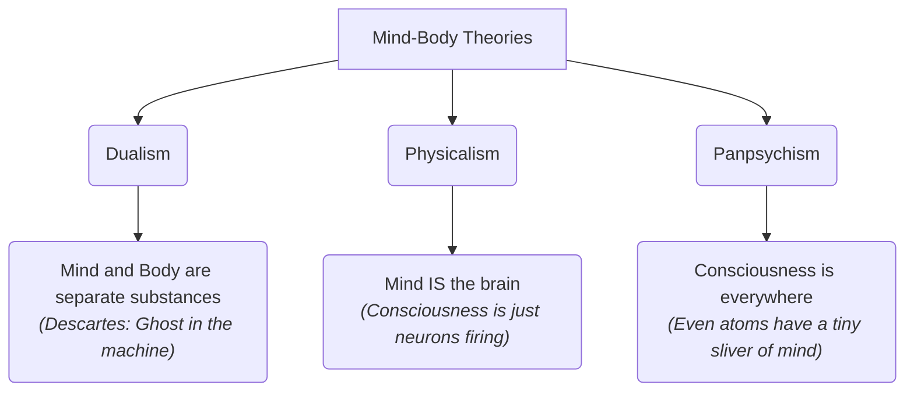

# Consciousness 101: The Mystery of the Mind 🧠

Imagine a advanced computer chatbot. You type: *"I am feeling lonely today."* The chatbot responds: *"I'm so sorry to hear that. I understand how hard it is to feel isolated, and I'm here to listen."*

The response sounds deeply empathetic. But does the chatbot actually **feel** sorry? Does it experience the sensation of sadness, or is it just calculating which words should follow next based on statistical patterns?

Now, think about your own experience. When you stub your toe, you don't just register a data signal saying "tissue damage." You feel a sharp, throbbing, unpleasant sensation of pain. When you look at a blue sky, you experience the subjective "blueness" of the sky. 

This subjective, inner world of experience is what we call **Consciousness**. It is the feeling of *what it is like* to be you. 

---

## The Thought Experiment: Mary the Color Scientist 🟥

To understand why consciousness is so puzzling, philosopher Frank Jackson created a famous thought experiment:

> Mary is a brilliant scientist who lives in a black-and-white room. She has never seen color. However, she has access to books and screens that teach her everything there is to know about the physics and biology of color. She knows exactly how light waves enter the eye, stimulate the retina, and send signals to the brain. She knows the complete science of the color red.
> 
> One day, Mary is released from her black-and-white room. She steps outside and sees a bright red apple. 
> 
> **Does Mary learn anything new?**

```
┌───────────────────────────────────────┐      ┌───────────────────────────────────────┐
│          MARY'S BLACK & WHITE ROOM    │      │         STEPPING OUTSIDE              │
│ - Knows the science of red waves      │      │ - Sees a real red apple               │
│ - Knows brain signals & neurons       │ ───► │ - Experiences "Redness"               │
│ - Has never seen color                │      │   <b>(Learns something new: Qualia!)</b>  │
└───────────────────────────────────────┘      └───────────────────────────────────────┘
```

Jackson argued that Mary *does* learn something new: she learns what the color red actually *looks like*. 

This subjective quality of experience is what philosophers call **Qualia** (singular: *quale*). Qualia are the raw, sensory feelings of life: the taste of chocolate, the smell of a rose, the sting of pain, or the sight of red. Mary knew all the physical facts, but she lacked the qualia. This suggests that reality cannot be explained by physical science alone; there is a subjective side to existence that science cannot capture from the outside.

---

## The Mind-Body Problem: Dualism vs. Physicalism

How does a three-pound lump of wet, physical brain tissue produce a private, non-physical experience of consciousness? This is the **Mind-Body Problem**. 

Philosophers have proposed three main theories:



### 1. Dualism (Mind and Body are Separate)
*   **Famous Proponent:** René Descartes.
*   **Core Idea:** The mind (or soul) is made of a non-physical substance that is completely separate from the physical body. The body is like a machine, and the mind is the "ghost" driving it.
*   **Weakness:** The Interaction Problem. If they are completely separate substances, how does a physical injury (like stubbing your toe) cause a non-physical feeling of pain? How does your non-physical decision to raise your hand force your physical arm to move?

### 2. Physicalism (Mind is the Brain)
*   **Core Idea:** There is no ghost in the machine. The mind *is* the brain. Consciousness is just a product of biological computer chips (neurons) firing in complex patterns. Once the brain dies, consciousness disappears.
*   **Weakness:** The Hard Problem. We can explain the *easy problems* (how the brain processes sights, sounds, and memory). But why should all that processing feel like anything? A computer processes data without feeling anything. Why aren't we just biological robots (philosophers call them "philosophical zombies") who process inputs but have no inner light of experience?

### 3. Panpsychism (Mind is Fundamental)
*   **Core Idea:** Consciousness is not something that "emerges" only in complex brains. It is a fundamental property of the universe, like mass or electrical charge. Everything in the universe—from humans to dogs to trees to individual electrons—possesses a tiny, basic sliver of consciousness.
*   **Weakness:** The Combination Problem. How do billions of tiny conscious atoms in your brain combine to form your single, unified human experience?

---

## The "Easy" Problem vs. The "Hard" Problem

Philosopher David Chalmers famously split the study of the mind into two categories:
*   **The Easy Problems:** Understanding how the brain focuses attention, integrates information, retrieves memory, or reacts to stimuli. (They are called "easy" not because they are simple, but because we know how to solve them using the methods of neuroscience and biology).
*   **The Hard Problem:** Explaining *why* any of this brain activity is accompanied by a subjective, felt experience. Why does the brain processing the wavelength of 650 nanometers result in the vibrant, warm feeling of seeing the color red?

---

## Why Consciousness Matters

1.  **Animal Rights:** Does a dog feel pain the same way you do? What about a fish, a lobster, or an ant? If an animal is conscious, we have a moral duty to reduce its suffering. 
2.  **Artificial Intelligence:** If we build a super-computer that claims to be alive and begs us not to turn it off, is it actually conscious? How would we prove it? Turning it off might be equivalent to murder if it has qualia.
3.  **Medical Ethics:** In patients who are in a coma or a vegetative state, how can doctors determine if there is a silent "mind" trapped inside a non-responsive body?

---

## Ready to Explore More?

*   **David Chalmers' TED Talk:** Watch David Chalmers' talk [How do you explain consciousness?](https://www.ted.com/talks/david_chalmers_how_do_you_explain_consciousness) on YouTube for an engaging introduction to the Hard Problem.
*   **Stanford Encyclopedia of Philosophy:** Read peer-reviewed articles on [Consciousness](https://plato.stanford.edu/entries/consciousness/) and the [Qualia debate](https://plato.stanford.edu/entries/qualia/).
*   **Read the Thought Experiment:** Search for Thomas Nagel's famous 1974 paper, *What is it like to be a bat?*, to explore why objective science cannot capture subjective experiences.
