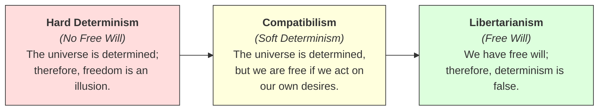

# Determinism 101: Free Will vs. Fate ⚙️

You decide to raise your right hand. You did it. It felt like a completely free choice—you could have easily chosen to keep your hand down, raise your left hand, or stand up instead. 

But let’s look closer. 

Why did you raise your hand? Perhaps you did it to test a philosophical idea. Why are you reading this? Because you want to learn. Why do you want to learn? Because of your curiosity. Why do you have curiosity? Because of your genetics, your brain structure, and your past experiences. 

If every choice you make is caused by a previous event, and those events were caused by events before them, all the way back to your birth and the beginning of the universe... **are your choices truly free?**

This is the age-old debate of **Free Will vs. Determinism**. Determinism is the philosophical theory that every event, including human actions and choices, is completely determined by previously existing causes.

---

## The Cosmic Clockwork and Laplace's Demon 🌌

To visualize determinism, think of the universe as a giant, incredibly complex **clockwork mechanism**. 

Once the clock is wound up and started (the Big Bang), every gear must turn in a specific, predictable way. Gear A turns Gear B, which turns Gear C. There is no room for choice; the position of every gear tomorrow is fixed by its position today.

In 1814, mathematician Pierre-Simon Laplace proposed a famous thought experiment to explain this, known as **Laplace's Demon**:

> Imagine a super-intelligent "demon" or computer that knows the exact position and momentum of every single atom in the universe right now, along with all the laws of physics. 
> 
> Using this data, the demon could calculate the entire past and the entire future with absolute certainty. It could predict the exact moment a star will explode, the weather next year, and your exact choice of what to eat for lunch tomorrow.

```
[ Current Position of Atoms ] + [ Laws of Physics ] 
               │
               ▼
       [ Laplace's Demon ] ───► Calculates ───► [ Complete Future with 100% Certainty ]
```

If Laplace's Demon is correct, the future is as fixed as the past. You cannot change what you will choose tomorrow, because that choice was already set in stone billions of years ago.

---

## The Free Will Spectrum: Three Views

How do we reconcile this clockwork universe with our feeling of freedom? Philosophers generally fall into three camps along a spectrum:



### 1. Hard Determinism (Freedom is an Illusion)
*   **Core Idea:** Determinism is true, and free will is completely incompatible with it. Because everything has a cause, we have no real choice. Our feeling of free will is just an illusion.
*   **Example:** You choose to buy a coffee. A hard determinist says you *had* to buy that coffee because of your brain chemistry, your lack of sleep, and your history with caffeine. You could not have chosen otherwise.

### 2. Libertarianism (We Are Free)
*   **Core Idea:** Humans have free will, and free will is incompatible with determinism. Therefore, determinism must be false. (Note: This is a philosophical term, unrelated to political libertarianism).
*   **Example:** When you make a choice, you are the first cause. Your decision is not just the result of a chain of dominoes; you are tipping the first domino yourself.
*   **Weakness:** It clashes with modern science, which shows that our brains obey the physical laws of cause and effect.

### 3. Compatibilism (We Can Have Both)
*   **Core Idea:** The universe is determined, but free will and determinism can exist together. You are free as long as your actions align with your internal desires, even if those desires were caused by something else.
*   **Example:** If you want a coffee and you buy a coffee without anyone forcing a gun to your head, your action is "free," even if your desire for coffee was determined by your brain's chemistry.

---

## Why Determinism Matters

The debate over determinism is not just a theoretical puzzle. It shapes our entire society:

1.  **Justice & Punishment:** If a criminal's actions were completely determined by their upbringing, genetics, and environment, is it moral to punish them? If they could not have chosen otherwise, does it make sense to blame them? In a determinist view, prison should be for rehabilitation and public safety, not retribution.
2.  **Moral Responsibility:** If you do something heroic, do you deserve praise? If your courage was just the result of genetics and training, did you "choose" to be good?
3.  **Mental Health:** Studies show that when people stop believing in free will, they are more likely to cheat, behave aggressively, and feel less motivated, because they feel like they have no control over their lives.

---

## Ready to Explore More?

*   **Play with Physics:** Research how Quantum Mechanics (which suggests that subatomic particles behave randomly, not deterministically) impacts the free will debate.
*   **Stanford Encyclopedia of Philosophy:** Read academic articles on [Causal Determinism](https://plato.stanford.edu/entries/determinism-causal/) and [Free Will](https://plato.stanford.edu/entries/freewill/).
*   **Watch the Lectures:** Search for Crash Course Philosophy's videos on [Determinism vs. Free Will](https://www.youtube.com/results?search_query=crash+course+philosophy+free+will) on YouTube.
