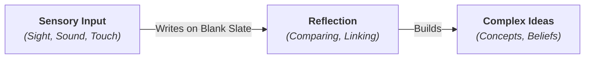

# Empiricism 101: Knowledge Through Experience 👁️

Close your eyes. Block your ears. Sit completely still. 

If you had been born in this state, with zero senses working—no sight, no sound, no touch, no taste, no smell—what would your mind contain? Would you have any thoughts, concepts, or ideas? Or would your mind be a vast, silent, empty void?

Where does our knowledge actually come from? 

This is the central question of **Epistemology** (the study of knowledge). For centuries, philosophers have split into two competing camps to answer it:
*   **Rationalists** believe that some knowledge is innate (born with us) and that we can discover truths about the universe through pure reason alone (like mathematics).
*   **Empiricists** believe that all knowledge comes from **sensory experience**. Without our senses, we can know nothing.

---

## The Tabula Rasa (The Blank Slate) ✏️

The foundation of modern empiricism was laid in the late 1600s by English philosopher **John Locke**. He proposed a famous analogy:

Imagine the human mind at birth as a **Tabula Rasa**—a completely blank slate or empty whiteboard. 

When a baby is born, they have no concepts of "justice," "triangles," or "God." The whiteboard is empty. As the baby grows, their senses write on this whiteboard:
*   They see a red object (Sensory Input).
*   They touch a hot surface (Sensory Input).
*   Their mind compares, links, and reflects on these inputs (Reflection).
*   Over time, they build complex ideas (like "fire" is red and hot, so I should not touch it).

For empiricists, there is no such thing as an "innate idea." Every concept in your head is just recycled sensory data.

---

## Primary vs. Secondary Qualities

To explain how our senses interact with the real world, John Locke split the properties of objects into two categories:

1.  **Primary Qualities (Objective Facts):** These are properties that exist inside the object itself, whether anyone is looking at it or not. They can be measured mathematically.
    *   *Examples:* Shape, size, weight, movement, and number. (An apple is round and weighs 150 grams, regardless of who looks at it).
2.  **Secondary Qualities (Subjective Interpretations):** These are properties that do not exist inside the object. They are produced in our minds by our senses.
    *   *Examples:* Color, taste, smell, sound, and temperature. (The apple is not actually "red" in the dark; red is just how our eyes interpret light reflecting off its surface. The taste of "sweetness" only exists when the apple touches your tongue).

---

## David Hume's Impressions and Ideas 🧠

In the 1700s, Scottish philosopher **David Hume** took empiricism to its logical conclusion. He split all mental contents into two types:

*   **Impressions (Vivid Experiences):** The direct, raw sensations we feel in the moment. (e.g., the burning pain of touching a hot stove, or the vivid sight of a sunset). Impressions are always strong and immediate.
*   **Ideas (Faint Copies):** The memories or thoughts we build from those impressions later. (e.g., thinking about the time you burnt your hand, or remembering the sunset). Ideas are just faint, less-vivid copies of our impressions.

Haidt's Rule of Empiricism: **If you cannot trace an idea back to a sensory impression, the idea is meaningless.** For example, you can imagine a "golden mountain" because your mind took the impression of "gold" and the impression of a "mountain" and combined them. But if you try to think of an abstract concept that has no sensory equivalent, an empiricist will argue it is just empty words.

---

## Why Empiricism Matters

Empiricism changed the course of human history:

1.  **The Scientific Method:** Modern science is entirely empiricist. We do not discover the laws of physics by sitting in an armchair thinking (rationalism); we run experiments, collect data, and make observations (empiricism). If an idea cannot be tested or observed, it is not scientific.
2.  **Democracy & Equality:** If everyone is born as a blank slate, then nobody is born "better" than anyone else. Kings and nobles are not born with innate wisdom or a divine right to rule. This idea fueled the American and French revolutions.
3.  **Artificial Intelligence:** Machine learning (feeding AI millions of images, texts, and data points to let it learn patterns) is a highly empiricist approach to intelligence. It is the blank slate learning from experience.

---

## Ready to Explore More?

*   **Rationalism vs. Empiricism:** Visit the [Stanford Encyclopedia of Philosophy: Rationalism vs. Empiricism](https://plato.stanford.edu/entries/rationalism-empiricism/) to read about the historical debate.
*   **Locke's Essay:** Look up summaries of John Locke's 1689 work, *An Essay Concerning Human Understanding*, to see how he defended the blank slate.
*   **Watch the Comparison:** Search for Crash Course Philosophy's video on [Locke, Berkeley, & Empiricism](https://www.youtube.com/results?search_query=crash+course+philosophy+empiricism) on YouTube.
