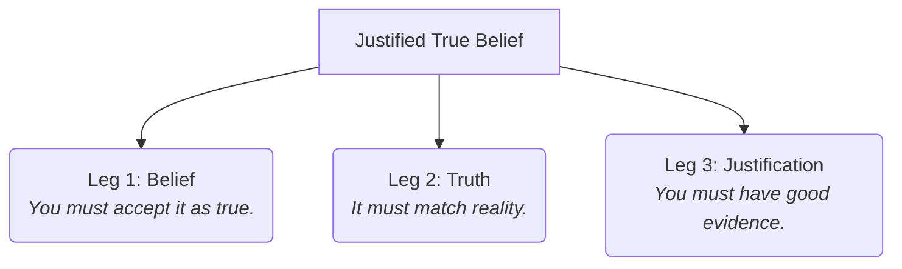

# Epistemology 101: The Study of Knowledge 💭

Imagine waking up in a clean, quiet room. Everything looks, smells, and feels normal. 

But how can you prove you are actually awake? 
*   Could you be having an incredibly vivid dream?
*   Could you be a brain in a jar, hooked up to a supercomputer that is feeding electrical signals into your sensory nerves, simulating this entire room (like *The Matrix*)?

How do you know what is real? In fact, how do you **know** anything at all?

This is the central question of **Epistemology** (from the Greek words *episteme*, meaning knowledge, and *logos*, meaning study). It is the branch of philosophy that investigates the nature, origin, limits, and validity of knowledge.

---

## What is Knowledge? The Three-Legged Stool (JTB) 🪑

For over 2,000 years, philosophers have defined knowledge using a formula originally proposed by Plato: **Justified True Belief (JTB)**. 

Think of JTB as a three-legged stool. If you remove any one of the legs, the stool collapses, and you no longer have "knowledge."

Let's say you claim: *"I know that it is raining outside."* For this claim to count as knowledge, it must pass three tests:
1.  **Belief (Leg 1):** You must actually believe it is raining. If you say, *"It is raining, but I don't believe it,"* it cannot be knowledge.
2.  **Truth (Leg 2):** It must actually be raining outside. If you believe it is raining, but you step outside and find a clear, sunny sky, your belief was incorrect. You cannot "know" something that is false.
3.  **Justification (Leg 3):** You must have a good reason or evidence for your belief. If you guessed it was raining because you flipped a coin, and it happened to be raining by pure coincidence, your belief was true, but it wasn't *justified*. It was just a lucky guess. Good justifications include looking out the window, hearing rain on the roof, or getting wet.

---

## The Gettier Problem: When Luck Mimics Knowledge

In 1963, a philosopher named Edmund Gettier threw a wrench into Plato's JTB formula. He showed that you can have a Justified True Belief that still doesn't feel like real knowledge because of **luck**.

Here is a classic variation of a Gettier case:
> You walk into a room and look at a clock on the wall. The clock reads 3:00 PM. You believe the time is 3:00 PM (Belief). Your belief is justified because wall clocks are generally reliable (Justification). And, by coincidence, it actually is 3:00 PM (Truth). 
> 
> However, unbeknownst to you, the clock broke exactly 24 hours ago and has not ticked since.

Your belief was **true** (it was 3:00 PM) and **justified** (you looked at a clock), but did you actually *know* the time? Or were you just lucky? 

Gettier cases show that JTB is missing something. Philosophers are still debating how to fix it (for example, by adding a fourth leg: *"your justification must not be based on a false premise"*).

---

## Skepticism: Can We Know Anything?

Some philosophers, called **Skeptics**, argue that we can never have absolute, 100% justification for anything, meaning we can never have true knowledge.

*   **René Descartes' Radical Doubt:** Descartes tried to find a foundation of knowledge that was impossible to doubt. He imagined an "evil demon" whose sole purpose was to deceive his senses about everything—shapes, colors, and the external world. He realized there was only one thing the demon could not deceive: the fact that Descartes was thinking. He wrote: *"Cogito, ergo sum"* (I think, therefore I am).
*   **The Brain in a Vat:** A modern version of Descartes' demon. If you cannot prove you aren't a brain in a vat being stimulated by a scientist, then you cannot "know" that you have hands, that the sky is blue, or that other people exist.

---

## Why Epistemology Matters

1.  **Fake News & Media:** In the digital age, we are flooded with information. Epistemology teaches us to ask: *What is the justification for this claim? Is the source reliable, or is my belief based on luck and confirmation bias?*
2.  **Science & Experiments:** Science does not deal in absolute, unchangeable truths. It is an epistemological system that continuously updates its justifications based on new evidence.
3.  **Artificial Intelligence:** As AI models generate answers, we must ask: does the AI "know" things, or is it just presenting statements without justification or true belief?

---

## Ready to Explore More?

*   **Solve the Gettier Riddle:** Read more about [Gettier Cases](https://plato.stanford.edu/entries/knowledge-analysis/#GetProb) on the Stanford Encyclopedia of Philosophy.
*   **Watch the Matrix Debate:** Watch YouTube videos analyzing [The Matrix and Cartesian Skepticism](https://www.youtube.com/results?search_query=the+matrix+and+descartes+skepticism) to see how philosophy inspired the movie.
*   **Test Your Justification:** Read about the difference between *A Priori* knowledge (known through reason alone, like 2+2=4) and *A Posteriori* knowledge (known through experience, like the sky is blue).
