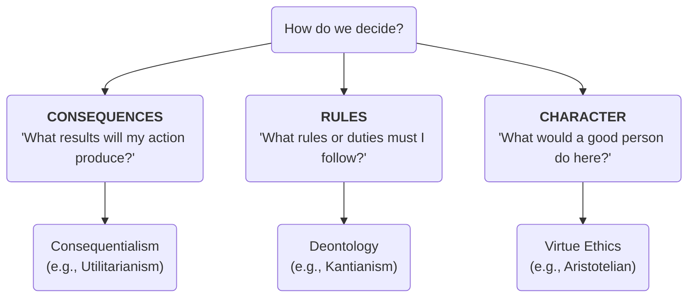
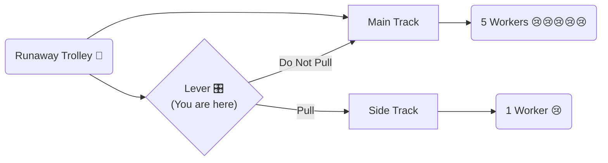

# Ethics 101: The Compass of Human Choices 🧭

Imagine you are standing in a busy supermarket aisle and notice a $20 bill lying on the floor. Nobody else seems to have seen it, and there are no security cameras nearby. 

What do you do? Do you pocket the money, or do you hand it to the cashier? 

More importantly: **why** did you make that choice? 

At some point, we all face choices that make us pause. We ask ourselves: *What is the right thing to do?* The study of these choices is what we call **Ethics**. It is the search for a rational compass to guide our actions, helping us decide what constitutes a "good life" and how we should treat one another.

---

## Morality vs. Ethics: The Internal and External Compass

People often use the words "morality" and "ethics" interchangeably, but philosophers draw a helpful distinction between the two:

*   **Morality (Your Internal Compass):** These are your personal, deeply-held beliefs about right and wrong. It is the voice inside you that says, *"I shouldn't lie,"* often shaped by your upbringing, culture, or personal reflections.
*   **Ethics (The Rules of the Road):** Ethics is the systematic study of those beliefs. It is the external framework we build to evaluate actions. If morality is your driver's license, ethics is the traffic laws and highway design that keep everyone safe. Ethics asks: *"Why is lying wrong? Are there times when lying is actually the right thing to do?"*

---

## The Messy Kitchen: An Everyday Analogy 🍽️

Before diving into complex philosophical jargon, let's look at a situation almost everyone has faced: **a sink full of dirty dishes in a shared apartment.** 

Three roommates—Sam, Chloe, and Arthur—each look at the messy kitchen and decide what to do. Although they all want a clean kitchen, they decide how to act using three completely different ethical frameworks:

### 1. Sam: The Outcome Seeker (Consequentialism)
Sam looks at the sink and thinks: *"If I wash all of these dishes, the kitchen will be clean, pests will stay away, and my roommates will feel happy and unstressed when they come home. Washing these dishes will create the most happiness and the best outcome for the house."*
*   **Core Idea:** The rightness of an action is judged entirely by its **consequences**. If the result is good, the action is good.

### 2. Chloe: The Rule Follower (Deontology)
Chloe looks at the sink, sees the chore chart on the fridge, and thinks: *"Our house agreement says we must wash our own dishes immediately after eating. I have already washed my bowl. I am not obligated to clean up after anyone else, and it would be unfair to violate our agreed-upon rules. I will only wash my bowl."*
*   **Core Idea:** The rightness of an action is judged by whether it follows **rules, duties, and obligations**, regardless of the outcome. Rules are absolute.

### 3. Arthur: The Character Builder (Virtue Ethics)
Arthur looks at the sink and thinks: *"What kind of roommate do I want to be? I want to be someone who is helpful, responsible, and kind. A helpful and kind person wouldn't leave a mess for their busy roommates, even if it's not their turn. I will clean the dishes to practice being a good friend."*
*   **Core Idea:** The rightness of an action is judged by the **moral character** of the person performing it. It's not about following rules or calculating outcomes; it's about practicing virtues like honesty, kindness, and courage.

---

## Deconstructing the Three Pillars of Ethics

Philosophers have spent thousands of years refining the ideas represented by our three roommates. These are the three pillars of **Normative Ethics**:

### 1. Consequentialism (Focus on the Destination)
For consequentialists, actions themselves are neutral. It is the destination—the final result—that matters.
*   **Famous Version:** **Utilitarianism** (popularized by Jeremy Bentham and John Stuart Mill). Its motto is: *"The greatest happiness for the greatest number of people."*
*   **Strength:** Highly practical. It encourages us to look at real-world impacts and make decisions that reduce suffering and increase joy.
*   **Weakness:** It can lead to "ends justifying the means." For example, if harvesting one healthy person's organs could save five dying patients, a strict utilitarian might argue it is the right choice because five lives saved is a better outcome than one.

### 2. Deontology (Focus on the Path)
Deontology comes from the Greek word *deon*, meaning duty. For deontologists, some actions are inherently right or wrong, no matter how much good or bad they cause.
*   **Famous Version:** **Kantian Ethics** (developed by Immanuel Kant). Kant proposed the **Categorical Imperative**: only act in a way that you would want to become a universal law for everyone. If you lie to save yourself, you must want a world where *everyone* lies all the time—which would cause society to collapse. Therefore, lying is always wrong.
*   **Strength:** Protects individual rights. It sets clear, unbreakable boundaries (e.g., do not murder, do not steal, do not lie) that protect people from being used as mere tools for a "greater good."
*   **Weakness:** Rigid and inflexible. If a killer asks you where your friend is hiding, Kantian deontology argues that you must tell the truth, because lying is inherently wrong.

### 3. Virtue Ethics (Focus on the Driver)
Popularized by ancient Greek philosophers like Aristotle, virtue ethics focuses on the actor rather than the act. It asks: *What kind of person should I become?*
*   **The Golden Mean:** Aristotle believed that virtues are a middle ground (the "Golden Mean") between two extremes (vices). For example:
    *   **Cowardice** (too little courage) ─── **Courage** (the golden mean) ─── **Rashness** (reckless, dangerous overconfidence)
*   **Strength:** Holistic. It acknowledges that life is complicated and that we cannot write a rulebook for every situation. Instead, it focuses on building good habits and character so that we naturally make ethical choices.
*   **Weakness:** Subjective. What constitutes a "virtuous person" can vary wildly between cultures and eras, making it hard to resolve specific, immediate dilemmas.

---

## The Ultimate Test: The Trolley Problem 🚊

To see these three systems collide in real-time, philosophers use thought experiments. The most famous is **The Trolley Problem**:

> A runaway trolley is speeding down a track toward five workers who cannot escape. You are standing next to a lever. If you pull it, the trolley will switch to a side track, saving the five workers. However, there is one worker standing on the side track who will be killed if you pull the lever.
> 
> **Do you pull the lever?**

How do our ethical systems answer?
*   **Consequentialists** (Utilitarians) say: **Pull the lever.** Saving five lives at the cost of one maximizes happiness and minimizes loss.
*   **Deontologists** say: **Do not pull the lever.** By pulling the lever, you are actively choosing to kill an innocent person on the side track. Doing so violates the absolute moral duty: *do not murder*. You are not responsible for the trolley running away, but you *are* responsible for actively diverting it to kill someone.
*   **Virtue Ethicists** say: **Reflect on the choice.** They focus on the driver's intentions. Pulling the lever out of compassion for the five represents the virtue of benevolence, but it requires courage to make such a tragic decision. They look at the moral weight and character required to face such an impossible choice.

There is no "correct" answer to the Trolley Problem. That is precisely the point: it shows that our ethical values are often in conflict, and we must choose which system we prioritize in a given moment.

---

## Modern Frontiers: Why Ethics Matters Today

Ethics isn't just an ancient classroom debate. It is currently shaping the future of humanity in real-time:

1.  **Artificial Intelligence & Self-Driving Cars:** A self-driving car's brakes fail as a group of pedestrians steps into the road. Should the car swerve into a concrete barrier, killing its passenger to save the pedestrians? Programmers must literally write code that decides who lives and who dies—turning the Trolley Problem into executable software.
2.  **Bioethics (Gene Editing):** Technologies like CRISPR allow us to edit human DNA. Is it ethical to cure genetic diseases before a baby is born? What about editing DNA to make children taller, smarter, or choose their eye color? Where do we draw the line between healing and engineering humans?
3.  **Environmental Ethics:** Do future generations have rights? Should we reduce our carbon emissions today—even if it slows economic growth and increases costs for people living right now—to protect humans who won't be born for another 100 years?

---

## Ready to Explore More?

If you want to dive deeper into the world of ethics, check out these excellent interactive resources and databases:

*   **Play the Game:** Test your moral choices in various scenarios at MIT's [Moral Machine](https://www.moralmachine.net/), where you decide how self-driving cars should make life-or-death decisions.
*   **Stanford Encyclopedia of Philosophy:** Read peer-reviewed articles on [Consequentialism](https://plato.stanford.edu/entries/consequentialism/), [Deontological Ethics](https://plato.stanford.edu/entries/ethics-deontological/), and [Virtue Ethics](https://plato.stanford.edu/entries/ethics-virtue/).
*   **Crash Course Philosophy:** Watch the [Crash Course Philosophy: Ethics playlist](https://www.youtube.com/playlist?list=PL8dPuuaLjXtOF-z9Ia65AxryGoPtwryKG) on YouTube for an engaging, animated introduction.
