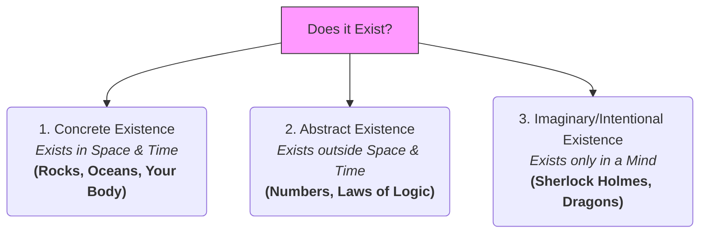

# Existence 101: What is Real? 🧱

Look around you. You see chairs, tables, computer screens, and windows. You know these things **exist**. 

But now, consider these examples:
*   Does the **number 3** exist? You cannot touch the number 3, and it doesn't take up space in your room. Yet, mathematical equations are true, and we rely on them to build bridges and fly spaceships.
*   Does **yesterday** exist? It was real, but it has passed and is no longer here.
*   Does the feeling of **justice** exist? You cannot put it in a box, but it dictates human laws and history.

What does it actually mean for something to exist? 

In philosophy, **Existence** is the state of being real, of having objective presence in the universe rather than being a non-entity or a pure figment of imagination. While close to *Being 101*, the study of existence focuses on the boundary between what is real (independent of us) and what is constructed or imaginary.

---

## Realism vs. Anti-Realism: The Shadow on the Wall 👥

How do we determine if something has independent existence? Philosophers split into two major perspectives:

*   **Realism:** The belief that the world exists independently of our minds. The chair is there whether you look at it, touch it, or even if all humans suddenly vanish.
*   **Anti-Realism:** The belief that what we call "reality" is construct-dependent. Things only exist relative to our language, conceptual frameworks, or minds.

To understand this, let's look at the **Shadow Analogy**:
Imagine a wooden toy block shaped like a cylinder. If you shine a light from one angle, it projects a square shadow on the wall. If you shine it from another angle, it projects a circular shadow.

```
                  [ Light Source 1 ] ───►  [ Cylinder ]  ───►  [ Square Shadow ] (Wall)
                                                ▲
                                                │
                                         [ Light Source 2 ] 
                                                │
                                                ▼
                                         [ Circle Shadow ] (Floor)
```

An **anti-realist** might argue that we only ever see the shadows (our sensory interpretations) and that "circle" or "square" existence is subjective. A **realist** argues that the physical, three-dimensional cylinder has a concrete, objective existence that transcends the two-dimensional shadows on the wall.

---

## Three Levels of Existence

To make sense of the universe, philosophers classify existence into three distinct levels:



1.  **Concrete Existence:** Things made of matter or energy that occupy a specific place in space and exist across time. You can touch them, measure them with physics, and they interact with other physical things (e.g., a rock, a tree, a photon of light).
2.  **Abstract Existence:** Things that are real and true, but have no physical location or mass. They do not decay over time. 
    *   *Example:* The equation $2 + 2 = 4$. Even if the physical universe ceased to exist, the logic of $2+2=4$ would still be true.
3.  **Imaginary (Intentional) Existence:** Things that exist because they are thought of, but have no independent reality outside of a mind. 
    *   *Example:* Sherlock Holmes. He has a history, an address (221B Baker Street), and a personality that millions of people know. He "exists" in our culture and literature, but he never walked the earth as a physical person.

---

## Why Existence Matters

1.  **Science & Subatomic Particles:** Physicists study quarks, dark matter, and Higgs bosons. We cannot see them directly, but we see their effects. Do they exist in a concrete way, or are they just mathematical models that help us calculate results?
2.  **Virtual Reality & The Metaverse:** As we spend more time in digital worlds, we must ask: does digital land or a digital avatar have "existence"? If someone steals your virtual sword, did they steal a real thing, or did nothing exist to be stolen?
3.  **Math and the Universe:** Galileo famously wrote that the book of nature is written in the language of mathematics. If mathematical laws have abstract existence, does that mean the universe is built on a non-physical foundation of logic?

---

## Ready to Explore More?

*   **Stanford Encyclopedia of Philosophy:** Read about [Existence](https://plato.stanford.edu/entries/existence/) and how modern logicians define it.
*   **The Debate of Realism:** Explore the differences between [Scientific Realism](https://plato.stanford.edu/entries/scientific-realism/) and its critics.
*   **Read the thought experiment:** Search for the *Ship of Theseus* riddle to ask: if you replace every single wooden plank of a ship over time, does the original ship still exist, or is it a new entity?
