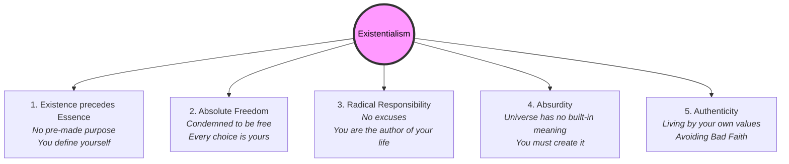

# Existentialism 101: Navigating Freedom and Meaning 🎨

Imagine you are handed a blank sheet of paper and a pen. The instructor says: *"Write the script for your life. There are no rules, no pre-made characters, and no required plot. You can write whatever you want, but you must write it now, and you must live it."*

For a brief second, you might feel a rush of excitement—you are completely free! But right behind that excitement comes a wave of anxiety. *What if I write a terrible story? What if I fail? Who will I blame if things go wrong?*

This mix of absolute freedom and deep anxiety is the core experience of **Existentialism**. 

Existentialism is a modern philosophical movement (which peaked in the mid-20th century through writers like Jean-Paul Sartre, Albert Camus, and Simone de Beauvoir) that focuses on the individual's freedom, responsibility, and the struggle to find meaning in an indifferent universe.

---

## The Core Idea: Existence Precedes Essence

As introduced in [Being 101](Being101.md), Sartre summarized the heart of existentialism in one famous phrase: **"Existence precedes essence."**

Think of a **paper cutter**:
*   A designer has a purpose in mind (cutting paper). They draw up plans (essence) and then manufacture the paper cutter (existence). The object's purpose was decided before it was even built.

Existentialists argue that **humans are different**:
*   We are not built for a pre-designed purpose. We are born first (existence)—we arrive in the world, stand on our own two feet, and only then do we start to define who we are, what we value, and what our purpose is (essence) through our choices.

---

## "Condemned to be Free" and Angst ⛓️

Sartre wrote that humans are **"condemned to be free."** 
*   **Condemned:** Because you did not create yourself or choose to be born.
*   **Free:** Because once you are here, you have no choice but to make choices. Even deciding *not* to choose is a choice.

Because we are completely free, we experience **Angst** (existential dread). If you are standing on the edge of a cliff, you don't just fear falling; you feel angst because you realize you are entirely free to jump. You are the only thing stopping yourself. 

Angst is the realization of our own radical freedom and the terrifying responsibility that comes with it. If you fail, you cannot blame fate, genetics, or your parents—you were the pilot.

---

## "Bad Faith" vs. Authenticity

Because freedom and responsibility are terrifying, many people try to escape them. Sartre called this escape **Bad Faith** (*mauvaise foi*).

*   **Bad Faith (Living a Lie):** When you pretend you do not have choices, hiding behind a social role, a job, or others' expectations. 
    *   *Sartre's Waiter:* Sartre described a café waiter whose movements are a bit too stiff, too eager, and too perfect. The waiter is playing a role. He has convinced himself that he *is* a waiter and has no choice but to wake up at 5:00 AM and serve coffee. He is treating himself like an object (a paper cutter) rather than a free human being.
*   **Authenticity (Living Truthfully):** Accepting your radical freedom. It means making choices that align with your own deeply-held values, accepting the consequences, and acknowledging that you are the author of your own life.

---

## The Absurd: Finding Meaning in a Blank Universe

Existentialists, particularly **Albert Camus**, wrote about the **Absurd**. The Absurd is the conflict between:
1.  Our human desire to find inherent meaning, order, and purpose in life.
2.  A cold, silent, and indifferent universe that contains no built-in meaning.

Camus used the Greek myth of **Sisyphus** to explain this:
Sisyphus was condemned by the gods to push a massive boulder up a mountain, only to watch it roll back down to the bottom, for eternity. His labor was completely meaningless and endless. 

Instead of despairing, Camus argued that Sisyphus is the ultimate existential hero. When Sisyphus walks back down the mountain to push the boulder again, he is conscious of his condition. He chooses to push the rock anyway. By choosing his struggle, Sisyphus claims ownership of his life. Camus famously wrote: *"One must imagine Sisyphus happy."*

---

## Why Existentialism Matters

1.  **Personal Agency:** If you feel stuck in a career, a relationship, or a lifestyle, existentialism reminds you: *you are choosing to stay*. You have the freedom to change, even if that change is difficult and scary.
2.  **Creating Your Own Values:** Existentialism does not believe in a universal moral template. You must decide what matters to you—whether it is art, family, career, or activism—and commit to it.
3.  **Resilience:** When tragedy strikes, existentialism doesn't promise that "everything happens for a reason." Instead, it empowers you to say: *"This event has no built-in meaning, but I will decide what meaning I give to my response."*

---

## Ready to Explore More?

*   **Read the Literature:** Read Albert Camus' novel *The Stranger* or Jean-Paul Sartre's play *No Exit* to see existentialism explored through story.
*   **Stanford Encyclopedia of Philosophy:** Read the academic overview of [Existentialism](https://plato.stanford.edu/entries/existentialism/).
*   **Watch the Lectures:** Search for Crash Course Philosophy's videos on [Existentialism and Jean-Paul Sartre](https://www.youtube.com/results?search_query=crash+course+philosophy+existentialism) on YouTube.
