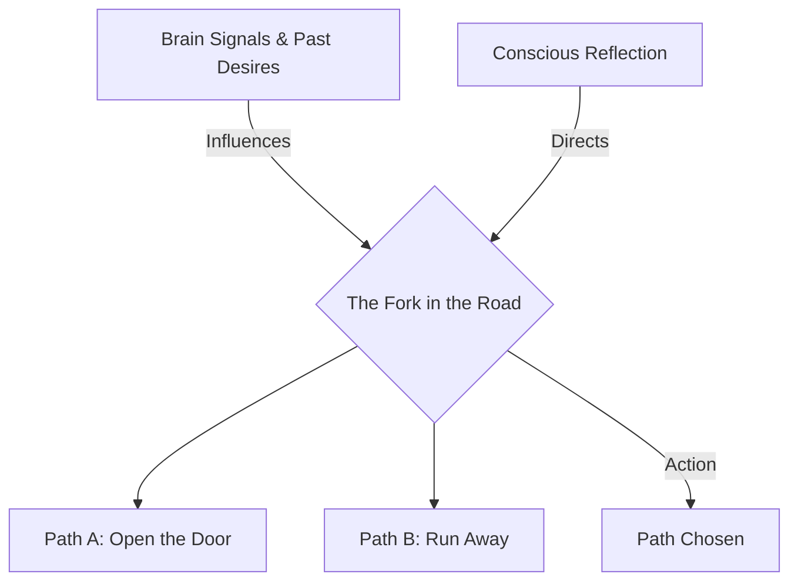

# Free Will 101: The Power of Choice 🛣️

Imagine reading a "Choose Your Own Adventure" book. You reach the end of a chapter, and the book says:
*   *To open the mysterious wooden door, turn to page 45.*
*   *To run back to the safety of your camp, turn to page 82.*

You pause, think, and decide to turn to page 45. 

It feels like you made a genuine choice. But consider this: the author of the book wrote both endings years ago. The pathways are already printed on the pages, and the physical ink is fixed. Did you actually *create* your path, or did you just uncover a track that was already laid down?

This is the core puzzle of **Free Will**. Free will is the capacity of rational agents to choose a course of action from among various alternatives, free from external coercion or pre-determined constraints.

---

## The Fork in the Road: Agency and Action 🔀

To understand free will, let's look at the concept of **Agency**. An *agent* is an entity capable of acting. A falling rock is not an agent; it cannot choose to stop falling. A human, however, is a moral agent who can evaluate options.

When you face a decision (a fork in the road), free will requires three conditions:
1.  **Alternatives:** There must be more than one open path available to you. If you are locked in a room, you do not have the free will to leave.
2.  **Deliberation:** You must be able to think about your options, weighing the pros and cons.
3.  **Ownership:** You must be the source of the final choice. If someone grabs your hand and forces you to sign a contract, the action belongs to them, not to you.

---

## Free Will vs. Determinism: A Brief Bridge

As explored in [Determinism 101](Determinism101.md), our actions are influenced by a chain of prior causes (genetics, physics, upbringing).

The great question is whether our conscious reflection is the *real* driver or just a passenger:
*   **The Libertarian View (Agency First):** Our conscious mind has veto power. We can override our instincts and past conditioning to make a truly free choice.
*   **The Compatibilist View (Desires First):** We are free as long as we aren't physically forced to do something we don't want to do, even if our wants were shaped by biology.
*   **The Neuroscience Challenge:** In the 1980s, scientist Benjamin Libet ran experiments showing that your brain registers activity preparing for a movement (like pressing a button) *hundreds of milliseconds before* you consciously decide to press it. Some argue this proves the subconscious brain makes the decision first, and the conscious mind just takes credit for it.

---

## Why Free Will Matters: Moral Responsibility

If free will does not exist, then **Moral Responsibility** collapses:

*   **Praise and Blame:** If you save a drowning child, you deserve praise because you made a difficult, free choice to risk your life. But if you had no choice (if you were just a programmed robot), praise makes no sense.
*   **The Foundation of Law:** Our legal systems are built on free will. A court will acquit a defendant if they were sleepwalking or experiencing a psychotic break during a crime, because they lacked the "guilty mind" (*mens rea*) and the free will to control their actions.
*   **Personal Growth:** Believing you have free will gives you a sense of **Self-Efficacy**—the belief that your choices matter and that you can shape your future through hard work and discipline.

---

## Ready to Explore More?

*   **Read the Classic Debates:** Research the famous debate between [Erasmus and Martin Luther](https://plato.stanford.edu/entries/luther/) on the topic of "free will" vs. "predestination."
*   **Stanford Encyclopedia of Philosophy:** Deep dive into the philosophical concepts of [Free Will](https://plato.stanford.edu/entries/freewill/) and [Compatibilism](https://plato.stanford.edu/entries/compatibilism/).
*   **Explore the Science:** Read about the [Libet Experiments](https://en.wikipedia.org/wiki/Benjamin_Libet#Conscious_mental_field) and how modern neuroscientists interpret brain signals and choice.
