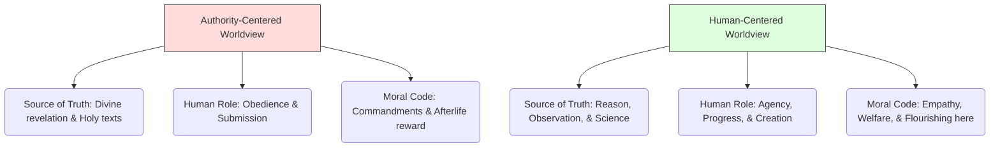

# Humanism 101: Believing in Human Potential 🔭

In the mid-1300s, the Black Death swept across Europe, killing nearly half the population. Desperate for help, communities did what they had done for centuries: they prayed, repented for their sins, and waited for a divine miracle. The plague continued to spread. 

Centuries later, when faced with global pandemics, humanity took a different route. Scientists looked through microscopes to study viruses, developed vaccines using genetics, and organized public health policies based on data. 

What changed in how we see our place in the universe? 

This shift is the core of **Humanism**. Humanism is a progressive philosophy of life that, without theism or other supernatural beliefs, affirms our ability and responsibility to lead ethical lives of personal fulfillment, contributing to the greater good of humanity. It places human reason, agency, science, and empathy at the center of the world.

---

## The Metaphor of the Telescope: Looking with Our Own Eyes 👁️

For centuries, truth was defined by **Authority**—holy books, kings, and religious institutions. If you wanted to know how the solar system worked, you read scripture. 

Humanism introduced a new metaphor: **The Telescope**.

When Galileo Galilei pointed his telescope at the night sky in 1609, he didn't check with the church to ask what he was allowed to see. He looked with his own eyes, recorded data, and used reason to conclude that the Earth revolves around the sun. 

Humanism is the belief that humans have the capacity—and the duty—to observe the world, use reason to find truth, and use our own empathy to build a moral society. We do not need a supernatural guide to tell us how to be good or how the universe works.

---

## Core Pillars of Humanist Thought

Modern humanism is built on three major pillars:

### 1. Reason and Science (How We Find Truth)
*   **Core Idea:** Natural laws govern the universe, and the scientific method is the most reliable tool we have to understand them. If a belief cannot be validated by observation and reason, we should reject it.
*   **Example:** Solving hunger through agricultural science rather than praying for rain.

### 2. Human Agency and Progress (How We Grow)
*   **Core Idea:** We are responsible for our own destiny. Human history is not a pre-written divine play; it is a story we are writing ourselves. Through education, democracy, technology, and social justice, we can continuously improve the human condition.
*   **Example:** Fighting to abolish slavery or secure women's rights based on human empathy and ethics.

### 3. Ethics of Compassion (How We Live Together)
*   **Core Idea:** Morality comes from human empathy and our shared need to cooperate, not from divine commandments. An action is good if it promotes human flourishing, reduces suffering, and respects individual dignity.
*   **Example:** The Golden Rule (*"treat others as you want to be treated"*), which exists in almost every human culture, is a product of our evolved social instincts.

---

## Secular Humanism vs. Religious Humanism

While humanism is often associated with atheism or agnosticism (Secular Humanism), it has diverse roots:
*   **Renaissance Humanism:** Began in Europe during the 14th century. Thinkers like Erasmus and Petrarch remained Christian but revived ancient Greek and Roman philosophy, emphasizing human education, literature, and art.
*   **Secular Humanism:** Focuses entirely on the natural world. It rejects supernaturalism and argues that meaning and morality must be built entirely on human reason, science, and empathy.

---

## Why Humanism Matters Today

1.  **Human Rights:** The Universal Declaration of Human Rights is a humanist document. It asserts that every human has dignity and rights simply because they are human, regardless of their nationality, race, or religion.
2.  **Bioethics & Technology:** As we develop AI and genetic engineering, humanism asks: *How does this technology serve human flourishing? Does it reduce suffering, or does it threaten human dignity?*
3.  **Environmentalism:** Because humanists do not believe a deity will step in to save the Earth, they argue that we have a radical responsibility to protect the planet for future generations.

---

## Ready to Explore More?

*   **Read the Humanist Manifesto:** Read the [Humanist Manifesto III](https://americanhumanist.org/what-is-humanism/manifesto3/), a document outlining the core values of modern secular humanists.
*   **Stanford Encyclopedia of Philosophy:** Explore the historical roots of [Humanism](https://plato.stanford.edu/entries/civic-humanism/) and its evolution.
*   **Watch the Discussions:** Search for videos on the [History of the Scientific Revolution](https://www.youtube.com/results?search_query=history+of+scientific+revolution) to see how reason replaced authority.
