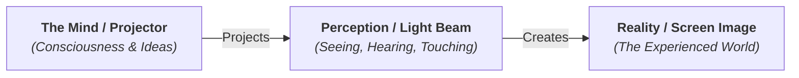

# Idealism 101: Reality in the Mind 👁️

Imagine putting on a state-of-the-art Virtual Reality (VR) headset. The graphics are indistinguishable from reality. The haptic suit lets you feel the wind, the texture of objects, and temperature. 

While wearing this suit, you look at a red apple. You see it, you touch its smooth skin, you smell its sweet scent, and you taste it. 

Where does the "apple" exist?
*   A physical scientist says: it's just code on a computer server causing electrical signals to feed into your headset and suit.
*   An **Idealist** says: the apple only exists inside your conscious experience. The color, shape, and taste are all mental perceptions. If you turn off the headset (the mind), the apple vanishes.

Now, take off the VR headset and look at a real apple on your table. How do you know *this* apple isn't just a mental projection too?

This is the foundation of **Idealism**. Idealism is the metaphysical theory that reality is fundamentally mental, immaterial, or ideational. It argues that the physical world only exists because it is perceived or shaped by conscious minds.

---

## The Metaphor of the Movie Projector 📽️

To understand idealism, let's look at the difference between how a Materialist and an Idealist view a movie:

*   **The Materialist View:** Reality is the screen. The physical screen is real, solid, and holds the picture.
*   **The Idealist View:** Reality is the projector. Without the lamp and the film reel (the Mind/Consciousness), the screen is completely blank and dark. The picture (Reality) is projected from within.

In this view, the mind is not a passive mirror that reflects a pre-existing physical world. Instead, the mind is the active creator of the world we experience.

---

## Two Famous Flavors of Idealism

Idealism has evolved in different ways throughout history. Here are the two most famous forms:

### 1. Subjective Idealism (Berkeley's Immaterialism)
*   **Famous Proponent:** George Berkeley (1685–1753).
*   **Core Idea:** Physical objects are nothing but collections of sensory ideas. An object only exists when it is being perceived by a mind. 
*   **Motto:** *Esse est percipi* (To be is to be perceived).
*   **The God Solution:** Critics asked Berkeley: *If I walk out of my study, does my desk cease to exist?* Berkeley answered: No, because God's mind is always observing everything, keeping the entire universe in continuous existence even when no humans are looking.

### 2. Transcendental Idealism (Kant's Copernican Revolution)
*   **Famous Proponent:** Immanuel Kant (1724–1804).
*   **Core Idea:** Kant split reality into two worlds:
    *   **The Noumenal World:** Things-in-themselves (*Das Ding an sich*). The raw, objective reality that exists outside our minds. Kant argued we can never know this world directly.
    *   **The Phenomenal World:** Things-as-they-appear-to-us. The world of space, time, colors, and sounds. 
*   **Why it's Idealist:** Kant argued that our minds possess built-in "filters" (like space and time). When raw data from the noumenal world enters our minds, our filters organize it into the structured world we see. We don't see reality as it is; we see reality as our minds shape it.

---

## Why Idealism Matters

1.  **Quantum Physics:** In quantum mechanics, the "Observer Effect" shows that subatomic particles (like electrons) exist in a state of probability (a wave) until they are measured or observed by an instrument, at which point they collapse into a single physical location (a particle). Some physicists argue this supports an idealist view: observation creates physical reality.
2.  **Cognitive Science & VR:** We know that our brains construct our reality. A colorblind person sees a green apple as gray. A bat hears the room through echolocation. There is no single, objective "color" or "sound" in the physical world; our minds create them.
3.  **Mind over Matter:** Idealism places value on ideas, spirit, and consciousness. If reality is mental, then changing your thoughts, your culture's ideas, and your beliefs literally changes the world you live in.

---

## Ready to Explore More?

*   **Read Berkeley's Dialogues:** Look up George Berkeley's *Three Dialogues between Hylas and Philonous* to see how he defended subjective idealism against materialism.
*   **Stanford Encyclopedia of Philosophy:** Read a comprehensive overview of [Idealism](https://plato.stanford.edu/entries/idealism/) and [Kant's Transcendental Idealism](https://plato.stanford.edu/entries/kant-transcendental-idealism/).
*   **Watch the Explanation:** Search for Crash Course Philosophy's video on [George Berkeley & Idealism](https://www.youtube.com/results?search_query=crash+course+philosophy+idealism) on YouTube.
