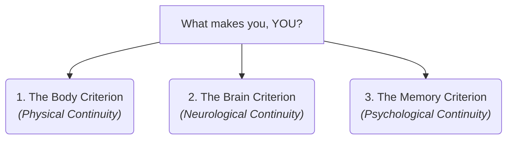

# Identity 101: What Makes You, You? 🧬

Imagine it is the year 2150, and teleportation is a common way to travel. You step into a teleporter booth in London. The machine scans your body, records the exact state of every atom and neuron, and immediately vaporizes you (destroying your physical body). 

A second later, a printer on Mars takes that data and reconstructs your body with brand-new atoms, copying every scar, memory, and thought. 

The person on Mars steps out of the booth, remembering the scanner in London, and goes about their day. 

Here is the question: **Did you actually travel to Mars, or did you die in London while a perfect clone was born on Mars?**

This is the classic **Teleporter Paradox**. It introduces the philosophical study of **Identity**—specifically, *Personal Identity*. It asks: *What is the "glue" that keeps you the same person from birth, through change, all the way to death?*

---

## The Ship of Theseus: The Analogy of Change ⛵

To understand identity, we must first look at a famous thought experiment from ancient Greece: **The Ship of Theseus**.

> Theseus, a legendary Greek hero, has a wooden ship. Over years of sailing, the wooden planks begin to rot. One by one, the sailors replace every rotten plank with a brand-new, sturdy oak plank. 
> 
> Eventually, every single original piece of wood has been replaced. 

```
Original Wooden Ship ───► [ Planks replaced one-by-one ] ───► Fully Replaced Ship
                                                                     │
                                                                     ▼
                                                             Is it the same ship?
```

Is the fully replaced ship still the same Ship of Theseus?
*   **Yes:** Because it maintained its shape, structure, and continuous history. If we say "no," then at what exact plank did it stop being the Ship of Theseus?
*   **No:** Because none of the original physical material remains.

Now, add a twist: *What if the sailors took all the old, rotten planks they discarded, cleaned them up, and built a second ship out of them?* Now we have two ships. Which one is the *real* Ship of Theseus?

This is not just a riddle about ships. **Your body is a Ship of Theseus.** Almost every cell in your body is replaced every 7 to 10 years. The atoms inside your brain right now are not the same atoms you were born with. Yet, you feel like the same person. Why?

---

## Three Theories of Personal Identity

Philosophers have proposed three main criteria to explain what keeps your identity intact:



### 1. The Body Criterion (Physical Continuity)
*   **Core Idea:** You are your physical body. You are the same person today as you were as a baby because you have a continuous physical history in space and time.
*   **Weakness:** The Teleporter Paradox. If your body is vaporized and rebuilt with new atoms, physical continuity is broken, meaning you died in London.

### 2. The Brain Criterion
*   **Core Idea:** You are your brain. Since your brain is the seat of your thoughts and personality, physical continuity of the brain is what matters. If we transplant your brain into a new body, "you" go with the brain.
*   **Weakness:** If your brain is split in half (hemispherectomy) and each half is put into a different clone body, which clone is "you"? You cannot be two people.

### 3. The Memory Criterion (Psychological Continuity)
*   **Famous Proponent:** John Locke (1632–1704).
*   **Core Idea:** You are your consciousness and memories. If you can remember being the five-year-old child who lost their first tooth, then you are that same person. 
*   **Locke's Prince and Cobbler:** Locke imagined a Prince whose soul/memory was moved into the body of a Cobbler. Locke argued that to everyone else, he looks like the cobbler, but to himself, he is still the prince. Identity is mental, not physical.
*   **Weakness:** If you forget what you had for breakfast three years ago, does that mean you are no longer the person who ate that breakfast? If a patient loses all memory due to dementia, have they ceased to exist as that person?

---

## Why Identity Matters

1.  **Ethics & Law:** We only punish people for crimes if they are the *same person* who committed the crime. If someone commits a murder, suffers extreme amnesia, and becomes a completely different, gentle person, should we still punish them?
2.  **Fear of Death:** If you believe you are your physical body (body criterion), then death is the absolute end. If you believe you are a psychological pattern (memory criterion), then you might believe "you" could survive by uploading your mind to a computer.
3.  **Self-Concept:** Recognizing that you are a collection of changing cells and memories can free you from feeling locked into your past. You are a process, not a static object.

---

## Ready to Explore More?

*   **Solve the Teleporter Dilemma:** Read Derek Parfit's book *Reasons and Persons* to explore his radical theories of personal identity and teleportation.
*   **Stanford Encyclopedia of Philosophy:** Read peer-reviewed articles on [Personal Identity](https://plato.stanford.edu/entries/identity-personal/) and [Temporal Parts](https://plato.stanford.edu/entries/temporal-parts/).
*   **Watch the Debate:** Watch YouTube videos explaining the [Ship of Theseus Paradox](https://www.youtube.com/results?search_query=ship+of+theseus+paradox) to see various solutions.
