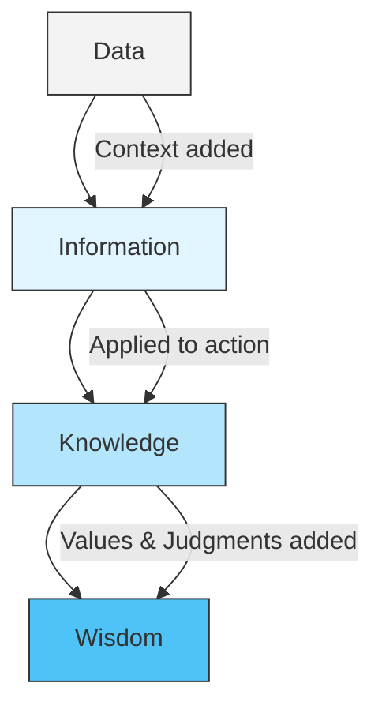

# Knowledge 101: Understanding Truth and Belief 🗺️

Imagine a parrot trained to squawk: *"A storm is coming!"* A few hours later, a massive hurricane hits the island. 

Did the parrot **know** the storm was coming? 

Most of us would say no. The parrot was just repeating sounds; it had no concept of rain, wind, or meteorology. 

Now, imagine a local weather forecaster who studies radar data, atmospheric pressure, and satellite imagery, and writes a report stating: *"A storm is coming."* 

The forecaster definitely **knew** the storm was coming. 

What is the difference between the parrot's correct statement and the forecaster's correct statement? What turns raw data or beliefs into actual **Knowledge**?

---

## The Metaphor: The Map and the Territory 🗺️

To understand knowledge, philosophers use the metaphor of **The Map and the Territory**:

*   **The Territory:** This is the real, physical world. It exists exactly as it is, regardless of what we think. (e.g., the actual streets, buildings, and rivers of New York City).
*   **The Map:** This is your mind's representation of the world. It is the set of beliefs, ideas, and concepts you carry in your head.

```
       ┌────────────────────────┐
       │     THE TERRITORY      │  ◄─── Objective Reality (The physical world)
       └───────────▲────────────┘
                   │
         [ Accurate Representation ]
                   │
       ┌───────────▼────────────┘
       │        THE MAP         │  ◄─── Subjective Knowledge (Your mental beliefs)
       └────────────────────────┘
```

**Knowledge is having a map that accurately reflects the territory.** If your map shows a bridge where there is actually a deep river, your map is incorrect, and your belief is false. If your map accurately guides you across the city, your map is correct, and you possess knowledge.

---

## From Data to Wisdom: The DIKW Pyramid

Knowledge is not just a collection of random facts. It is part of a hierarchy of understanding, often organized as the **DIKW Pyramid**:



1.  **Data (Raw Facts):** Isolated numbers, symbols, or observations without context. (e.g., *"101"*).
2.  **Information (Data + Context):** Organizing the data so it makes sense. (e.g., *"The temperature outside is 101 degrees Fahrenheit"*).
3.  **Knowledge (Information + Application):** Understanding *how* to use the information based on context. (e.g., *"101 degrees is extremely hot, so I should drink water and wear sunscreen if I go outside"*).
4.  **Wisdom (Knowledge + Value Judgments):** Understanding *why* we take certain actions, integrating experience, values, and long-term consequences. (e.g., *"We must address greenhouse emissions because rising temperatures threaten human communities"*).

---

## How Do We Acquire Knowledge?

Where do the lines on our mental maps come from? Philosophers identify four primary sources:

1.  **Perception (Sensory Experience):** Using your eyes, ears, and touch. (e.g., *"I know the stove is hot because I felt the heat"*). This is the foundation of [Empiricism 101](Empiricism101.md).
2.  **Reason (Logical Thinking):** Calculating truths through logic and math. (e.g., *"If $A > B$ and $B > C$, then I know $A > C$"*). This is the foundation of Rationalism.
3.  **Testimony (Social Learning):** Learning from others, books, teachers, and scientific reports. (e.g., *"I know Mars exists because astronomers have photographed it, even though I have never been there"*). Most of what you know comes from testimony.
4.  **Memory (Preservation):** Keeping past observations and reasoning active in your mind over time.

---

## Why Knowledge Matters

1.  **Navigating the Information Age:** The internet has democratized information, but not knowledge. We must learn to audit our sources (Testimony) and look for solid justifications to separate true knowledge from rumors and fake news.
2.  **Decision Making:** Building policies, launching businesses, and choosing careers require accurate mental maps. Operating on false beliefs leads to bad investments, failed projects, and poor health choices.
3.  **Intellectual Humility:** Recognizing the limits of our knowledge—understanding that our maps are always incomplete and simplified versions of the vast territory—keeps us open to learning and updating our beliefs.

---

## Ready to Explore More?

*   **Deepen the Study:** Visit [Epistemology 101](Epistemology101.md) to explore the philosophical limits of knowledge (the Gettier problem and skepticism).
*   **Stanford Encyclopedia of Philosophy:** Read about the [Analysis of Knowledge](https://plato.stanford.edu/entries/knowledge-analysis/) and the [Social Epistemology](https://plato.stanford.edu/entries/epistemology-social/) of testimony.
*   **Explore the Map Paradox:** Look up Alfred Korzybski’s famous phrase, *"The map is not the territory,"* to learn how language shapes our reality.
