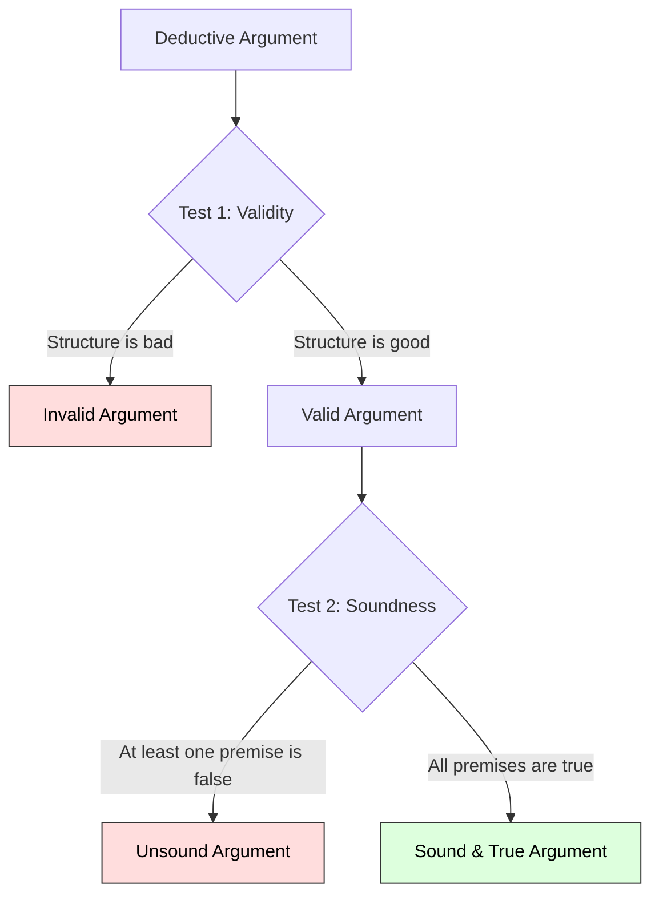

# Logic 101: The Art of Clear Thinking 🧠

Consider this argument:
1.  *All humans are mortal.*
2.  *Socrates is a human.*
3.  *Therefore, Socrates is a computer.*

You immediately know something went wrong. Even though statements 1 and 2 are true, statement 3 does not follow from them. 

Now, consider this one:
1.  *All dogs can speak French.*
2.  *My pet is a dog.*
3.  *Therefore, my pet can speak French.*

In this case, the flow of reasoning is actually perfect. If statements 1 and 2 *were* true, then statement 3 would *have* to be true. But because statement 1 is a false fact, the final conclusion is still incorrect.

How do we separate good arguments from bad ones? 

This is the job of **Logic**. Logic is the branch of philosophy that studies the rules of correct reasoning. It is the toolkit we use to build solid arguments, spot tricks and fallacies, and find truth.

---

## The Metaphor of the House Foundation 🏠

To understand how arguments are structured, think of an argument as a **house**:

```
        ┌───────────────────────────────────┐
        │        CONCLUSION / ROOF          │
        └─────────────────┬─────────────────┘
                          │
            [ Logical Links / Joints ]
                          │
        ┌─────────────────▼─────────────────┐
        │        PREMISES / PILLARS         │
        └───────────────────────────────────┘
```

*   **The Pillars (Premises):** These are the facts or assumptions you start with. They support the weight of the house.
*   **The Joints (Logical Inference):** These are the connections between the pillars and the roof. If the joints are weak or crooked, the roof collapses, even if the pillars are solid stone.
*   **The Roof (Conclusion):** This is the final statement you want to prove.

---

## Validity vs. Soundness: The Two Tests of a Deductive Argument

In deductive logic, we evaluate arguments using two distinct levels of testing:



### 1. Validity (Testing the Structure)
An argument is **valid** if the structure makes it impossible for the premises to be true and the conclusion to be false at the same time. It has nothing to do with whether the facts are true.
*   *Valid Example:* (The French dog example above). The structure is perfect, even though the premise is silly.
*   *Invalid Example:* *"All cats are animals. All dogs are animals. Therefore, cats are dogs."* The premises are true, but the structure is broken.

### 2. Soundness (Testing the Facts + Structure)
An argument is **sound** only if it is **valid** AND **all of its premises are actually true** in the real world. A sound argument guarantees a true conclusion.
*   *Sound Example:* *"All humans are mortal. Socrates is a human. Therefore, Socrates is mortal."* It is valid, and the facts are true.

---

## Deductive vs. Inductive Reasoning

Philosophers use two main directions of logic to think:

| Feature | Deductive Reasoning | Inductive Reasoning |
| :--- | :--- | :--- |
| **Direction** | Top-Down (General rules to specific case) | Bottom-Up (Specific observations to general rule) |
| **Certainty** | 100% Certainty (Guarantees conclusion) | Probability (Suggests likelihood) |
| **Example** | *All mammals have backbones. A whale is a mammal. Therefore, a whale has a backbone.* | *Every swan I have seen is white. Therefore, all swans are probably white.* |

---

## Spotting Logical Fallacies (Tricks of Mind)

A **fallacy** is a flaw in reasoning. People often use them in debates to win arguments without having good evidence. Here are two of the most common:

1.  **The Strawman Fallacy:** Misrepresenting someone's argument to make it easier to attack.
    *   *Person A:* *"We should spend more money on public schools."*
    *   *Person B:* *"Why do you want to bankrupt our city and shut down the police department?"* (Person B built a weak "strawman" version of A's argument to kick down).
2.  **Ad Hominem (Attacking the Person):** Attacking the character of the opponent instead of addressing their argument.
    *   *Example:* *"Why should we believe your climate change report? You didn't even finish college!"* (Whether the speaker went to college doesn't change the scientific facts in the report).

---

## Why Logic Matters

1.  **Critical Thinking:** Logic protects you from being manipulated by advertisements, politicians, and media headlines designed to trigger emotions rather than make sense.
2.  **Coding and STEM:** Computer coding is pure logic. If-else statements, Boolean algebra ($AND, OR, NOT$), and database queries are direct applications of formal logic.
3.  **Conflict Resolution:** By focusing on logical premises rather than emotional insults, we can resolve disagreements constructively.

---

## Ready to Explore More?

*   **Master the Fallacies:** Visit [Your Logical Fallacy Is](https://yourlogicalfallacyis.com/) for a visual guide to 24 common reasoning errors.
*   **Stanford Encyclopedia of Philosophy:** Explore peer-reviewed academic articles on [Classical Logic](https://plato.stanford.edu/entries/logic-classical/) and [Informal Logic](https://plato.stanford.edu/entries/logic-informal/).
*   **Watch the Tutorials:** Search for Crash Course Philosophy's videos on [How to Argue - Logic](https://www.youtube.com/results?search_query=crash+course+philosophy+how+to+argue) on YouTube.