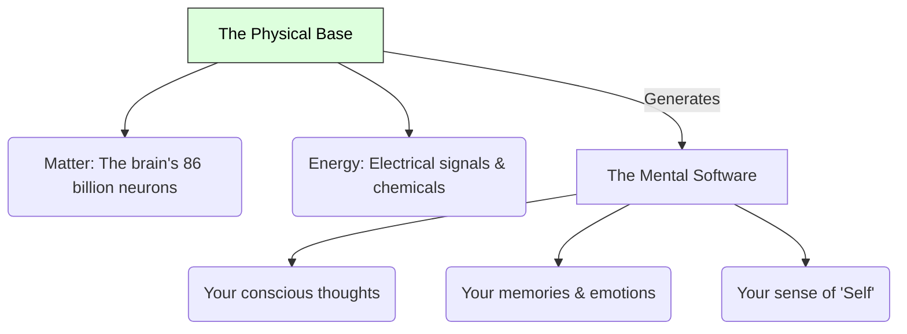

# Materialism 101: The Physical World Only ⚙️

Imagine taking apart a classic, mechanical pocket watch. You unscrew the back case, take out the tiny gears, remove the balance wheel, and disconnect the mainspring. 

You sit looking at the pile of metal parts on your desk. 

Now, ask yourself: *Where did the "time-telling" go?* Is there an invisible, ghostly "spirit of time" that fled the watch when you opened it? 

Of course not. "Time-telling" was simply the result of physical gears interacting with one another. When the physical arrangement was broken, the behavior stopped.

What if the human mind, the soul, and our thoughts are exactly like that pocket watch? 

This is the central idea of **Materialism** (also called **Physicalism** in modern philosophy). Materialism is the metaphysical view that only physical matter and energy exist. Everything in the universe—including life, consciousness, and your thoughts—can be explained entirely by physical processes.

---

## The Computer Metaphor: Hardware and Software 💻

To understand materialism, let's look at the relationship between your phone's screen and its hardware:

Think of your body and brain as the **Hardware** (the silicon chips, wires, battery, and screen of a smartphone). Your mind, thoughts, and feelings are the **Software** (the apps, operating system, and pixels displayed on the screen). 

The software feels very different from raw silicon. You can use it to chat, play games, and look at photos. But the software cannot exist without the hardware. If you crush the physical silicon chip with a hammer, the app vanishes instantly. 

For a materialist, there is no separate "soul" or non-physical mind. Your brain tissue is the hardware, and your consciousness is just the software running on it.

---

## Core Pillars of Materialism

To see how materialists view the universe, let's explore three main concepts:

### 1. Reductionism
*   **Core Idea:** Complex things can be understood by breaking them down into their simplest physical parts.
    *   *The Scale:* Your **Mind** is created by your **Brain**, which is a network of **Cells** (neurons), which are made of **Molecules**, which are collections of **Atoms**, which obey the laws of **Physics**.
    *   *Conclusion:* Therefore, studying physics and chemistry is ultimately how we explain psychology and the mind.

### 2. The Rejection of Dualism
Materialists reject **Dualism** (the idea that mind and matter are separate substances). They argue that dualism cannot explain how a physical brain and a non-physical soul interact. Instead, they argue that mind and brain are one and the same entity.

### 3. Epiphenomenalism (Thoughts as Steam)
Some materialists explain consciousness as an **epiphenomenon**—a byproduct of physical processes that has no physical power of its own. 
*   *Analogy:* Think of a steam locomotive. The burning coal and physical pistons move the train (physical action). The puff of white steam rising from the stack is a byproduct of the engine (epiphenomenon). The steam doesn't pull the train; the machinery does. Similarly, your physical brain causes your actions, and your conscious thought is just the "steam" rising from it.

---

## Why Materialism Matters

1.  **Modern Medicine & Psychology:** Materialism is the foundation of modern neuroscience and psychiatry. When a patient experiences depression or anxiety, doctors treat the physical hardware (by prescribing chemical antidepressants or targeting neural pathways) rather than attempting to cure an immaterial soul.
2.  **The Rise of Artificial Intelligence:** If materialism is true, then consciousness is just a matter of complex information processing. This means that if we build a computer network as complex as the human brain, that computer will eventually become conscious.
3.  **The Meaning of Death:** For a materialist, death is like turning off a computer. When the physical machinery of the brain stops functioning, the software (your consciousness) simply stops running. There is no afterlife, which makes this physical life highly valuable.

---

## Ready to Explore More?

*   **Deepen the Contrast:** Read [Idealism 101](Idealism101.md) and [Consciousness 101](Consciousness101.md) to see the strongest arguments against materialism.
*   **Stanford Encyclopedia of Philosophy:** Read peer-reviewed articles on [Physicalism](https://plato.stanford.edu/entries/physicalism/) and [Reductionism](https://plato.stanford.edu/entries/scientific-reduction/).
*   **Watch the Debate:** Search for videos discussing [The Mind-Body Problem and Physicalism](https://www.youtube.com/results?search_query=physicalism+mind+body+problem) on YouTube.
