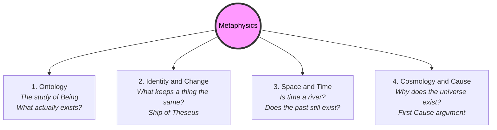

# Metaphysics 101: The Foundations of Reality 🌌

Look at a wooden chair. 

Now, let's play a mental game. Remove the properties of the chair one by one:
*   Remove its brown color.
*   Remove its smooth texture.
*   Remove its weight (10 pounds).
*   Remove its height (3 feet).
*   Remove the wood itself.

Once you have stripped away all of its physical properties, what is left? Is there a naked, property-less "substance" holding those properties together, or is the chair nothing more than a bundle of characteristics?

Why does anything exist at all instead of nothing? What is time? 

These questions go beyond the physical sciences. This is the domain of **Metaphysics**. Metaphysics is the branch of philosophy that studies the fundamental nature of reality, including the relationship between mind and matter, substance and attribute, potentiality and actuality. 

The name comes from the ancient editor of Aristotle's works, who placed his books on first philosophy *after* (*meta*) his books on physics (*physika*). Literally, it means "beyond physics."

---

## The Metaphor of the Video Game Source Code 🎮

To understand what metaphysics is, think of our universe as a massive, open-world 3D video game (like *Minecraft* or *Grand Theft Auto*):

*   **Physics (The Gameplay):** Physics studies the rules *inside* the game. It calculates how fast a car accelerates, how gravity pulls a falling block, and how light reflects off water.
*   **Metaphysics (The Source Code):** Metaphysics studies the code itself, the engine that allows the game to run. It asks: *What is space? How does time flow in the game? What defines the identity of a character if their avatar changes? What are the rules of possibility?*

```
          ┌────────────────────────────────────────────────────────┐
          │                    PHYSICS (Gameplay)                  │
          │ - Speed of cars, gravity of blocks, light reflection   │
          └───────────────────────────▲────────────────────────────┘
                                      │
                                [ Built upon ]
                                      │
          ┌───────────────────────────▼────────────────────────────┐
          │                  METAPHYSICS (Source Code)             │
          │ - Nature of space, flow of time, identity of players   │
          └────────────────────────────────────────────────────────┘
```

Without the code (metaphysics), the gameplay (physics) cannot exist. Metaphysics studies the underlying assumptions that science takes for granted.

---

## The Four Main Branches of Metaphysics

Metaphysics is a broad umbrella that covers several foundational areas:



### 1. Ontology (The Study of Being)
As introduced in [Being 101](Being101.md), ontology asks what categories of things exist. Are there abstract entities (like numbers) alongside physical matter?

### 2. Identity and Change
As introduced in [Identity 101](Identity101.md), this branch investigates how things can change over time while remaining the "same" thing.

### 3. Space and Time
What are space and time?
*   **Presentism:** The view that only the *present moment* exists. The past is gone, and the future is not yet real.
*   **Eternalism (The Block Universe):** The view that all points in time (past, present, and future) exist simultaneously, like points on a physical map. Julius Caesar, you reading this text, and human colonizers on Mars are all equally real in different slices of the "block."

### 4. Cosmology and Causality
Investigating the origin and structure of the cosmos. Why is there a universe? Does it have a starting point or first cause, or has it always existed?

---

## Why Metaphysics Matters

1.  **The Foundation of Science:** Science assumes that the universe is real (Realism), that cause and effect are consistent, and that the future will resemble the past. Science cannot prove these assumptions using experiments; it must rely on metaphysics to establish them.
2.  **Ethics and Free Will:** How you view metaphysics decides how you treat others. If your metaphysics says humans are just biological clockwork (Determinism), it changes how you view law and responsibility.
3.  **Human Curiosity:** Metaphysics tackles the ultimate questions that keep us up at night: *Who am I? Why am I here? What is the nature of the reality I am experiencing?*

---

## Ready to Explore More?

*   **Deepen Your Knowledge:** Visit [Being 101](Being101.md) and [Causality 101](Causality101.md) to explore key metaphysical debates.
*   **Stanford Encyclopedia of Philosophy:** Read peer-reviewed articles on [Metaphysics](https://plato.stanford.edu/entries/metaphysics/) and [Time](https://plato.stanford.edu/entries/time/).
*   **Watch the Lectures:** Search for Crash Course Philosophy's video on [Metaphysics](https://www.youtube.com/results?search_query=crash+course+philosophy+metaphysics) on YouTube.
