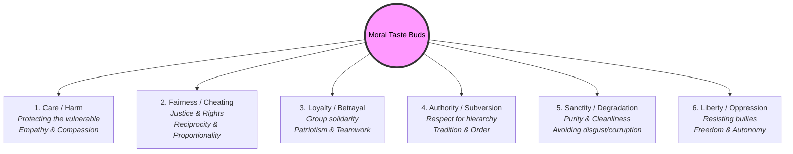
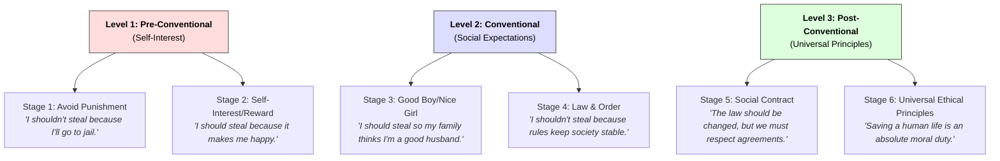

# Morality 101: The Chemistry of Right and Wrong ⚖️

You are walking through a park when you spot a wallet lying in the grass. You open it and find an ID card, a driver's license, and five crisp $20 bills. There is nobody else around. 

You face a split-second decision:
1.  Keep the $100 cash and toss the wallet in a bin.
2.  Use the ID to contact the owner and return the wallet with the money intact.

Most people feel an immediate, internal tug-of-war. That internal sense—the quiet voice telling us what we *should* do, regardless of what we can get away with—is **Morality**. It is the set of values, rules, and instincts that dictate how we behave, cooperate, and judge one another.

---

## Morality vs. Ethics: A Quick Refresher

As covered in [Ethics 101](Ethics101.md), morality and ethics are close relatives but not twins:
*   **Morality** is your personal or cultural belief system about what is right and wrong (e.g., *"I should return the wallet because stealing is wrong"*).
*   **Ethics** is the systematic study of those beliefs, examining *why* we hold them and how they clash (e.g., analyzing whether returning the wallet is driven by duty, consequences, or character).

In short: **Morality is the software; Ethics is the computer science analyzing it.**

---

## The "Moral Taste Buds" Analogy 👅

Why do people disagree so fiercely about what is moral? 

Social psychologist Jonathan Haidt proposed a brilliant explanation called **Moral Foundations Theory**, using the analogy of **taste buds**. 

Just as our tongues evolved physical receptors to detect five basic tastes (sweet, salty, sour, bitter, and umami) to keep us alive, our minds evolved psychological "taste buds" to help us survive and cooperate in groups. 

According to this theory, humans have six primary moral taste buds:

### 1. Care vs. Harm (The Empathy Receptor)
*   **Evolved for:** Protecting vulnerable offspring.
*   **Triggered by:** Signs of suffering, cruelty, or weakness.
*   **The Feeling:** Compassion for the victim, anger at the bully.

### 2. Fairness vs. Cheating (The Justice Receptor)
*   **Evolved for:** Making sure cooperation pays off.
*   **Triggered by:** Cheaters, freeloaders, or unequal splits.
*   **The Feeling:** Anger when someone takes more than their share; satisfaction in karma.

### 3. Loyalty vs. Betrayal (The Team Receptor)
*   **Evolved for:** Forming coalitions to compete with other groups.
*   **Triggered by:** Sports team loyalty, patriotism, or betraying a friend.
*   **The Feeling:** Pride in your group; intense disgust toward "traitors."

### 4. Authority vs. Subversion (The Order Receptor)
*   **Evolved for:** Creating stable social hierarchies.
*   **Triggered by:** Respect for parents, teachers, laws, and traditions.
*   **The Feeling:** A sense of respect and duty; discomfort with chaos and disrespect.

### 5. Sanctity vs. Degradation (The Purity Receptor)
*   **Evolved for:** Avoiding toxic foods, poisons, and disease.
*   **Triggered by:** Bodily cleanliness, sacred objects, and taboo behaviors.
*   **The Feeling:** Disgust toward corruption or degradation of what we deem "pure."

### 6. Liberty vs. Oppression (The Freedom Receptor)
*   **Evolved for:** Preventing tyrants or dominant individuals from hoarding resources.
*   **Triggered by:** Bullies, dictators, and micro-management.
*   **The Feeling:** An urge to rebel and demand freedom.

> **Why We Disagree:** Just as some people love spicy food while others hate it, different cultures and individuals dial their moral taste buds to different levels. For instance, liberals often prioritize *Care* and *Fairness* above all else, while conservatives tend to distribute their moral focus equally across all six taste buds.

---

## Growing Up Moral: Kohlberg's Stages of Development 📈

We aren't born with a fully-developed moral compass. Our moral reasoning grows as we age and interact with the world. 

To understand this, psychologist Lawrence Kohlberg presented children and adults with difficult scenarios, most famously **The Heinz Dilemma**:

> Heinz’s wife is dying of a rare cancer. A local druggist discovered a cure, but is charging $2,000 for it—ten times what it cost to make. Heinz could only raise $1,000. He begged the druggist to sell it cheaper or let him pay later, but the druggist refused. Desperate, Heinz broke into the pharmacy and stole the drug for his wife.
> 
> **Should Heinz have done that? Why or why not?**

By studying *how* people justified their answers, Kohlberg mapped out **Three Levels of Moral Development**:

1.  **Pre-Conventional Level (Children & Self-Interest):** Right and wrong are defined purely by consequences to yourself. You obey rules to avoid punishment (Stage 1) or to gain concrete rewards (Stage 2).
2.  **Conventional Level (Teens/Adults & Social Duty):** Right and wrong are defined by relationships and society. You act to gain social approval (Stage 3) or to maintain social order and follow the law (Stage 4).
3.  **Post-Conventional Level (Philosophers & Principles):** Right and wrong are defined by abstract, universal principles. You recognize that laws are social contracts that can be unjust (Stage 5) and that ethical values (like human life) transcend written laws (Stage 6).

---

## The Great Debate: Universal or Relative?

One of the oldest debates in philosophy centers on the nature of moral truths:

*   **Moral Objectivism (Universalism):** The belief that certain moral rules apply to all humans everywhere, regardless of what they believe. For example, *torturing an innocent child for fun is always and everywhere wrong*, regardless of cultural customs.
*   **Moral Relativism:** The belief that moral rules are subjective. They are created by cultures, environments, or history, meaning there is no objective, universal "right" or "wrong." For example, what is moral in 21st-century New York may be completely different from what was moral in 12th-century Sparta.

---

## Ready to Explore More?

*   **Discover Your Moral Profile:** Take the psychological survey at [YourMorals.org](https://www.yourmorals.org/) to see how your own "moral taste buds" score compared to others worldwide.
*   **Read the Source Material:** Read Jonathan Haidt's *The Righteous Mind: Why Good People Are Divided by Politics and Religion* for a deep dive into Moral Foundations Theory.
*   **Explore Philosophy Databases:** Search the [Stanford Encyclopedia of Philosophy: Moral Relativism](https://plato.stanford.edu/entries/moral-relativism/) or [Kohlberg's Moral Stages](https://plato.stanford.edu/entries/reasoning-moral/) to learn more about the academic arguments.
