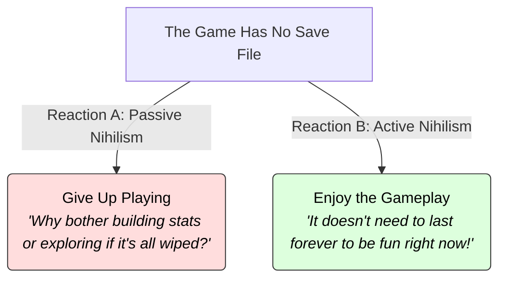

# Nihilism 101: Confronting Nothingness 🌌

If you look at the famous "Pale Blue Dot" photograph taken by the Voyager 1 spacecraft, our entire planet appears as a single, microscopic speck of dust suspended in a vast, dark, empty void. 

It hits you: the universe is billions of light-years wide, contains trillions of stars, and has existed for 13.8 billion years. Humanity has existed for just a blink of an eye on a tiny grain of sand. The universe does not know we are here, and it will eventually collapse or expand into cold, dark silence.

If everything we build, write, love, and fight for will eventually vanish without a trace... **does anything we do actually matter?**

This is the question of **Nihilism** (from the Latin *nihil*, meaning "nothing"). Nihilism is the philosophical belief that life is without objective meaning, purpose, or intrinsic value.

---

## The Metaphor: The Video Game Without a Save File 🎮

To understand how to react to nihilism, think of playing a massive, beautiful open-world video game:

Imagine playing a game like *The Legend of Zelda* or *Skyrim*, but you know that the console has **no save feature**. The moment you turn off the console, your character, your gear, and your progress will be wiped out forever.

How do you react to this news?
*   **Passive Nihilism (The Despairing Player):** You throw down the controller and refuse to play. You say, *"If none of my progress is saved, then playing the game is completely pointless."* This is the path of despair, apathy, and resignation.
*   **Active Nihilism (The Joyful Player):** You keep playing anyway. You say, *"The fact that the game doesn't save doesn't make the first-person experience of playing any less fun! I can still enjoy the story, explore the mountains, and have a great time right now."* 

---

## Three Flavors of Nihilism

Nihilism is not just one idea; it applies to different areas of philosophy:

### 1. Existential Nihilism (No Meaning)
*   **Core Idea:** Life has no inherent meaning or purpose. The universe was not created for us, and nature has no plan. 
*   **The Turn:** While this sounds bleak, existentialists (who build on this idea) see it as a form of liberation. If the universe didn't write a script for you, you are completely free to write your own.

### 2. Moral Nihilism (No Right or Wrong)
*   **Core Idea:** Objective moral facts do not exist. Killing is not "objectively" wrong in the same way gravity is physically real. Morality is just a human construct made of social rules and emotional preferences.
*   **Clarification:** A moral nihilist doesn't necessarily behave like a monster; they just recognize that their preference for kindness is a human choice, not a cosmic law.

### 3. Cosmic Nihilism (No Cosmic Status)
*   **Core Idea:** Human beings are completely insignificant in the grand scale of the cosmos. Our existence is a random cosmic accident, and the universe is entirely indifferent to our suffering or survival.

---

## Friedrich Nietzsche: Active vs. Passive Nihilism

The philosopher most famous for analyzing nihilism was **Friedrich Nietzsche** (1844–1900). Nietzsche saw nihilism as a massive historical crisis. As science replaced religious belief (what he called "the death of God"), society would lose its objective foundation for meaning and morality.

Nietzsche warned against two reactions:
*   **Passive Nihilism:** A decline in the strength of the spirit. When people realize there is no objective meaning, they give up, fall into cynicism, and look for escapes (drugs, distraction, or political dogmas).
*   **Active Nihilism:** An increase in the strength of the spirit. The active nihilist acts like a sledgehammer—they destroy old, false values (like divine rights or dogmas) to clear the ground. Once the old values are gone, they become **creators of new values** based on their own life-force (what Nietzsche called the *Will to Power*).

---

## Why Nihilism Matters

1.  **Mental Freedom:** If you make a mistake, feel embarrassed, or fail, nihilism offers comfort: in the grand scheme of things, it is completely minor. Nobody will remember it in a hundred years. You are free to take risks.
2.  **Creating Genuine Value:** If meaning isn't handed down to you by an authority, then the meaning you create (your love for your family, your art, or your career) is yours. It is valuable *because you choose it*.
3.  **Secular Ethics:** Nihilism forces us to ask: *How do we build a good society if we don't have cosmic commandments?* It drives us to construct ethics based on empathy and human flourishing (like [Humanism 101](Humanism101.md)).

---

## Ready to Explore More?

*   **Read the Existentialists:** Explore how [Existentialism 101](Existentialism101.md) takes the facts of nihilism and builds a positive philosophy of freedom.
*   **Stanford Encyclopedia of Philosophy:** Read academic articles on [Nihilism](https://plato.stanford.edu/entries/nihilism/) and [Nietzsche's moral philosophy](https://plato.stanford.edu/entries/nietzsche-moral-values/).
*   **Watch the Cosmic Perspective:** Watch videos on YouTube analyzing the [Pale Blue Dot](https://www.youtube.com/results?search_query=carl+sagan+pale+blue+dot) speech by Carl Sagan.
