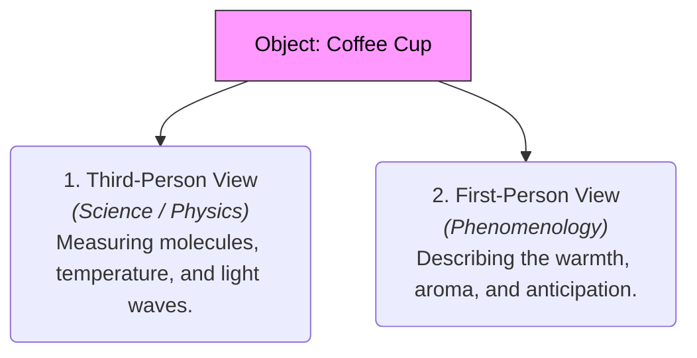

# Phenomenology 101: The Study of Experience 👁️

Imagine sitting in a quiet café. A scientist walks up to your table, points to your cup of hot coffee, and describes it:
*   *"This consists of $H_2O$ molecules, caffeine alkaloids ($C_8H_{10}N_4O_2$), heated to exactly 140 degrees Fahrenheit, reflecting light waves at a wavelength of 700 nanometers (brown)."*

The scientist is mathematically correct. But does that list of data capture what it is actually like to **drink the coffee**? 
*   What about the warm steam rising against your face?
*   What about the rich, roasted aroma that triggers a memory of your grandmother's kitchen?
*   What about the feeling of comfort as you hold the warm ceramic mug?

This direct, raw, first-person experience is what **Phenomenology** studies. Phenomenology is the philosophical movement that investigates the structures of conscious experience from the first-person point of view. Its slogan, coined by founder Edmund Husserl, is: **"Back to the things themselves!"** (i.e., back to how we actually encounter the world, before we build scientific theories about it).

---

## The Metaphor of the First-Person Camera 📹

To understand phenomenology, think of the difference between two ways of filming a movie scene:

*   **The Third-Person Camera (Science/Materialism):** The camera sits on a tripod across the room, recording the actors, the table, and the coffee cup from the outside. It measures positions, lighting, and movement objectively.
*   **The First-Person Camera (Phenomenology):** The camera is strapped to the actor's head. You see what they see, watch their hands reach for the mug, see the steam blur the lens, and feel the motion.

Phenomenology argues that the first-person perspective is where all our knowledge starts. Before a scientist can measure a light wave with a machine, they must first *experience* looking at the screen of the machine. Consciousness is the canvas upon which everything else is painted.

---

## Key Tools of the Phenomenologist

How do we study experience without getting distracted by our assumptions? Phenomenologists developed specific mental tools:

### 1. The Epoché (Bracketing)
Normally, we take the existence of the physical world for granted (what Husserl called the *Natural Attitude*). When you see a tree, you assume it's physically there.
*   **The Epoché:** Husserl suggested we "bracket" (set aside) the question of whether the physical tree actually exists outside of us. Instead, we focus entirely on **how the tree appears in our consciousness**—its shape, color, and how our mind processes the experience of "tree-ness." By bracketing reality, we can study the mechanics of perception itself.

### 2. Intentionality (Aboutness)
As introduced in [Mind 101](Mind101.md), consciousness is never empty; it is always *consciousness of something*. When you think, you think *about* a concept. When you love, you love *someone*. Phenomenology maps how our mind links to the objects of our experience.

### 3. Being-in-the-World (*Dasein*)
Husserl's student, **Martin Heidegger**, took phenomenology in a more practical direction. He argued that we are not detached minds looking at objects. We are fundamentally **Being-in-the-world** (*Dasein*).
*   *Heidegger's Hammer:* When an experienced carpenter uses a hammer, they don't think about the hammer as an object. The hammer becomes an extension of their arm; it becomes "transparent." Only when the hammer breaks does the carpenter stop and look at it as a separate physical object. Heidegger argued we must study how we actively interact with the world, not just how we look at it.

---

## Why Phenomenology Matters

1.  **User Experience (UX) Design:** Good apps are designed phenomenologically. A designer doesn't just look at code; they study the raw, first-person experience of the user: *Does this button feel satisfying to click? Does the transition feel smooth?*
2.  **Psychotherapy:** In therapies like existential therapy or mindfulness, the therapist doesn't just give the patient a brain scan. They ask: *"What does your anxiety feel like in this moment? Where do you feel it in your body?"* They study the raw experience of the patient.
3.  **Artificial Intelligence:** Can a robot be programmed to have phenomenology? A robot can use sensors to detect obstacles, but does it have the first-person experience of "sight"?

---

## Ready to Explore More?

*   **Stanford Encyclopedia of Philosophy:** Read academic overviews of [Phenomenology](https://plato.stanford.edu/entries/phenomenology/) and [Edmund Husserl](https://plato.stanford.edu/entries/husserl/).
*   **Read Heidegger's Ideas:** Look up Heidegger's book *Being and Time* to see how he developed the concept of *Dasein*.
*   **Watch the Summaries:** Search for YouTube videos explaining [Heidegger's Hammer Analogy](https://www.youtube.com/results?search_query=heidegger+hammer+analogy) to see how we interact with tools.
