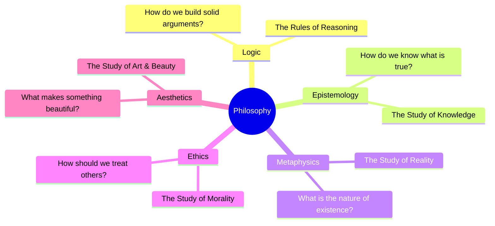

# Philosophy 101: The Operating System of Thought 🧠

When you were a child, you were probably a natural-born philosopher. You likely asked questions like:
*   *"Why is lying wrong?"*
*   *"How do I know that you see the color blue the same way I do?"*
*   *"Why does anything exist at all?"*
*   *"What happens to 'me' when I die?"*

As we grow up, society often tells us to stop asking these questions. We are told to focus on practical things: getting a job, paying taxes, and buying groceries. But those childhood questions don't go away. They form the foundation of how we live, make laws, and decide what is valuable.

Asking these questions systematically is **Philosophy**. 

The word philosophy comes from the ancient Greek words *philo* (meaning love) and *sophia* (meaning wisdom). Literally, it means **the love of wisdom**. It is not a collection of dusty facts; it is a systematic way of questioning, analyzing, and structuring our thoughts.

---

## The Metaphor of the Operating System (OS) 💻

To understand why philosophy matters, think of your mind as a **smartphone**:

*   **The Apps (Daily Tasks):** These are the specific skills you use daily—coding, cooking, accounting, or studying history. 
*   **The Operating System (Philosophy):** This is the underlying software (like iOS or Android) that runs in the background. It manages how the apps talk to one another, determines what is "good" behavior, sets the rules of logic, and decides how you process new information.

```
       ┌────────────────────────────────────────────────────────┐
       │                   THE APPS (Skills)                    │
       │ - Coding, Math, Business, Art, Daily Life              │
       └───────────────────────────▲────────────────────────────┘
                                   │
                             [ Powered by ]
                                   │
       ┌───────────────────────────▼────────────────────────────┐
       │              THE OPERATING SYSTEM (Philosophy)         │
       │ - Logic, Ethics, Epistemology, Values, Critical Thought│
       └────────────────────────────────────────────────────────┘
```

If your phone's OS is full of bugs, outdated rules, or virus files, your apps will crash. Similarly, if your philosophical OS is unexamined—if you have never questioned why you believe what you believe—your decisions, ethics, and career choices will be built on a shaky foundation. Socrates famously warned: **"The unexamined life is not worth living."**

---

## The Five Main Branches of Philosophy

To organize our questioning, philosophers divide the subject into five primary branches:



1.  **Logic:** The rules of correct reasoning. It is the filter we use to separate good arguments from bad ones. (Start with [Logic 101](Logic101.md)).
2.  **Epistemology:** The study of knowledge. It asks: *What is truth? How do our senses and reason acquire knowledge?* (Start with [Epistemology 101](Epistemology101.md)).
3.  **Metaphysics:** The study of the fundamental nature of reality. It asks: *What is time? What is space? Does the mind differ from the brain?* (Start with [Metaphysics 101](Metaphysics101.md)).
4.  **Ethics:** The study of morality. It asks: *What is the good life? How should we act? What is our duty to others?* (Start with [Ethics 101](Ethics101.md) and [Morality 101](Morality101.md)).
5.  **Aesthetics:** The study of beauty, art, and taste. It asks: *What makes a painting art? Is beauty objective or subjective?* (Start with [Aesthetics 101](Aesthetics101.md)).

---

## How to Think Like a Philosopher

Philosophy is a method, not a dogma. It relies on specific practices:
*   **Socratic Questioning:** Continually asking *"Why?"* and *"What do you mean by that?"* to uncover hidden assumptions.
*   **Thought Experiments:** Creating hypothetical scenarios (like the *Trolley Problem* or the *Ship of Theseus*) to isolate and test our moral and logical intuitions.
*   **Charity (The Principle of Charity):** Interpreting your opponent's argument in its strongest, most logical form before trying to critique it. This prevents you from fighting "strawmen."

---

## Why Philosophy Matters Today

1.  **Ethics in Tech:** As we develop artificial intelligence, self-driving cars, and genetic editing, we face massive ethical questions. *How should an automated car choose between hitting a pedestrian or crashing into a wall?* This is a direct application of ethics.
2.  **Critical Thinking:** In an era of social media algorithms and information warfare, philosophy is your armor. It helps you detect logical fallacies and evaluate evidence.
3.  **Finding Purpose:** In a secular world where traditional templates for life are fading, philosophy provides the tools to build your own values, deal with existential anxiety, and live an authentic life.

---

## Ready to Explore More?

*   **Explore the Repository:** Follow the links in the branches above to read the individual "101" guides for each area.
*   **Stanford Encyclopedia of Philosophy:** The premier, peer-reviewed academic resource for [Philosophy](https://plato.stanford.edu/).
*   **Watch the Lectures:** Search for YouTube channels like [Crash Course Philosophy](https://www.youtube.com/results?search_query=crash+course+philosophy) or [School of Life: Philosophy](https://www.youtube.com/results?search_query=school+of+life+philosophy) for engaging visual overviews.
