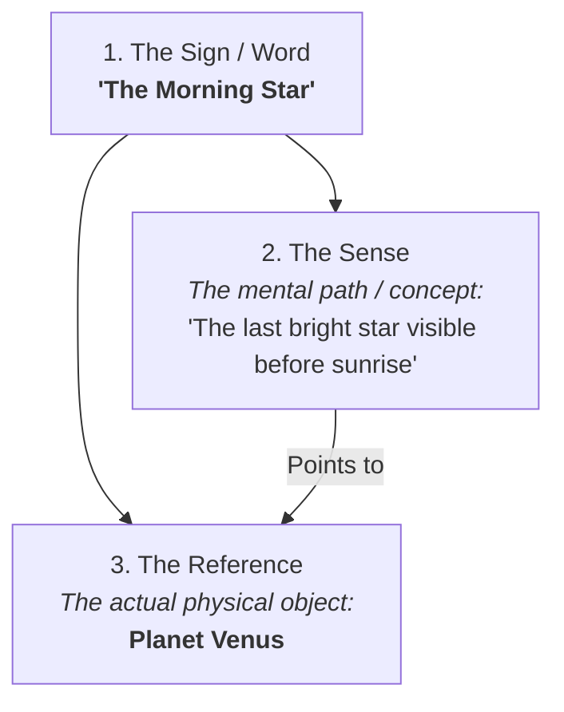

# Philosophy of Language 101: The Magic of Meaning 🗣️

You open your mouth, vibrate your vocal cords, and produce a sound wave that travels through the air: *"Pass the salt."* 

Another person's ear registers the vibration, their brain processes the sound, and they reach out their hand to hand you a small shaker of white crystals. 

Think about how incredibly weird this is. A physical sound wave created by your throat successfully transmitted a specific thought from your mind into another person's mind, resulting in physical action. 

How do words—which are just sounds in the air or black ink on a screen—carry **meaning**? How does language connect to the real world?

This is the focus of the **Philosophy of Language**. It investigates the nature of meaning, language use, cognition, and how language relates to reality.

---

## The Metaphor of the Lego Blocks of Thought 🧱

To understand language, think of words as **Lego blocks**:

```
        ┌────────────────────────────────────────────────────────┐
        │                     WORDS (Lego Blocks)                │
        │ - "Red", "Apple", "Table", "Likes"                     │
        └───────────────────────────▲────────────────────────────┘
                                    │
                              [ Built into ]
                                    │
        ┌───────────────────────────▼────────────────────────────┘
        │                    MEANING (Structure)                 │
        │ - "The red apple sits on the table."                   │
        └────────────────────────────────────────────────────────┘
```

A single block doesn't do much. But when you snap them together using specific rules (syntax/grammar), you can build complex structures (sentences) that represent thoughts. 

However, this metaphor has a catch: a Lego house is a physical object, but a sentence's *meaning* is mental and abstract. If you snap the blocks together to say, *"A blue dragon is flying,"* you built a meaning, even though the physical object doesn't exist in the real world. How do we explain this connection?

---

## Frege's Triangle: Sense and Reference 🔺

In 1892, German philosopher **Gottlob Frege** made a breakthrough by splitting "meaning" into two different parts: **Sense** (*Sinn*) and **Reference** (*Bedeutung*).

To visualize this, think of the **Semiotic Triangle**:



Let's look at a classic example:
1.  **The Morning Star:** The bright object seen in the eastern sky before sunrise.
2.  **The Evening Star:** The bright object seen in the western sky after sunset.

For centuries, people used these two different names. Eventually, astronomers discovered that both names point to the exact same physical object: the **Planet Venus**. 

Frege explained this using his two concepts:
*   **The Reference (The Object):** The actual physical planet Venus. Both names have the *same reference*.
*   **The Sense (The Concept):** The way the object is presented to us. "The star in the morning" and "the star in the evening" have *different senses*. 

This distinction explains how we can learn new things. If we say *"The Morning Star is the Morning Star,"* it is a boring, obvious statement. But if we say *"The Morning Star is the Evening Star,"* it is a scientific discovery, because we connected two different *senses* to the same *reference*.

---

## Wittgenstein's Shift: Language-Games and Meaning as Use 🎲

In the 20th century, **Ludwig Wittgenstein** revolutionized the field. 
*   **His Early View:** Language is a picture of reality. A sentence is like a map; its job is to represent physical facts. If a sentence doesn't point to a physical fact (like religious statements or art claims), it is literally meaningless.
*   **His Later View (The Shift):** Wittgenstein realized language is much broader than just making maps. He introduced the concept of **Language-Games**.

Wittgenstein argued that **meaning is use**. Words do not have fixed, dictionary meanings. Instead, language is like a collection of different games (like chess, soccer, or poker), each with its own rules.
*   *The Word "Water":*
    *   If a scientist in a lab says *"Water,"* they are playing the *scientific naming game* (referring to $H_2O$).
    *   If a thirsty person in a desert screams *"Water!"*, they are playing the *request/command game* (asking for help).
    *   If a father points to a river and tells his child *"Water,"* he is playing the *teaching game*.

The meaning of the word "water" changes depending on the rules of the game you are playing in that moment. Miscommunication happens when we play different games without realizing it.

---

## Why the Philosophy of Language Matters

1.  **Programming Languages:** Computers don't understand human context; they require formal, mathematical syntax. Designing code languages (like Python or JavaScript) requires applying rules of logic and semantics.
2.  **Politics and Framing:** Words are not neutral. Calling a policy "tax relief" instead of "tax cut" changes the "sense" (the mental framing), influencing how voters react, even if the "reference" (the actual policy) is identical.
3.  **Artificial Intelligence:** Large Language Models (LLMs like ChatGPT) generate human-like text. But do they understand the *reference* of the words they use, or are they just playing a complex, statistical *language-game* without knowing what the words connect to in reality?

---

## Ready to Explore More?

*   **Solve the Riddles:** Explore the differences between [Syntax](https://en.wikipedia.org/wiki/Syntax) (rules of structure) and [Semantics](https://en.wikipedia.org/wiki/Semantics) (rules of meaning).
*   **Stanford Encyclopedia of Philosophy:** Read peer-reviewed articles on the [Philosophy of Language](https://plato.stanford.edu/entries/analysis/) and [Wittgenstein](https://plato.stanford.edu/entries/wittgenstein/).
*   **Watch the Lectures:** Search for videos explaining [Wittgenstein's Language Games](https://www.youtube.com/results?search_query=wittgenstein+language+games) on YouTube.
