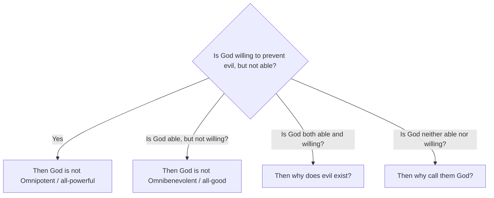

# Philosophy of Religion 101: Faith, Reason, and the Divine 🌌

Imagine the following scenario:
A massive, destructive earthquake strikes a town, collapsing schools and hospitals. Thousands of innocent children are injured or trapped. 

If you had the power to stop this earthquake with a single button, would you press it? 
Almost everyone would say: *Yes, immediately.* To watch children suffer without helping, when you have the power to stop it, seems deeply immoral.

Now, consider the traditional concept of God in major religions (like Christianity, Judaism, and Islam): God is defined as **Omnipotent** (all-powerful), **Omniscient** (all-knowing), and **Omnibenevolent** (all-good).

If an all-powerful, all-knowing, and all-good entity exists... **why does evil and suffering exist in the world?**

This is the famous **Problem of Evil** (or the Epicurean Paradox). It is the central debate in the **Philosophy of Religion**. Philosophy of Religion is the rational study of religious concepts, beliefs, and arguments, exploring them using logic and reason rather than faith or dogma.

---

## The Metaphor of the Parent and the Doctor 🩺

To defend the existence of God in the face of suffering, theologians and philosophers use the metaphor of **the Parent and the Doctor**:

Imagine a loving parent taking their toddler to the clinic. The doctor pulls out a syringe with a sharp needle to administer a vaccine. The toddler screams, cries, and looks at the parent in terror, wondering why the person who loves them is letting this stranger hurt them. 

The toddler does not understand the science of immunology. To them, the needle is pure, unnecessary evil. But the parent knows that the temporary pain is necessary to prevent a far greater suffering (disease) in the future.

```
       ┌────────────────────────┐
       │   PARENT'S PERSPECTIVE │  ◄─── Sees the big picture (Immunity/Health)
       └───────────▲────────────┘
                   │
        [ Temporary Pain Permitted ]
                   │
       ┌───────────▼────────────┘
       │   TODDLER'S EXPERIENCE │  ◄─── Sees only immediate suffering (The needle)
       └────────────────────────┘
```

Philosophers who defend God (a practice called **Theodicy**) argue that humans are like the toddler. We see immediate, terrible suffering, but an all-knowing God might permit that suffering for a greater, long-term cosmic good that our limited human minds cannot yet comprehend (for example, allowing free will to exist, or building human soul-character through overcoming challenges).

---

## The Epicurean Paradox

To map the logical challenge of evil, the ancient Greek philosopher Epicurus structured the debate as a series of questions:



---

## Three Classic Arguments for the Existence of God

Philosophers have used reason to try to prove that God exists. Here are the three most famous arguments:

### 1. The Cosmological Argument (The First Cause)
*   **Core Idea:** Everything that begins to exist has a cause. The universe began to exist (The Big Bang). Therefore, the universe must have a cause. There must be an uncaused "First Cause" (an Prime Mover) that started the domino chain of reality. Philosophers argue this first cause is God.

### 2. The Teleological Argument (The Fine-Tuning/Design Argument)
*   **Core Idea:** The universe is incredibly complex and ordered. If the laws of physics (like the strength of gravity or electromagnetism) were altered by even one part in a trillion-trillion, stars, planets, and life could never have formed. The universe looks like it was "fine-tuned" for life. Just as a pocket watch suggests a watchmaker, a designed universe suggests a Designer.

### 3. The Ontological Argument (The Logic Argument)
*   **Famous Proponent:** St. Anselm (1033–1109).
*   **Core Idea:** God is defined as *the greatest possible being that can be imagined*. 
    *   It is greater to exist in reality than to exist only in the mind (e.g., a real dollar is better than an imaginary dollar).
    *   Therefore, if God only existed in our minds, we could imagine a greater being (one that also exists in reality).
    *   To remain the greatest possible being, God *must* exist in reality.

---

## Why the Philosophy of Religion Matters

1.  **Faith vs. Reason:** It forces us to ask: *Can religious beliefs be defended using logic, or must they rely entirely on faith?* 
2.  **Ethics & Secularism:** If there is no God, where do human rights come from? Do we have a cosmic duty to be good, or must we build our own morality (as explored in [Ethics 101](Ethics101.md))?
3.  **Human Culture:** Religion has shaped human history, art, war, and laws for millennia. Studying it philosophically helps us understand the psychological and historical forces that drive human civilization.

---

## Ready to Explore More?

*   **Stanford Encyclopedia of Philosophy:** Read peer-reviewed overviews of the [Philosophy of Religion](https://plato.stanford.edu/entries/philosophy-religion/) and [The Problem of Evil](https://plato.stanford.edu/entries/evil/).
*   **Test the Arguments:** Research the counter-arguments to the Design Argument, such as Charles Darwin's theory of Natural Selection, which explains complex life without a designer.
*   **Watch the Debate:** Search for videos discussing the [Epicurean Paradox and Theodicies](https://www.youtube.com/results?search_query=epicurean+paradox+problem+of+evil) on YouTube.
