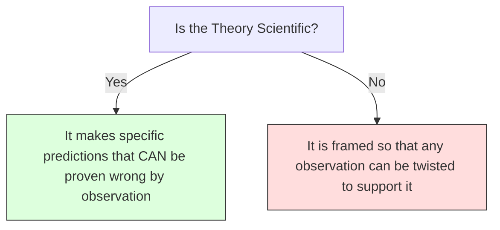

# Philosophy of Science 101: How We Know What Works 🧪

Imagine you are a researcher. You travel the world, observe 1,000 swans, and notice that every single one of them is white. You write a scientific paper concluding: *"All swans are white."* 

Your theory is supported by massive data. But the next day, you travel to Australia and spot a single **black swan**. 

In an instant, your theory is completely destroyed. 

How many white swans do you need to observe to *prove* a theory is true? (An infinite number). How many black swans do you need to *disprove* it? (Just one).

This is the famous **Problem of Induction**. It is a central puzzle in the **Philosophy of Science**. Philosophy of Science is the branch of philosophy that examines the foundations, methods, assumptions, and implications of science. It asks: *What makes a theory scientific? How does science progress? Can we ever know absolute scientific truth?*

---

## The Metaphor of the Detective's Clues 🕵️‍♂️

To understand how science works, think of a scientist as a **detective** solving a crime:

```
        ┌────────────────────────────────────────────────────────┐
        │                 THE DETECTIVE'S CASE                   │
        │                                                        │
        │     ┌────────────────────────────────────────────┐     │
        │     │                  THE CLUES                 │     │  ◄─── Observations & Experiments
        │     │          (Fingerprints, DNA, Alibis)       │     │
        │     └─────────────────────▲──────────────────────┘     │
        │                           │                            │
        │                   [ Formulates & Tests ]               │
        │                           │                            │
        │                   ┌───────┴───────┐                    │
        │                   │  THE THEORY   │                    │  ◄─── Scientific Theory (Falsifiable)
        │                   │ (Suspect is X)│                    │
        │                   └───────────────┘                    │
        └────────────────────────────────────────────────────────┘
```

A detective collects fingerprints, studies DNA samples, and interviews witnesses (Observations). They form a theory: *"Suspect X did it."* 

Can the detective ever be 100% mathematically certain they are right? No—there could always be a crazy alternative scenario (e.g., an identical twin framed them). However, the detective keeps the theory because it explains all the clues, and despite trying to break the alibi, it remains the strongest explanation. 

In science, **we do not prove theories to be 100% true; we find the theories that survive our best attempts to prove them false.**

---

## Karl Popper's Falsifiability: Science vs. Pseudoscience

In the 20th century, philosopher **Karl Popper** asked a key question: *What separates a real scientific theory from a fake one (pseudoscience)?*

He compared two theories of his time:
1.  **Albert Einstein's Theory of Relativity:** Einstein made a bold prediction: gravity bends light. He named a specific star whose position would look shifted during a solar eclipse. If the eclipse happened and the star was in the normal position, Einstein's theory would be proven false. (It was tested and survived).
2.  **Astrology:** An astrologer predicts: *"You will face a challenge today, but also an opportunity."* Can this prediction ever be proven false? If you drop your keys, it's a challenge. If you find a penny, it's an opportunity. It is impossible to disprove.

Popper concluded: **A theory is only scientific if it is Falsifiable (capable of being proven wrong).** If a theory cannot be tested or disproven by any possible observation, it is not science.



---

## Thomas Kuhn and Paradigm Shifts

If science progresses by disproving theories, does it happen smoothly? 
Philosopher **Thomas Kuhn** argued that science progresses in sudden jumps, which he called **Paradigm Shifts**:

1.  **Normal Science:** Scientists operate under a shared "paradigm" (a model of reality, like Newton's physics). They solve puzzles using these rules.
2.  **Anomalies:** Over time, observations occur that don't fit the paradigm (anomalies). At first, scientists ignore them or write them off as errors.
3.  **Crisis:** The anomalies pile up until the old model cannot support them anymore. The scientific community enters a crisis.
4.  **Revolution (Paradigm Shift):** A new model emerges (like Einstein's physics) that explains the old data AND the anomalies. The community shifts to the new paradigm, and the cycle repeats.

---

## Why the Philosophy of Science Matters

1.  **Evaluating Claims:** In debates over climate change, medicine, and nutrition, it helps us ask: *Is this claim based on falsifiable studies, or is it a non-falsifiable conspiracy theory?*
2.  **The Limits of Science:** It reminds us that science is a process, not a holy book. Today's "facts" are simply the best theories that haven't been falsified yet. This keeps science open to progress.
3.  **Science Policy:** It helps governments decide which research to fund (supporting reproducible, peer-reviewed science instead of junk science).

---

## Ready to Explore More?

*   **Solve the Induction Riddle:** Read about David Hume's original argument regarding the [Problem of Induction](https://plato.stanford.edu/entries/induction-problem/).
*   **Stanford Encyclopedia of Philosophy:** Explore peer-reviewed articles on [Karl Popper](https://plato.stanford.edu/entries/popper/) and [Scientific Revolutions](https://plato.stanford.edu/entries/scientific-revolutions/).
*   **Watch the Visual Summaries:** Search for YouTube videos explaining [Thomas Kuhn's Paradigm Shifts](https://www.youtube.com/results?search_query=thomas+kuhn+paradigm+shifts) to see how science evolves.
