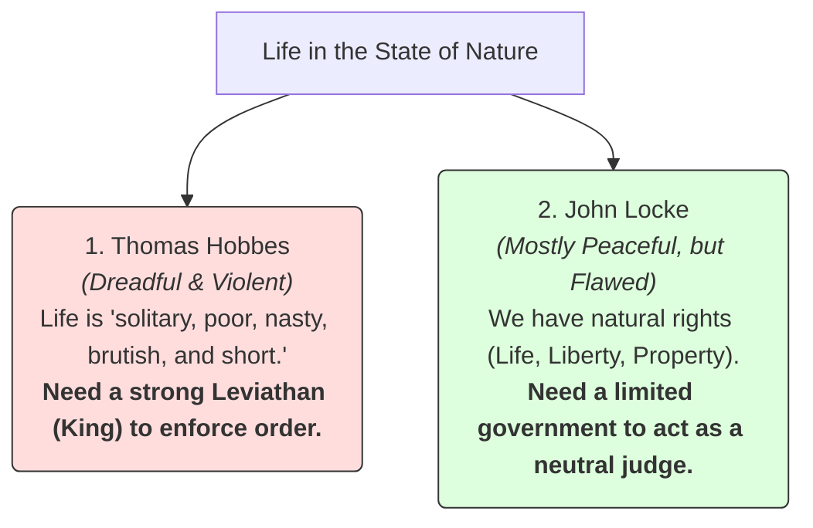

# Political Philosophy 101: Power, Justice, and Society 🏛️

Imagine you are on a cruise ship that crashes. You and 50 survivors wash ashore on a fertile, uninhabited island. 

The immediate shock wears off, and you realize you must survive together. 
*   Who decides where the shelter is built? 
*   If someone finds a bush of berries, do the berries belong to them, or are they shared by everyone?
*   If someone takes your shoes by force, who punishes them?

Do you appoint a single leader? Do you vote on every decision? Or does everyone just do whatever they want?

This is the central challenge of **Political Philosophy**. Political philosophy is the study of fundamental questions about the state, government, politics, liberty, justice, property, and the enforcement of a legal code by authority. It asks: *Why do we need governments? What makes a ruler legitimate? What is the balance between individual freedom and social order?*

---

## The Metaphor of the Club Membership Agreement 📄

To understand how we justify having a government, think of it as joining a **sports club**:

```
        ┌────────────────────────────────────────────────────────┐
        │                  INDIVIDUAL SURRENDER                  │
        │ - You yield unlimited freedom (cannot hit members)     │
        │ - You pay dues (taxes)                                 │
        └───────────────────────────▲────────────────────────────┘
                                    │
                              [ Exchanges for ]
                                    │
        ┌───────────────────────────▼────────────────────────────┘
        │                     COLLECTIVE BENEFIT                 │
        │ - You get access to the club gym (infrastructure)      │
        │ - The club security protects you (police/laws)         │
        └────────────────────────────────────────────────────────┘
```

When you join a club, you sign an agreement. You yield some of your unlimited freedom (e.g., you can't blast music at 3:00 AM in the gym, and you have to pay membership fees). In exchange, you get access to the gym equipment, rules that keep people from stealing your towel, and security. 

In political philosophy, this agreement is called **The Social Contract**. We yield a small slice of our absolute freedom (submitting to laws and paying taxes) to a government in exchange for protection, infrastructure, and order.

---

## The State of Nature: Hobbes vs. Locke

To understand why we signed the Social Contract, philosophers imagined what life was like *before* governments existed—a hypothetical state called **The State of Nature**:



### 1. Thomas Hobbes (The Grim View)
*   **His View of Nature:** Human beings are naturally selfish and driven by fear. Without a government to keep us in check, the state of nature is a permanent state of war of *"every man against every man."* Life is *"solitary, poor, nasty, brutish, and short."*
*   **The Government We Need:** A **Leviathan** (an absolute ruler or king). Hobbes argued that to escape the violent state of nature, we must hand over absolute power to a ruler who keeps the peace by force.

### 2. John Locke (The Optimistic View)
*   **His View of Nature:** Human beings are naturally rational and cooperative. In the state of nature, we have natural rights to **Life, Liberty, and Property**. However, there are no police or neutral judges, so if a dispute occurs, it can escalate into war.
*   **The Government We Need:** A **Limited Democracy**. Locke argued that we create a government *only* to protect our natural rights. If the government fails to protect those rights (or violates them), the citizens have a **right to revolution** to overthrow it. (Locke's ideas heavily inspired the American Declaration of Independence).

---

## Liberty vs. Equality: The Great Political Balance

Once a government is established, it must navigate the tension between two core values:

*   **Liberty (Freedom):** The right of individuals to act, speak, and live without government interference. 
*   **Equality (Fairness):** The state where everyone has the same rights, opportunities, and resources.

If a government maximizes **liberty** (unregulated capitalism), the strong and lucky will accumulate massive wealth, leading to high **inequality**. If a government maximizes **equality** (distributing all resources equally), it must limit individual **liberty** (forcing people to work or seizing property). 

Finding the sweet spot between these two concepts is the divide between modern political ideologies (like liberalism, conservatism, socialism, and libertarianism).

---

## Why Political Philosophy Matters

1.  **Voting and Citizenship:** Every time you vote, you are expressing a preference for a specific political philosophy. Understanding the roots of these ideas helps you make informed choices.
2.  **Evaluating Laws:** When a government proposes a law (like curfew rules, tax changes, or surveillance policies), political philosophy helps us ask: *Is this a legitimate use of government power, or does it violate the Social Contract?*
3.  **Human Rights:** The concept that you have rights simply because you exist—rights that no government can take away—is a direct product of political philosophy.

---

## Ready to Explore More?

*   **Stanford Encyclopedia of Philosophy:** Read peer-reviewed articles on [Social Contract Theory](https://plato.stanford.edu/entries/social-contract/) and [Distributive Justice](https://plato.stanford.edu/entries/justice-distributive/).
*   **Compare the Classics:** Research Thomas Hobbes' *Leviathan* and John Locke's *Second Treatise of Government* to see the original debates.
*   **Watch the Lectures:** Search for Harvard University's famous free lecture series **"Justice with Michael Sandel"** on YouTube for engaging discussions on political philosophy.
