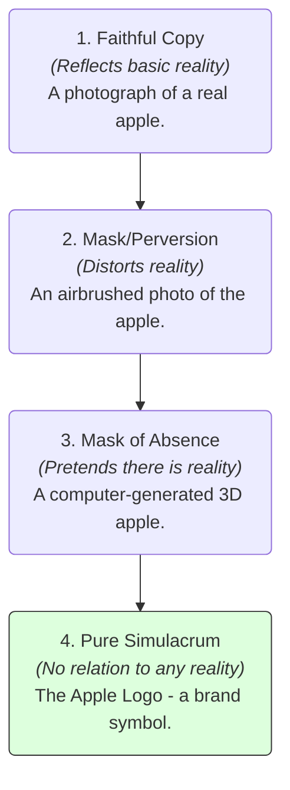

# Postmodernism 101: Questioning the Absolute 🌐

Imagine visiting a replica of Paris built in the middle of a desert in China. It has its own Eiffel Tower, Parisian streetlights, and French cafes. 

You walk around taking photos. You post them on Instagram with a filter that makes it look like a vintage film photo. Your friends comment: *"Wow, Paris looks beautiful!"* 

Where is the "real" experience? 
*   Is it the physical concrete tower in China?
*   Is it the original iron tower in France?
*   Is it the digital pixels on your friends' phone screens?

We live in a world saturated by screens, copies, media feeds, and advertisements. Sometimes, the representation of a thing feels more real to us than the thing itself. 

This environment is the playground of **Postmodernism**. Postmodernism is a late-20th-century movement in philosophy, art, and criticism that is characterized by broad skepticism, subjectivism, or relativism. It is a suspicious reaction to the "modern" belief in absolute truths, scientific certainty, and inevitable human progress.

---

## The Metaphor of the Copy of a Copy (Simulacra) 🖨️

To understand postmodernism, think of a photocopy machine:

Imagine painting a beautiful, original picture of a flower (The Reality). 
1.  You scan it and print a copy.
2.  You take that printed copy, scan it, and print a copy of the copy.
3.  You repeat this process 1,000 times.

```
[ Original Flower ] ──► [ Copy 1 ] ──► [ Copy 2 ] ──► ... ──► [ Copy 1,000 ]
  (Raw Reality)                                                (Pure Simulacrum)
                                                                 No connection to 
                                                                 original flower!
```

By the 1,000th print, the image is distorted, pixelated, and looks nothing like a real flower. It has become a new object entirely. 

Philosopher Jean Baudrillard called these copies **Simulacra**. He argued that modern society has replaced real things with symbols and signs. Our experience of life is a simulation, where we interact with copies of copies that have no connection to any original reality.

---

## Baudrillard's Four Stages of the Image

Baudrillard mapped out how our connection to reality has broken down over history in four distinct steps:



1.  **Stage 1 (Faithful Reflection):** The sign represents a clear reality. (e.g., a hand-drawn map of a forest).
2.  **Stage 2 (Perversion of Reality):** The sign hides or distorts the reality. (e.g., a map that exaggerates the size of a king's estate to make them look powerful).
3.  **Stage 3 (Absence of Reality):** The sign pretends to represent a reality that isn't actually there. (e.g., a map of a mythical island like Atlantis).
4.  **Stage 4 (Pure Simulacrum):** The sign has no relationship to any reality whatsoever. It is its own clean simulation. (e.g., Disney World—a replica of a fairytale kingdom that never existed, built purely as an interactive environment).

---

## Core Pillars of Postmodern Philosophy

Beyond Baudrillard, other postmodern philosophers introduced key tools:

### 1. Rejection of Meta-Narratives (Lyotard)
Jean-François Lyotard defined postmodernism as **"incredulity toward meta-narratives."** 
*   **Meta-narratives** are the grand stories we tell to explain history and justify our societies. Examples include: *Science will solve all problems,* *History is a steady progress toward freedom,* or *One specific religion will save humanity.*
*   Postmodernists argue that these grand stories are dangerous tools used by those in power to control people. They prefer "local narratives"—diverse, small-scale stories and perspectives.

### 2. Deconstruction (Derrida)
Jacques Derrida created **Deconstruction**, a method of reading texts to find their internal contradictions. 
*   He showed that Western thinking is built on binary oppositions (e.g., speech vs. writing, male vs. female, rational vs. emotional), where one side is always treated as "better."
*   Deconstruction flips these binaries upside down, showing that they rely on each other and that language is slippery, never holding a single, final meaning.

---

## Why Postmodernism Matters Today

1.  **Social Media & Identity:** Instagram, TikTok, and filters let us create simulations of our lives. We curate a digital "simulacrum" of happiness and success. Sometimes, people get depressed because their real life doesn't match the digital simulation they constructed.
2.  **Media & "Post-Truth":** In the news, we see debates over "alternative facts." Postmodernism predicted this: when we reject the idea of objective truth, truth becomes a battle of stories, where whoever has the loudest media feed wins.
3.  **Art and Architecture:** Postmodern art is famous for irony, parody, and mixing different styles (bricolage). It doesn't try to be "pure" or "original"; it celebrates the copy, the mashup, and the remix.

---

## Ready to Explore More?

*   **Stanford Encyclopedia of Philosophy:** Read academic articles on [Postmodernism](https://plato.stanford.edu/entries/postmodernism/) and [Jacques Derrida](https://plato.stanford.edu/entries/derrida/).
*   **Explore the Text:** Look up summaries of Jean Baudrillard’s book *Simulacra and Simulation* (which was a major inspiration for the movie *The Matrix*).
*   **Watch the Critiques:** Search for YouTube lectures discussing [Nietzsche's influence on Postmodernism](https://www.youtube.com/results?search_query=nietzsche+and+postmodernism) to see where these ideas started.
