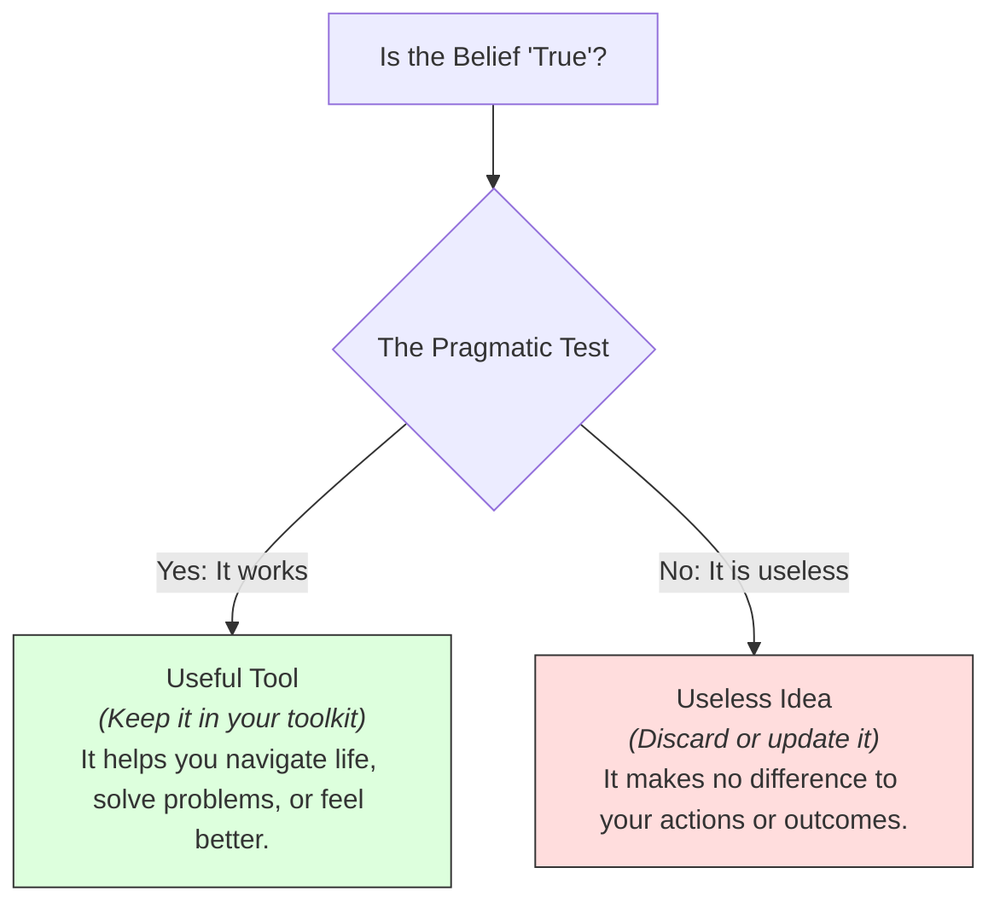

# Pragmatism 101: Truth is What Works 🛠️

Imagine two scholars sitting at a table debating a glass containing water. 
*   **Scholar A** argues passionately: *"The glass is objectively half-full! We must focus on the positive presence of the liquid."*
*   **Scholar B** argues back: *"No! The glass is half-empty! We must address the tragic absence of the water."*

They debate for hours, citing ancient texts and logical formulas. 

A **Pragmatist** walks up, looks at the glass, drinks the water, and says: *"The debate is useless. The water was real because it successfully quenched my thirst. Now, let's go find a tap to refill the glass."*

What is the point of an idea? Is it to paint a perfect, abstract picture of the universe, or is it to help us solve problems and navigate life?

This is the core approach of **Pragmatism**. Pragmatism is a school of philosophy (developed in the United States in the late 1800s by thinkers like William James, Charles Sanders Peirce, and John Dewey) that evaluates the truth or value of an idea by its **practical consequences** and usefulness.

---

## The Metaphor of the Swiss Army Knife 🇨🇭

To understand pragmatism, think of your beliefs as tools in a **Swiss Army Knife**:

If you are lost in a forest, you don't ask: *"Is this screwdriver blade 'beautiful' or 'inherently true' in an abstract sense?"* You ask: *"Does this blade turn the screw? Does the knife blade cut the branches?"* 

A tool is "true" if it does the job it was designed to do. 

Pragmatists argue that **ideas and beliefs are tools, not pictures.** We should not ask if a belief is an "accurate copy" of an abstract reality. We should ask: *"What difference does holding this belief make to my life? How does it help me act?"* If an idea works, solves problems, and helps us adapt, we call it "true."

---

## William James: The "Cash Value" of Truth

Philosopher **William James** (1842–1910) wrote that we should look for the **"cash value"** of an idea. By this, he didn't mean money; he meant: *What does this idea pay out in terms of actual human experience?*

He applied this to difficult, non-scientific beliefs, like religion:
*   Imagine a person who believes in a loving God. Because of this belief, they feel peace, behave kindly to their neighbors, and find the courage to recover from addiction.
*   James argued that for this person, the belief has high "cash value." It produces positive, physical consequences. Therefore, we can say the belief is "true" *for them*, because it functions effectively in their life. 

Truth is not static; it is something that *happens* to an idea when it is put to work. James wrote: **"Truth is what happens to an idea. It becomes true, is made true by events."**

---

## John Dewey: Instrumentalism and Education

**John Dewey** (1859–1952) applied pragmatism to society and schools, a view called **Instrumentalism**. 
*   Dewey argued that the human mind evolved as an instrument for survival. We think to solve problems (like finding food or escaping danger).
*   **Learning by Doing:** Because the mind is an active tool, Dewey revolutionized education. He argued that children shouldn't sit silently in rows memorizing abstract lists. Instead, they should learn by doing—running experiments, building projects, and solving real-world problems.

---

## Why Pragmatism Matters Today

1.  **Science & Engineering:** Engineers are natural pragmatists. They don't wait for physicists to solve the absolute, ultimate metaphysics of quantum space. They use the formulas that work to build bridges, microchips, and medical scanners today.
2.  **Agile & Startup Culture:** The concept of the "Minimum Viable Product" (MVP) is pure pragmatism. Instead of planning a perfect product for years in theory, you ship a simple version, see how users interact with it (practical feedback), and update it based on what works.
3.  **Reducing Dogmatism:** Pragmatism defuses ideological wars. Instead of arguing over absolute, abstract dogmas, it forces us to ask: *What are the actual, measurable consequences of this policy on real people?*

---

## Ready to Explore More?

*   **Stanford Encyclopedia of Philosophy:** Read peer-reviewed overviews of [Pragmatism](https://plato.stanford.edu/entries/pragmatism/) and [William James](https://plato.stanford.edu/entries/james/).
*   **Explore the Founders:** Read summaries of Charles Sanders Peirce’s 1878 paper, *How to Make Our Ideas Clear*, which started the pragmatist movement.
*   **Watch the Lectures:** Search for YouTube videos discussing [John Dewey's Pragmatism in Education](https://www.youtube.com/results?search_query=john+dewey+education+pragmatism) to see how it shaped modern classrooms.
