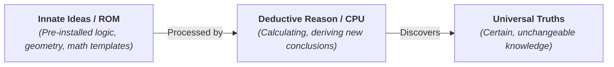

# Rationalism 101: Truth Through Reason 🧠

Imagine a person born completely blind and deaf. They have never seen a physical triangle drawn on a chalkboard, nor have they ever heard a teacher describe one. 

Yet, sitting alone in quiet contemplation, this person can calculate that if you draw a three-sided shape on a flat surface, the three internal angles must **always add up to exactly 180 degrees**. 

How is this possible? They didn't observe this fact in the physical world. They didn't run an experiment measuring 100 triangles with a protractor. They discovered a universal, unchangeable law of the universe using nothing but the power of **pure reason**.

Where does our most reliable knowledge come from? 

This is the question of **Rationalism**. Rationalism is the epistemological view that **reason** is the primary source of knowledge, independent of sensory experience. It stands in direct contrast to [Empiricism 101](Empiricism101.md) (which argues that all knowledge comes from the senses).

---

## The Metaphor of the Pre-installed Software 💻

To understand rationalism, think of the human mind at birth not as a blank whiteboard (Locke's *Tabula Rasa*), but as a brand-new **smartphone**:

When you turn on a new phone, the hard drive is not empty. It contains an operating system (ROM) and pre-installed apps (logic, mathematical templates, and structural rules). Even without connecting to the internet (sensory experience), the phone can run calculations and organize data because the templates are built-in.

Rationalists argue that the human mind has **Innate Ideas**—concepts we are born with (like the laws of logic, basic geometry, and the concept of cause and effect). Our senses are too messy and limited to give us absolute, universal truths. We must look inward to the templates already installed in our reason.

---

## The Rationalist Path: Deduction

While empiricists rely on **induction** (observing specific cases to guess a general rule), rationalists rely on **deduction** (starting with a self-evident, innate rule and deriving specific truths with 100% certainty).

Let's look at the classic rationalist approach:
1.  **Start with Intuition:** We find a truth that is so clear and distinct that it is impossible to doubt. (e.g., Descartes' *"I think, therefore I am"*).
2.  **Apply Deduction:** We use logic to build new truths on top of that foundation.
    *   *Premise 1:* I am thinking.
    *   *Premise 2:* A thought requires a thinker (substance).
    *   *Conclusion:* Therefore, I exist as a thinking substance.

Rationalists argue that this method yields **certainty**, whereas sensory observation only yields **probability**. (Your eyes can be fooled by optical illusions, but the rules of math cannot be fooled).

---

## The Big Three Rationalists

During the 17th-century Enlightenment, three thinkers defined the rationalist movement:

*   **René Descartes (1596–1650):** Tried to doubt everything until he found the indubitable foundation (*"Cogito, ergo sum"*). He argued that our idea of a perfect God is innate, placed in our minds like a craftsman's mark on a pot.
*   **Baruch Spinoza (1632–1677):** Built a complete model of the universe styled like a geometry textbook. He started with basic axioms and deduced that God and nature are the exact same physical-mental substance (Pantheism).
*   **Gottfried Wilhelm Leibniz (1646–1716):** Co-invented calculus. He argued that the universe is made of tiny, immaterial units of force called *Monads*, coordinated in a pre-established harmony by God.

---

## Why Rationalism Matters Today

1.  **Mathematics and Physics:** Theoretical physicists (like Einstein or string theorists) are highly rationalist. They often calculate the existence of things (like black holes, gravitational waves, or new particles) using pure mathematics years before engineers build instruments to observe them physically.
2.  **Innate Language (Chomsky):** In linguistics, Noam Chomsky revolutionized the field by showing that human children learn languages too fast to be simple "blank slates" copying sounds. He argued we have an innate, pre-installed "Universal Grammar" template in our brains.
3.  **AI & Logic Systems:** Symbolic AI (expert systems that operate on strict logical rules and deductions) is built on rationalist principles, compared to machine learning which is highly empiricist.

---

## Ready to Explore More?

*   **Stanford Encyclopedia of Philosophy:** Read peer-reviewed articles on [Rationalism vs. Empiricism](https://plato.stanford.edu/entries/rationalism-empiricism/) and [Innate Ideas](https://plato.stanford.edu/entries/innate-cognition/).
*   **Read the Classics:** Look up Descartes' *Meditations on First Philosophy* to see how he doubted his senses to find rational certainty.
*   **Watch the Debate:** Search for YouTube videos summarizing the [Rationalism vs. Empiricism debate](https://www.youtube.com/results?search_query=rationalism+vs+empiricism) to see how both sides shaped history.
