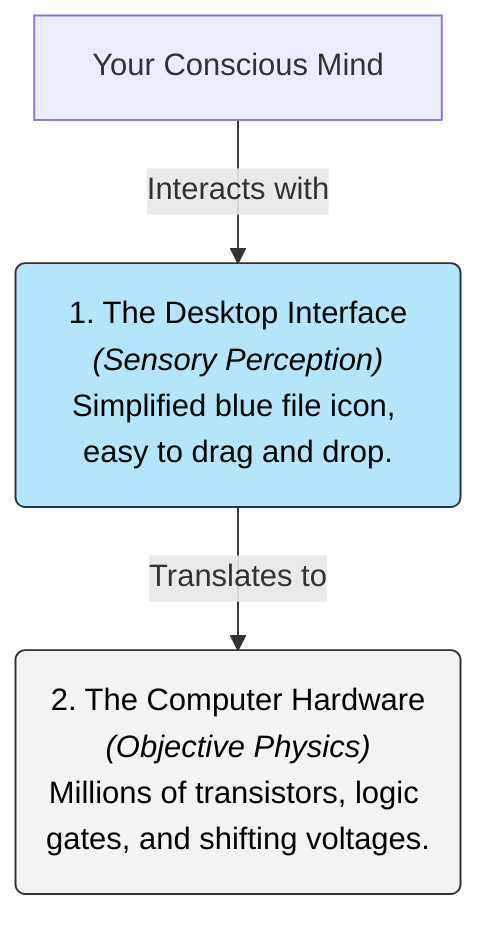

# Reality 101: The Limits of the Experienced World 🌀

Lean forward and knock your knuckles against a solid wooden desk or table. You hear a sharp *thud*, and your hand stops flat against the surface. 

To your senses, the table is solid, brown, static, and real. 

But now, ask a quantum physicist to describe the exact same table:
*   *"The table is actually 99.999999999% empty space. It consists of tiny subatomic probability-clouds (electrons, protons, quarks) separated by vast distances, vibrating at high speeds. The 'solidity' you feel is just the electromagnetic force repelling the electrons in your hand from the electrons in the table."*

Which table is **real**? The solid, static brown wood, or the empty, vibrating quantum storm? 

This is the central question of **Reality**. Reality is the sum or aggregate of all that is real or existent, as opposed to that which is only imaginary, fictional, or simulated. It asks: *How does our perception connect to objective reality? Is what we see a direct mirror of the universe, or is it a simplified interface designed for survival?*

---

## The Metaphor of the Desktop Icons 🖥️

To understand how our brains process reality, cognitive scientist Donald Hoffman proposed a famous analogy: **The Desktop Interface**.

Imagine you are writing a document on your computer. On your screen, you see a neat, blue, rectangular **file icon** representing your document.

How do you interact with this document?
*   **Naive Realism (The Mirror View):** You assume that inside your computer's motherboard, there is a tiny, physical blue rectangle sitting on a piece of silicon. (Of course there isn't. The real document consists of millions of shifting electrical voltages, transistors, and logic gates).
*   **Interface Realism (The Pragmatic View):** You recognize that the blue file icon is a **necessary simplification**. If you had to manually toggle millions of voltages to write an email, your brain would melt. The icon *hides the complex truth* to help you get the job done.

Hoffman argues that **evolution shaped our senses to be desktop icons.** We do not see objective reality (the quantum voltages of the universe) because it is too complex. Instead, our brain projects a simplified interface—colors, shapes, smells, and solidity—to help us survive and reproduce. A snake or a bat has a completely different interface because they have different survival needs.

---

## Realism vs. Anti-Realism: A Quick Spectrum

How do we define our relationship to the objective world? Philosophers map three main positions:

1.  **Naive Realism (Direct Realism):** 
    *   *The View:* What you see is what is there. The sky is objectively blue, the apple is objectively sweet, and the table is objectively solid, exactly as you perceive them.
    *   *Weakness:* Easily disproven by optical illusions, colorblindness, and quantum physics.
2.  **Scientific Realism:**
    *   *The View:* The physical world exists independently of us, but our senses are limited. The "real" world is the one described by our best scientific theories (atoms, forces, gravity), and our sensory experiences are just byproducts.
    *   *Weakness:* Science itself relies on human observations, which must pass through our sensory filters first.
3.  **Idealism (Immaterialism):**
    *   *The View:* As explored in [Idealism 101](Idealism101.md), reality is fundamentally mental. The table only exists because a mind is perceiving it.

---

## Why Reality Matters

1.  **Mental Health & Reframing:** In cognitive behavioral therapy (CBT), patients learn that their "reality" is shaped by their cognitive filters. If you look at the world through a filter of fear, you perceive danger everywhere. Changing your filters changes your experienced reality.
2.  **Virtual Reality (VR):** As VR headsets and haptic suits improve, we will eventually build virtual worlds that feel completely solid and real to our senses. This will force us to redefine what makes an environment "real."
3.  **Exploring the Unknown:** Knowing that our senses only show us a tiny slice of the electromagnetic spectrum (we cannot see infrared, ultraviolet, or radio waves) keeps us curious. Science is the tool we use to build instruments that extend our interface.

---

## Ready to Explore More?

*   **Donald Hoffman's TED Talk:** Watch Donald Hoffman's talk [Do we see reality as it is?](https://www.ted.com/talks/donald_hoffman_do_we_see_reality_as_it_is) on YouTube for an engaging visual explanation of the Desktop Interface theory.
*   **Stanford Encyclopedia of Philosophy:** Explore peer-reviewed articles on [Realism](https://plato.stanford.edu/entries/realism/) and the [Observer Effect](https://plato.stanford.edu/entries/qt-issues/) in physics.
*   **Read the thought experiment:** Look up the *Ship of Theseus* or *Schrödinger's Cat* to see how reality and observation intersect in philosophy and physics.
