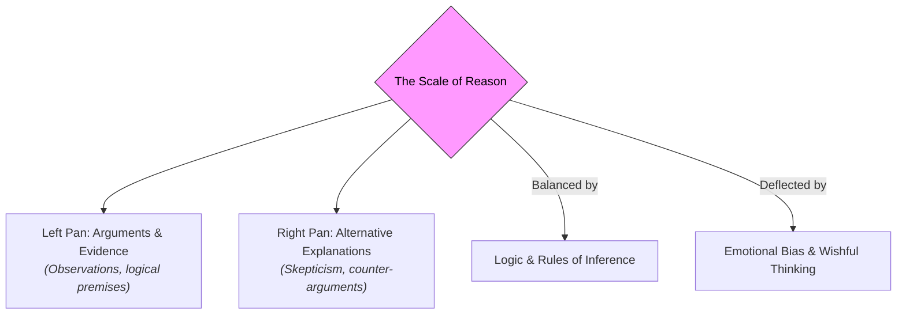

# Reason 101: The Mechanics of Rational Thought ⚖️

Imagine finding an old parchment map that claims to show the location of a chest of gold coins buried in a local park. 

How do you decide what to do?
*   **Impulse:** You grab a shovel, run out of the house, and start digging up random lawns based on a hunch.
*   **Faith:** You sit on your couch, close your eyes, and pray that the gold magically transports itself to your living room.
*   **Reason:** You study the landmarks on the map, compare them to Google Earth, check historical records to see if the map is a known fake, and calculate the exact coordinates before digging.

Which approach is most likely to lead you to the gold? 

This is the power of **Reason**. Reason is the capacity for consciously making sense of things, establishing and verifying facts, applying logic, and adapting or justifying practices, beliefs, and institutions based on new information. It is the counterweight to superstition, emotional reactivity, and impulsive behavior.

---

## The Metaphor of the Balance Scale ⚖️

To understand how reason functions, think of it as a classic **Balance Scale**:



When we make a decision or choose a belief, our mind acts like a merchant weighing goods. 
*   On one pan, we place the evidence, facts, and logical reasons *for* the idea.
*   On the other, we place the counter-evidence and alternative explanations.
*   **Reason is the calibration of the scale.** It ensures that we weigh both sides fairly, following the laws of logic, rather than letting our emotional desires (wishful thinking) push down on one side of the scale to cheat the result.

---

## Reason vs. Emotion: A Balanced Relationship

For centuries, philosophers treated reason and emotion as bitter enemies. 
*   Ancient Greeks compared the mind to a chariot driver (Reason) struggling to control two wild horses (Passions/Emotions).
*   However, modern cognitive science shows they are partners. Emotion tells us *what we care about* (e.g., you feel empathy for a suffering person), while reason acts as the strategist, calculating *how to help them effectively* without making the problem worse. 

```
┌───────────────────────────────────────┐      ┌───────────────────────────────────────┐
│          EMOTIONAL REACTION           │      │          RATIONAL REFLECTION          │
│ - You feel anger at a headline.       │ ───► │ - You search for the source.          │
│ - You immediately share the post.     │      │ - You check for logical fallacies.    │
│ - Result: You spread misinformation.  │      │ - Result: You find the objective truth.│
└───────────────────────────────────────┘      └───────────────────────────────────────┘
```

---

## Cognitive Biases: The Rust on the Scale

Even when we try to be rational, our brains have built-in shortcuts (evolved to help us make fast decisions in the wild) that distort our reason. These are called **Cognitive Biases**:

1.  **Confirmation Bias:** The tendency to search for, interpret, and recall information in a way that confirms your pre-existing beliefs. (e.g., if you believe a politician is bad, you only read articles detailing their scandals and ignore their achievements).
2.  **The Bandwagon Effect:** The tendency to believe or do something because many other people do or believe the same. (e.g., following a trend or a belief system simply to fit in with your social circle).
3.  **Availability Heuristic:** Estimating the likelihood of an event based on how easily examples of it come to mind. (e.g., being terrified of a shark attack because you watched a movie about it, even though you are statistically far more likely to get hit by a falling coconut).

To be rational, we must actively inspect our scale for these mental biases and adjust our weights accordingly.

---

## Why Reason Matters

1.  **Science & Medicine:** The scientific method is the ultimate structured application of reason. It ensures we test drugs using double-blind control trials, letting data decide if a treatment works rather than relying on a doctor's hunch.
2.  **Conflict Resolution:** When individuals or nations disagree, they can fight (force) or they can debate using reason. A peaceful, democratic society is built on the belief that we can resolve conflicts by sharing arguments and letting the strongest reason win.
3.  **Personal Decisiveness:** Applying reason protects you from making major life decisions based on fleeting emotions (like buying an expensive car you can't afford because you felt insecure in the showroom).

---

## Ready to Explore More?

*   **Deepen the Logic:** Read [Logic 101](Logic101.md) to learn the formal rules and structures of deduction and induction.
*   **Stanford Encyclopedia of Philosophy:** Explore peer-reviewed articles on [Rationality](https://plato.stanford.edu/entries/rationality/) and [Historic Views of Reason](https://plato.stanford.edu/entries/reason-historic/).
*   **Audit Your Biases:** Visit [Pocket Biases](https://www.pocketbiases.com/) or read Daniel Kahneman’s book *Thinking, Fast and Slow* to learn how your brain tricks you.
