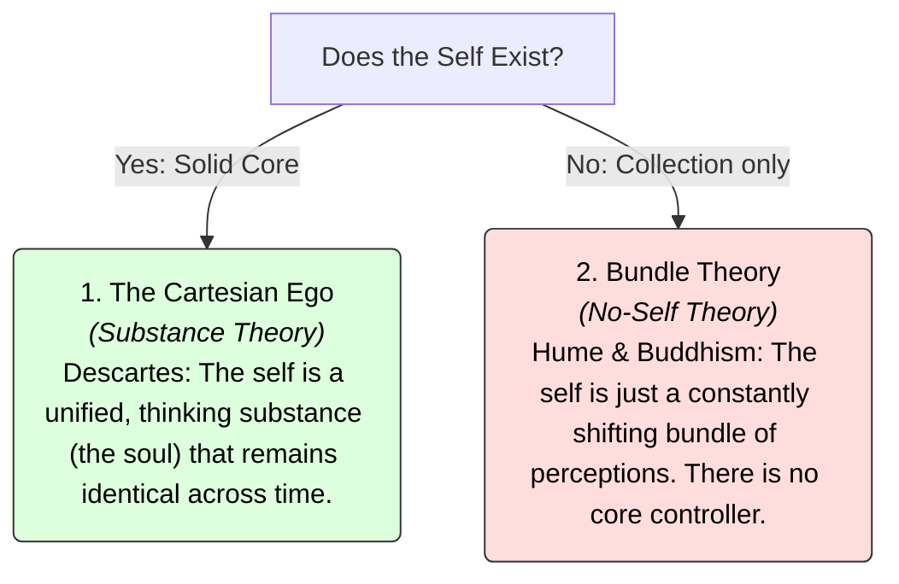

# Self 101: The Search for Who You Are 🧅

Pull out a photo of yourself taken ten years ago. 

Look at the face in the picture. In the ten years since it was taken:
*   Almost every cell in your physical body has died and been replaced.
*   Your personality, beliefs, and interests have likely shifted.
*   The physical location where you live, work, or study is probably different.

Yet, you look at the photo and say: *"That is **me**."* 

What is this "me"? If your body has changed, your thoughts have changed, and your memories have faded, what is the link that connects the child you once were, the person you are today, and the elderly person you will eventually become? 

Does a permanent, unchanging **Self** actually exist inside you?

This is the question of the **Self** in philosophy and psychology. It explores the nature of self-consciousness, personal identity, and whether our feeling of a solid "I" is a reality or a sophisticated mental illusion.

---

## The Metaphor of the Onion 🧅

To understand the debate over the self, think of your identity as an **onion**:

Imagine trying to find the "core" of the onion. You start peeling away the outer layers:

```
        ┌────────────────────────────────────────────────────────┐
        │                     LAYERS OF SELF                     │
        │ - Layer 1: The physical body & face                    │
        │ - Layer 2: Your memories & experiences                 │
        │ - Layer 3: Your beliefs, political views, & values     │
        │ - Layer 4: Your daily desires, emotions, & habits     │
        └───────────────────────────▲────────────────────────────┘
                                    │
                         [ Peeling them all away ]
                                    │
        ┌───────────────────────────▼────────────────────────────┘
        │                 WHAT IS LEFT AT THE CENTER?            │
        │ - View A (Cartesian): An unchanging soul / nucleus     │
        │ - View B (Hume/Buddist): Nothing! The layers are all   │
        │   that existed.                                        │
        └────────────────────────────────────────────────────────┘
```

If you peel away your body, your memories, your beliefs, your desires, and your habits, what is left at the center?
*   **The Cartesian View (The Nucleus):** There is a solid, unchanging, spiritual "soul" or conscious nucleus sitting at the center of the onion. The layers are just clothes it wears.
*   **The Bundle View (The Empty Center):** There is nothing at the center. Once you peel away all the layers, the onion is gone. The "onion" was never a single thing at the center; it was just the **collection of layers** itself.

---

## The Great Debate: Cartesian Ego vs. Bundle Theory

Philosophers generally split into two camps when analyzing what the self is:



### 1. The Cartesian Ego (Substance Theory)
*   **Famous Proponent:** René Descartes.
*   **Core Idea:** The self is a unified, non-physical substance (a soul) that remains identical throughout your life. It is the "observer" sitting in the [Cartesian Theater](Mind101.md) of your mind.
*   **Why it's comforting:** It guarantees that you remain the same person through memory loss, aging, and potentially even death (afterlife).

### 2. David Hume's Bundle Theory (No-Self)
*   **Core Idea:** If you look closely inside your own mind, you never encounter a "self." You only ever find specific, fleeting perceptions: a flash of heat, a memory of a song, a feeling of hunger, or a thought of work. Hume argued that the self is nothing but a **bundle or collection of different perceptions**, succeeding one another with inconceivable rapidity.
*   **Buddhism (*Anatta*):** Over 2,000 years before Hume, the Buddha taught the doctrine of *Anatta* (non-self). He argued that clinging to the illusion of a permanent self is the root cause of all human suffering. Once we realize the self is a fluid process, we can find peace.

---

## Why the Self Matters

1.  **Mental Health & Growth:** If you believe you have a fixed, unchanging self, you might say, *"I am just a lazy person; it's who I am."* But if the self is a fluid bundle of habits and thoughts, you are free to change. You aren't "lazy"; you just have a temporary pattern of behavior that you can reshape.
2.  **Death & Teleportation:** As explored in [Identity 101](Identity101.md), if you believe in a Cartesian ego, teleportation is terrifying because your soul might not make the trip. If you are a bundle theory believer, as long as the psychological pattern is copied, "you" have survived.
3.  **Modern Neuroscience:** Brain scans show no "center" or CPU where the self lives. Instead, different regions of the brain cooperate, and a network called the **Default Mode Network (DMN)** constructs our feeling of a narrative self. When people take psychedelics or meditate deeply, the DMN quiets down, resulting in the experience of "ego death" or feeling unified with the universe.

---

## Ready to Explore More?

*   **Understand Personal Identity:** Read [Identity 101](Identity101.md) to see how the self relates to physical and psychological continuity.
*   **Stanford Encyclopedia of Philosophy:** Explore peer-reviewed articles on [The Self](https://plato.stanford.edu/entries/self-knowledge/) and [Hume's views on Personal Identity](https://plato.stanford.edu/entries/hume-moral/#Pers).
*   **Watch the Neuroscience:** Search for videos discussing the [Default Mode Network and Ego Death](https://www.youtube.com/results?search_query=default+mode+network+ego+death) to see how science explains the illusion of self.
