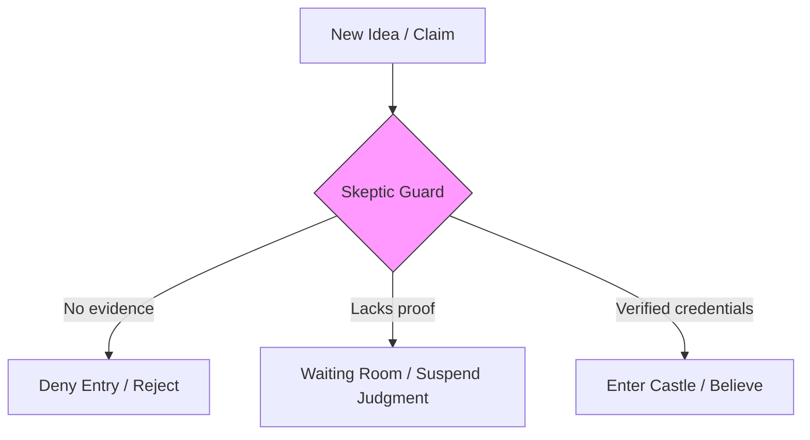

# Skepticism 101: The Power of Doubt 🛡️

A friend pulls you aside and whispers: *"Did you hear? The President is secretly a shape-shifting lizard-alien from another galaxy. I read it on a blog!"*

How do you react?
*   **Gullibility:** You gasp, immediately believe them, and text your family to warn them about the lizard menace.
*   **Cynicism:** You roll your eyes, get angry, and call your friend an idiot without checking anything.
*   **Skepticism:** You ask: *"What is the evidence? Where did the blogger get their sources? Are there photos, documents, or peer-reviewed findings, or is it just a rumor?"*

We are flooded with advertisements, headlines, and claims every day. How do we keep our minds from being cluttered by false beliefs?

The shield we use is **Skepticism**. Skepticism is the philosophical attitude of doubting knowledge claims, demanding solid evidence, and suspending judgment when evidence is lacking. 

---

## The Metaphor of the Guard at the Gate 🏰

To understand skepticism, think of your mind as a **castle**:

Your beliefs are the residents living inside the castle. 
*   **Gullibility** is leaving the castle gates wide open, letting any traveling salesman, rumor, or scammer walk in and make themselves at home.
*   **Cynicism** is locking the gates shut with iron bars, refusing to let *anyone* in, even family members carrying groceries (refusing to believe new facts even when evidence is presented).
*   **Skepticism is hiring a professional Guard at the gate.** The guard stops every new visitor and asks: *"Where is your passport? Show me your credentials (evidence) before I let you enter."* The guard keeps the castle safe without locking out truth.

---

## Two Kinds of Skepticism

Philosophers look at skepticism in two very different ways:

### 1. Healthy (Scientific) Skepticism (A Tool for Daily Life)
*   **Core Idea:** We should proportion our beliefs to the evidence. If a claim is extraordinary, it requires extraordinary evidence. We don't deny that truth exists; we just make sure we check the credentials before believing.
*   **Carl Sagan's Rule:** *"Keep your mind open, but not so open that your brains fall out."*

### 2. Radical (Philosophical) Skepticism (A Tool for Testing Certainty)
*   **Pyrrhonism (Ancient Greece):** Pyrrho of Ellis argued that we can never know the true nature of reality. Because our senses can be fooled, we should suspend judgment on *everything*. By giving up the struggle to find absolute truths, we can find peace of mind (*Ataraxia*).
*   **Cartesian Doubt:** As introduced in [Epistemology 101](Epistemology101.md), Descartes used radical doubt as a sledgehammer. He doubted his senses, his memory, and even mathematics (imagining an "evil demon" fooling him) to see if there was *anything* that survived the doubt. (Only the fact that he was doubting/thinking survived: *I think, therefore I am*).

---

## The Skeptic's Toolkit: How to Audit a Claim

When you encounter a new belief, apply these three questions:
1.  **What is the source?** Is the claim coming from a peer-reviewed scientific journal, or a random social media post? Who benefits if you believe this claim?
2.  **Is it falsifiable?** As explored in [Philosophy of Science 101](PhilosophyOfScience101.md), is there any possible observation that could prove the claim wrong? If the claim is structured so that "everything is proof" (like a conspiracy theory), it is not reliable.
3.  **Has it been replicated?** In science, a single study showing a result is not enough. Other independent labs must run the same test and get the same result to ensure it wasn't a lucky fluke or fraud.

---

## Why Skepticism Matters

1.  **Protecting Your Money:** Scammers rely on gullibility. Applying skepticism helps you spot "get rich quick" schemes, fake investment bots, and sketchy health supplements.
2.  **Health & Medicine:** Skepticism helps patients evaluate treatments. It protects you from buying "snake oil" cures by demanding clinical trials showing the treatment works better than a sugar pill (placebo).
3.  **Strengthening Real Beliefs:** Challenging your own beliefs with skepticism is like testing a bridge. If a belief is true, it will survive the doubt and become stronger. If it is false, the bridge collapses, and you can build a better one.

---

## Ready to Explore More?

*   **Audit Your Thinking:** Visit [Skeptical Inquirer](https://skepticalinquirer.org/) to read how scientists and investigators audit paranormal and pseudoscientific claims.
*   **Stanford Encyclopedia of Philosophy:** Explore peer-reviewed academic articles on [Skepticism](https://plato.stanford.edu/entries/skepticism/) and [Ancient Skepticism](https://plato.stanford.edu/entries/skepticism-ancient/).
*   **Watch the Lectures:** Search for YouTube lectures explaining [Descartes' Method of Doubt](https://www.youtube.com/results?search_query=descartes+method+of+doubt) to see how he used skepticism to build certainty.
