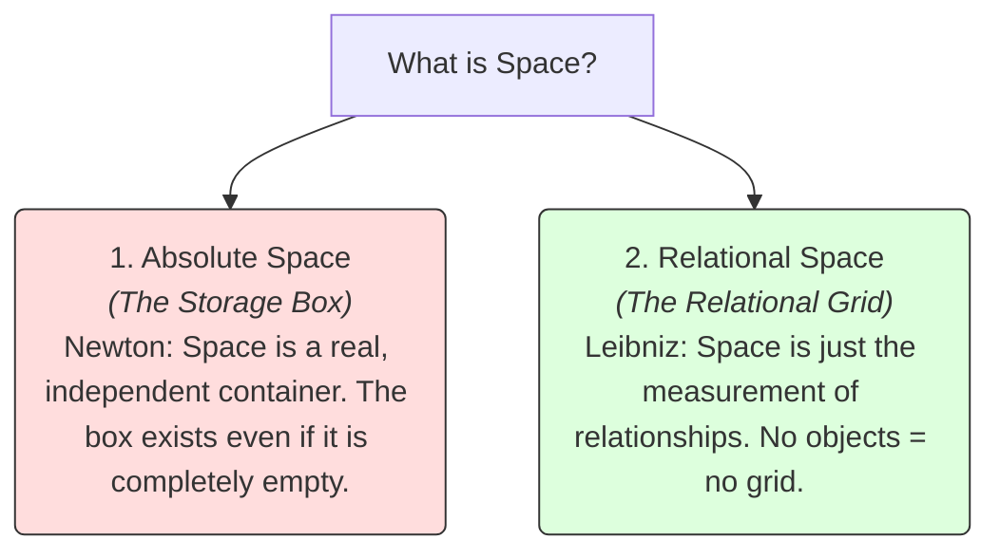

# Space 101: The Container of Reality 🌌

Imagine a completely empty universe. There are no stars, no planets, no atoms, and no light. It is a vast, absolute void. 

Now, ask yourself: **Does "space" still exist?**
*   **Yes:** Space is a physical, three-dimensional container. Even if it is empty, the empty "box" is still there, waiting for someone to put matter inside it.
*   **No:** Space is nothing more than the relationship between physical things. If you have no objects, there is no distance between them, and therefore "space" does not exist at all.

This debate represents one of the deepest questions in metaphysics and physics: *What is the nature of Space?* Is it a real, independent "substance," or is it just a language tool we use to measure the distance between objects?

---

## The Metaphor of the Storage Box vs. the Relational Grid 📦

To understand how philosophers view space, let's compare two different metaphors:



### 1. The Storage Box (Newton's Absolute Space)
*   **The Idea:** Space is like a physical cardboard storage box. If you put toys inside, they take up space in the box. If you empty the toys, the box is still sitting in your attic. 
*   **Sir Isaac Newton** (1642–1727) argued for this view. He believed space was absolute, infinite, and existed independently of whatever matter was placed inside it. It acted as God's "sensorium"—the frame of reference for the universe.

### 2. The Relational Grid (Leibniz's Relationalism)
*   **The Idea:** Space is like family relationships. If you have a father, a mother, and a child, you have relationships between them. If those three people disappear, the "relationship" doesn't keep floating in the air. 
*   **Gottfried Wilhelm Leibniz** (1646–1716) argued for this view. He believed that space is not a real thing. It is just a conceptual grid we use to describe the order of co-existing objects. If you remove all matter, space ceases to be.

---

## Einstein's Revolution: Space as a Fabric 🌐

For centuries, Newton's absolute container view dominated physics. But in 1915, Albert Einstein changed everything with his **Theory of General Relativity**. 

Einstein showed that space and time are not separate, static backdrops. They are woven together into a four-dimensional fabric called **Spacetime**. 

Furthermore, this fabric is not rigid; it is **bendy**:
*   Imagine a stretched rubber sheet. If you place a heavy bowling ball (The Sun) in the center, the sheet curves downward.
*   If you roll a small marble (The Earth) onto the sheet, it curves around the bowling ball because of the dip.
*   **Gravity is not an invisible force pull; it is the curvature of spacetime fabric.**

```
          [ Mass (The Sun) ] ───► Bends ───► [ Spacetime Fabric ]
                                                    │
                                                    ▼
                                         [ Curves Path of Earth ] 
                                             (Gravity Effect)
```

Einstein's discovery merged both historical views: space is a real "something" that can bend, stretch, and ripple (like Newton's absolute structure), but it only exists and behaves in relationship to the mass and energy within it (like Leibniz's relationalism).

---

## Why Space Matters

1.  **Exploring the Universe:** Rocket science, satellite GPS systems, and deep-space telescopes rely on general relativity. GPS satellites must adjust their clocks because gravity bends spacetime differently in orbit than on Earth.
2.  **Quantum Mechanics:** At the subatomic level, particles can experience "quantum entanglement," where two particles interact instantaneously across light-years of space, appearing to violate the speed of light. This forces physicists to ask if space is a mental construct or if there is a deeper, non-local reality underneath.
3.  **Metaphysics of Time:** As explored in [Metaphysics 101](Metaphysics101.md), space and time are linked. How we view space decides whether we believe the future and past are physically real locations in the block universe.

---

## Ready to Explore More?

*   **Deepen the Physics:** Research Albert Einstein’s *General Relativity* and how it changed our understanding of gravity.
*   **Stanford Encyclopedia of Philosophy:** Explore peer-reviewed academic articles on [Absolute vs. Relational Space-Time](https://plato.stanford.edu/entries/spacetime-theories/).
*   **Watch the Visuals:** Search for videos explaining [How Gravity Works as Bent Spacetime](https://www.youtube.com/results?search_query=gravity+as+bent+spacetime) on YouTube to see the rubber sheet metaphor in action.
