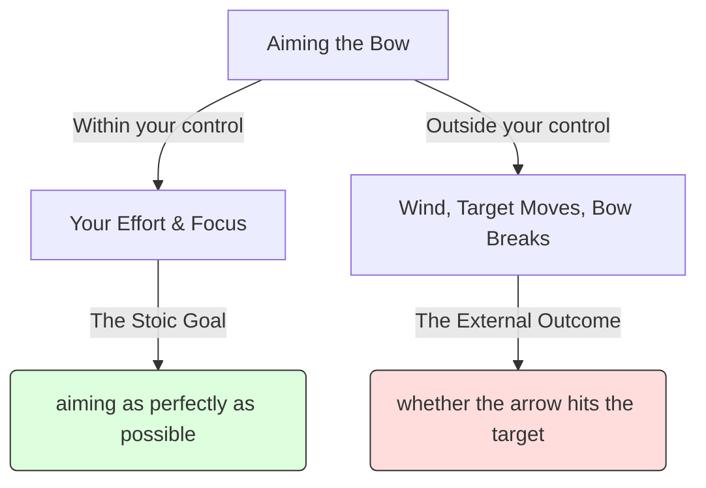
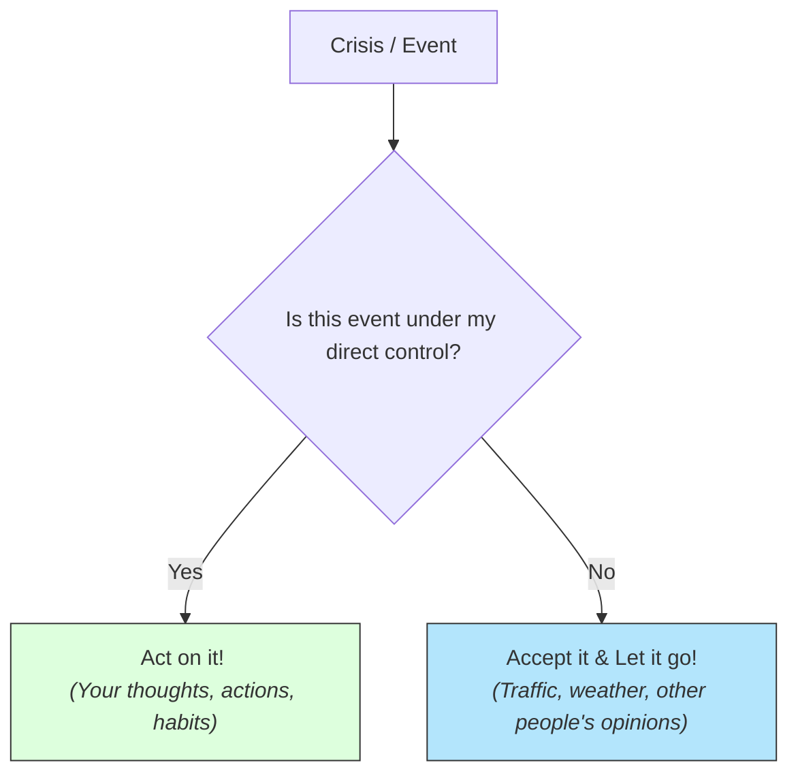

# Stoicism 101: Taming Chaos and Finding Peace 🏹

Imagine you are driving to an incredibly important job interview. You prepared for weeks. Ten minutes from the office, the highway grinds to a halt. A major accident has blocked all lanes. You are stuck in a massive, miles-long traffic jam. 

You look at the clock. You are definitely going to be late. 

How do you react?
*   **Reaction A:** You scream, slam your hands on the steering wheel, honk your horn, and feel your heart rate spike. You ruin your day and arrive at the interview (if you make it) sweating, angry, and flustered.
*   **Reaction B:** You take a deep breath. You realize you cannot fly over the cars. You call the office to explain, put on a podcast, and accept the situation. You arrive late, but calm, collected, and ready.

In both scenarios, the traffic jam is identical. The only thing that changed was your **reaction**. 

This is the central insight of **Stoicism**. Stoicism is an ancient Greek and Roman philosophy (founded in Athens by Zeno of Citium around 300 BC) that teaches us how to remain calm, resilient, and virtuous in the face of life's unpredictable storms.

---

## The Metaphor of the Archer 🏹

To explain how a Stoic approaches goals, the writer Cicero used the metaphor of the **Archer**:

An archer does everything in their power to hit the target: they select the best bow, polish their arrows, calculate the distance, aim carefully, and release the string (Effort). 

But once the arrow leaves the bow, the archer's control drops to **zero**. A sudden gust of wind can blow the arrow offline. The target (e.g., a deer) can step aside. 

A Stoic archer understands that **success lies in aiming as perfectly as possible (your effort), not in whether the arrow actually hits the target (the outcome).** By placing your happiness in your own effort, you become immune to bad luck.

---

## The Dichotomy of Control: The Stoic filter

The Roman philosopher **Epictetus** (who was born a slave and became a famous teacher) summarized the heart of Stoicism in the **Dichotomy of Control**:

> *"Some things are in our control and others not. Things in our control are opinion, pursuit, desire, aversion, and, in a word, whatever are our own actions. Things not in our control are body, property, reputation, command, and, in one word, whatever are not our own actions."*

When faced with a crisis, pass it through this decision tree:

If it is outside your control (like the weather, the economy, or what other people say about you), a Stoic says: *"It is nothing to me."* You cannot change it, so spending energy worrying about it is irrational.

---

## The Big Three Roman Stoics

We know Stoicism today primarily through the writings of three very different men in ancient Rome:

1.  **Epictetus (The Slave):** Taught that freedom is a state of mind. A king can chain your body, but they cannot force you to change your beliefs or your integrity.
2.  **Marcus Aurelius (The Emperor):** The ruler of the entire Roman Empire. He wrote his private journal, *Meditations*, to remind himself to remain humble, kind, and dutiful despite holding absolute power.
3.  **Seneca (The Wealthy Statesman):** A brilliant writer and advisor to the emperor Nero. He wrote letters offering practical advice on dealing with grief, anger, and wealth.

---

## Why Stoicism Matters Today

1.  **Resilience in Crises:** When facing job loss, illness, or breakups, Stoicism teaches us to ask: *What can I control in this moment?* (You can control how you react, your next step, and your attitude).
2.  **Cognitive Behavioral Therapy (CBT):** CBT is built on Stoic principles. The founder of CBT, Aaron Beck, cited Epictetus' famous quote: **"People are disturbed not by things, but by the view they take of them."** By changing our cognitive interpretations, we can reduce anxiety and depression.
3.  **Leadership & Focus:** Elite athletes, Navy SEALs, and tech founders read Stoicism because it trains them to ignore criticism, focus entirely on execution, and remain calm under high-pressure scenarios.

---

## Ready to Explore More?

*   **Read the Meditations:** Look up Marcus Aurelius' *Meditations* (specifically Book 2) to see how an emperor coached himself through daily frustrations.
*   **Stanford Encyclopedia of Philosophy:** Explore peer-reviewed academic articles on [Stoicism](https://plato.stanford.edu/entries/stoicism/).
*   **Watch the Summaries:** Search for YouTube channels like [Daily Stoic](https://www.youtube.com/results?search_query=daily+stoic) or [Philosophy Tube: Stoicism](https://www.youtube.com/results?search_query=philosophy+tube+stoicism) for modern applications of the philosophy.
