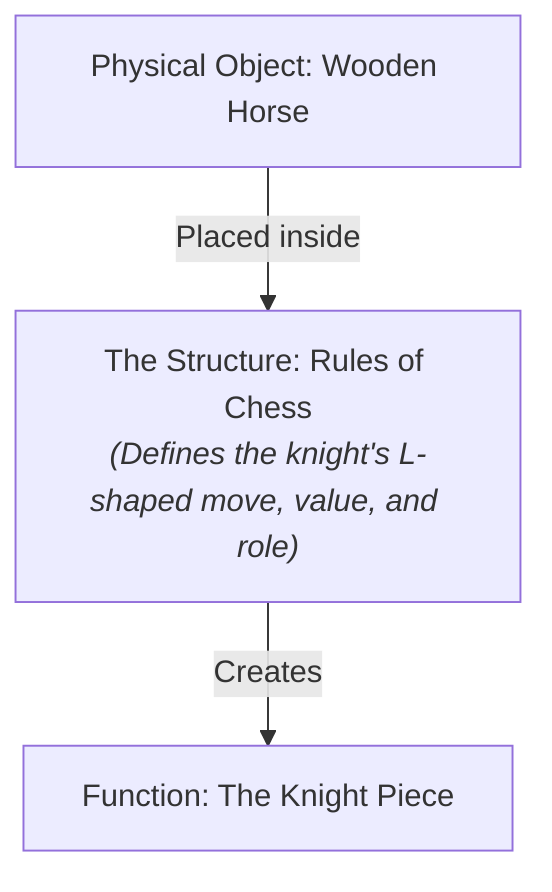
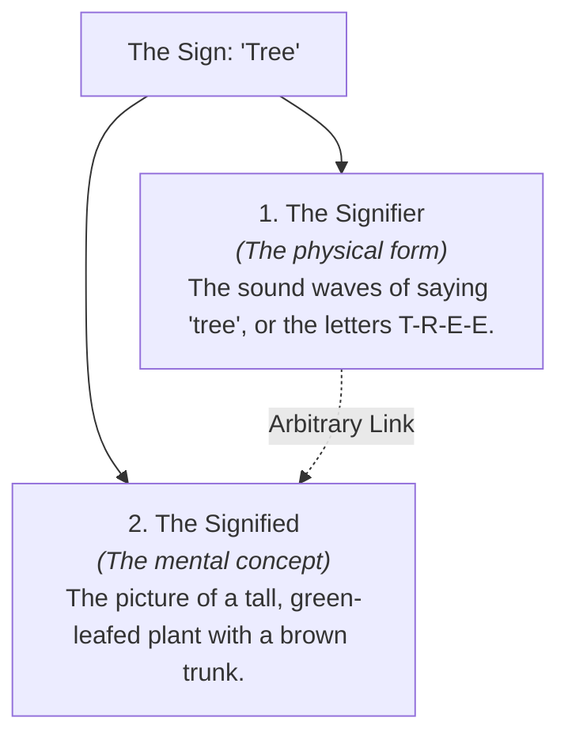

# Structuralism 101: The Hidden Grid of Culture 🕸️

Imagine driving down a road and seeing a red, octagonal metal sign with the letters "S-T-O-P" printed in white. You immediately press your foot on the brake. 

Why did you stop?
*   Does the metal itself have a physical force field that stops your car? No.
*   Does the color red have a biological gravity that pulls your foot down? No.

You stopped because you understand the **Sign**. The sign has power only because it is part of a massive, shared **system of traffic rules, symbols, and language** that we all agreed to obey. A single stop sign sitting in the middle of a forest is just a useless piece of scrap metal; it only makes sense when placed inside the grid of a transportation system.

How do human societies build meaning? 

This is the central question of **Structuralism**. Structuralism is a 20th-century theoretical framework that argues that individual elements of human culture (like words, myths, fashion, or behavior) cannot be understood in isolation. Instead, they must be analyzed in relation to the larger, overarching **structures** or systems that contain them.

---

## The Metaphor of the Rules of Chess ♟️

To understand structuralism, let's look at the game of **chess**:

Imagine holding a small, carved wooden piece shaped like a horse. On its own, it is just a piece of wood. It has no power, no goals, and no identity. 

But when you place it onto a checkered board and apply **the rules of chess**:
*   The piece becomes a **Knight**.
*   It gains the power to move in an L-shape.
*   It gains a specific value (roughly 3 pawns).
*   Its role is defined by its relationship to the King, Queen, and Pawns.

A structuralist argues that **human beings, words, and cultures are like the chess pieces.** We do not have "meaning" on our own; we are shaped, defined, and controlled by the invisible rules and structures of language, society, and culture we are born into.

---

## Ferdinand de Saussure and the Anatomy of the Sign

The roots of structuralism lie in linguistics, started by Swiss thinker **Ferdinand de Saussure** (1857–1913). He showed that language is a system of signs. 

A **Sign** is made of two inseparable parts:

1.  **The Signifier (The Sound/Symbol):** The physical letters ("T-R-E-E") or the sound wave created by your throat when you speak the word.
2.  **The Signified (The Mental Image):** The concept of a tall plant with leaves and a brown trunk that appears in your mind.

Saussure made a key observation: **The link between the signifier and the signified is arbitrary.** There is no natural reason why the letters T-R-E-E should represent a plant. In Spanish, it is *árbol*; in French, it is *arbre*. Words only have meaning because they differ from other words in the system (e.g., "tree" is not "free," "three," or "shrub"). Meaning is created by **differences** within the structure.

---

## Claude Lévi-Strauss and Cultural Structures

In the mid-20th century, anthropologist **Claude Lévi-Strauss** took Saussure's linguistics and applied them to human culture. 
*   **Analyzing Myths:** He collected hundreds of myths from different indigenous tribes around the world. Instead of looking at the specific characters, he looked at the **structure of relationships** in the stories (e.g., raw vs. cooked, nature vs. culture, sky vs. earth). 
*   He discovered that while the names of the gods changed, the underlying structural relationships were identical across civilizations. He concluded that the human mind has a universal, biological structure that organizes reality using binary oppositions.

---

## Why Structuralism Matters

1.  **Spotting Social Codes:** Structuralism helps us audit media and fashion. A business suit, a pair of ripped jeans, or a specific brand logo are signs. We wear them to project messages inside the "fashion game" of our culture.
2.  **Understanding Language:** It shows how language shapes our reality. If a culture doesn't have a word for a specific emotion or color, their members might experience or process it differently because their structural grid lacks that category.
3.  **The Foundation of Post-Structuralism:** Structuralism was so powerful that it sparked a counter-movement: **Post-Structuralism** (featuring thinkers like Derrida and Foucault, who argued that social structures are not fixed or natural; they are constructed by power and can be deconstructed).

---

## Ready to Explore More?

*   **Deepen the Language:** Read [Philosophy of Language 101](PhilosophyOfLanguage101.md) to see how words and signs construct meaning.
*   **Stanford Encyclopedia of Philosophy:** Explore peer-reviewed academic articles on [Structuralism](https://plato.stanford.edu/entries/structuralism-linguistics/) and [Ferdinand de Saussure](https://plato.stanford.edu/entries/semiotics/).
*   **Watch the Anthropology:** Search for YouTube lectures explaining [Claude Lévi-Strauss and Structural Anthropology](https://www.youtube.com/results?search_query=claude+levi+strauss+structuralism) to see how culture maps out.
