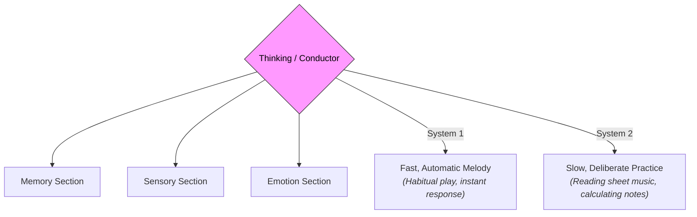

# Thinking 101: The Mechanics of the Mind 🎼

Think about what you did in the last hour. Perhaps you woke up, checked your phone, brewed a cup of coffee, and walked to your desk. 

While doing this, a continuous stream of words, images, memories, and calculations ran through your head: *What should I wear? Did I reply to that email? That coffee smells good. I need to focus on this task.*

This internal flow is what we call **Thinking**. 

But what is a "thought" actually made of? How does the brain select, coordinate, and experience a stream of consciousness instead of a chaotic storm of random signals?

In cognitive philosophy, **Thinking** is the mental process of manipulating information, building concepts, solving problems, making decisions, and reflecting on ideas.

---

## The Metaphor of the Orchestra Conductor 🎼

To understand how thinking works, think of your brain as a massive **symphony orchestra**:

*   **The Instruments:** Your memories (strings), your senses (brass), your emotions (percussion), and your logical reasoning (woodwinds). They are all playing notes at the same time.
*   **The Conductor (Thinking):** Without a conductor, the orchestra produces random, deafening noise (anxiety, chaos, distraction). Thinking is the conductor who directs the spotlight of attention, telling the memory section to play louder, the emotion section to quiet down, and coordinating all the elements into a single, beautiful melody (a coherent thought stream).

---

## System 1 vs. System 2 Thinking: The Fast and the Slow

In modern psychology, Nobel laureate **Daniel Kahneman** showed that our "conductor" has two completely different modes of operating:

| Feature | System 1 (Fast Thinking) | System 2 (Slow Thinking) |
| :--- | :--- | :--- |
| **Speed** | Instant, automatic, unconscious. | Slow, deliberate, conscious. |
| **Effort** | Low effort, runs on autopilot. | High effort, requires focus and energy. |
| **Role** | Handles habits and survival reactions. | Handles calculations, logic, and choice. |
| **Example** | *Reading a sign, dodging a falling cup, calculating $2+2$.* | *Calculating $17 \times 24$, filling out taxes, checking alibis.* |

We use **System 1** for 95% of our daily life because it saves energy. However, System 1 is prone to shortcuts and errors (cognitive biases). To think clearly, we must consciously activate **System 2** to check our intuition when making major decisions.

---

## Metacognition: Thinking About Thinking

The most unique human capacity is **Metacognition**—the ability to look down from the balcony at your own conductor and evaluate how they are directing the music.

*   *Normal Thought:* *"I am terrified of failing this test."*
*   *Metacognitive Thought:* *"Why am I feeling anxious? Ah, it is because I haven't studied the third chapter. If I make a study schedule, I can reduce this fear."*

Metacognition allows us to audit our own cognitive biases, correct our errors, and change our learning habits. It is the tool that turns raw thoughts into **wisdom**.

---

## Why Thinking Matters

1.  **Effective Learning:** By studying metacognition, you can identify how you learn best (e.g., active recall vs. passive reading) rather than studying on autopilot.
2.  **Emotional Regulation:** When you experience anger or fear, metacognition lets you step back and say: *"This is a System 1 emotional reaction. I will wait five minutes before reacting so my System 2 reason can take over."*
3.  **Human vs. AI:** While AI can process data at lightning speeds, it lacks metacognition. It cannot reflect on its own thoughts or ask *why* it reached a conclusion; it just runs the algorithm.

---

## Ready to Explore More?

*   **Read the Book:** Read Daniel Kahneman’s book *Thinking, Fast and Slow* to explore System 1 and System 2 in depth.
*   **Stanford Encyclopedia of Philosophy:** Explore peer-reviewed academic articles on [Cognitive Science](https://plato.stanford.edu/entries/cognitive-science/) and [The Mind](https://plato.stanford.edu/entries/mind-identity/).
*   **Watch the Lectures:** Search for YouTube videos explaining [Metacognition and Learning Strategies](https://www.youtube.com/results?search_query=metacognition+learning+strategies) to improve your study habits.
