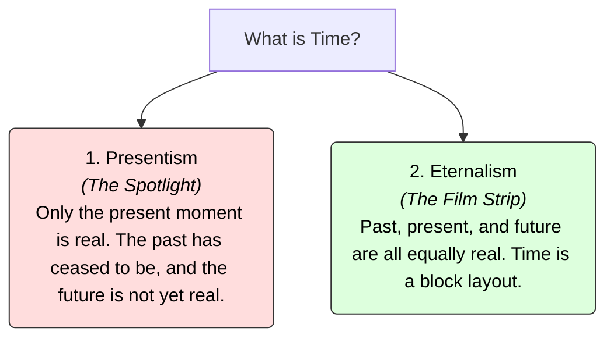

# Time 101: The Flow of Existence ⏳

Look at the ticking second hand of a watch. 

With every tick:
*   The future becomes the present.
*   The present immediately slides into the past.

We feel like we are riding on a surfboard along the crest of a wave called "The Now." But look closer at this flow:
*   Does **yesterday** still exist physically somewhere? Or did it vanish completely the second it passed?
*   Does **tomorrow** already exist, waiting for us to arrive? Or is it an unwritten, non-existent blank?

What is **Time**? Is it a real, flowing river that carries us along, or is it a mental construction we use to organize change?

---

## The Metaphor of the Spotlight vs. the Film Strip 📽️

To understand the metaphysics of time, philosophers compare two radically different models:

### 1. The Spotlight (Presentism / A-Theory)
*   **The Idea:** Imagine walking down a completely dark street at night, holding a flashlight. Only the circle of ground lit by the flashlight (The Present) exists. The dark road behind you (The Past) has vanished, and the dark road ahead (The Future) is not yet real. 
*   **Core Belief:** Only the present moment (*now*) has existence. 

### 2. The Film Strip (Eternalism / B-Theory)
*   **The Idea:** Imagine a physical reel of movie film. If you look at the strip, you see the frame of the movie at minute 5, minute 30, and the final frame at minute 90. All frames exist simultaneously on the plastic strip. The characters in the movie feel like time is passing as the projector runs, but the entire movie is already printed.
*   **Core Belief:** Past, present, and future are all equally real. Time is a four-dimensional block (The Block Universe). Julius Caesar, you reading this text, and humans living on Mars in 3000 are all equally real, just located in different slices of the block.

---

## Einstein and the Death of "Now"

For centuries, Presentism felt like obvious common sense. But in 1905, Albert Einstein destroyed the concept of a universal "Now" with his **Theory of Special Relativity**.

Einstein discovered that **time is relative, not absolute.** How fast time passes depends on how fast you are moving (velocity) and how close you are to a heavy mass (gravity). This is called **Time Dilation**:
*   If you step onto a spaceship and travel near the speed of light for what feels like 1 year to you, when you return to Earth, 10 years will have passed for your friends. Your "present" and their "present" are completely out of sync.

Because there is no single, universal clock ticking for the entire universe, **there is no objective, universal "Now."** 

If two events happen "at the same time" for you, they can happen at different times for someone moving at a different speed. This discovery forced most physicists and philosophers to accept **Eternalism** (the B-Theory). Einstein himself wrote in a letter of condolence: *"For us believing physicists, the distinction between past, present, and future is only a stubbornly persistent illusion."*

---

## Why Time Matters

1.  **Grief and Loss:** Under Eternalism, a person who has died has not "ceased to exist" in the universe. They still exist, permanently and really, in the slices of spacetime that constitute their life. They are just no longer located in the slice we call the present.
2.  **Free Will:** If Eternalism is true, the future is already printed on the film strip. Does this mean our future choices are pre-determined, or is the film strip just the recording of the free choices we will make? (Bridges with [Determinism 101](Determinism101.md)).
3.  **Time Travel:** Presentism makes time travel logically impossible (you cannot travel to the past if the past doesn't exist). Under Eternalism, time travel is theoretically possible because the past and future are real physical destinations.

---

## Ready to Explore More?

*   **Deepen the Physics:** Research Albert Einstein's *Special Relativity* and the *Twin Paradox* to see time dilation calculations.
*   **Stanford Encyclopedia of Philosophy:** Explore peer-reviewed academic articles on [Time](https://plato.stanford.edu/entries/time/) and [Being and Time](https://plato.stanford.edu/entries/heidegger/#BeiTim).
*   **Watch the Visual Explanations:** Search for videos explaining [The Block Universe Theory of Time](https://www.youtube.com/results?search_query=block+universe+theory+of+time) on YouTube to see the film strip analogy in motion.
