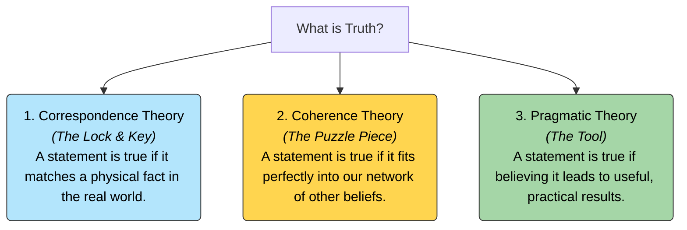

# Truth 101: What Makes a Statement Real? 🗝️

You write on a piece of paper: *"The cat is sitting on the rug."*

What makes this statement **true**? 
*   Is it because you can look down, see a physical cat sitting on a rug, and verify that the words match reality?
*   Is it because the statement fits perfectly with everything else you know (e.g., you own a cat, you have a rug, and cats like soft surfaces)?
*   Is it because believing the cat is on the rug helps you walk across the room without tripping over it?

We all search for truth in our daily lives, news, and science. But what does "truth" actually mean? 

In philosophy, the study of **Truth** is the investigation of what makes a belief, statement, or proposition correct or real. Philosophers have proposed three major theories to define it.

---

## Three Theories of Truth: Lock, Puzzle, and Tool 🗝️

To understand how philosophers define truth, let's look at three different metaphors:

### 1. The Correspondence Theory (The Lock and Key)
*   **The Idea:** A statement is true if it matches (corresponds to) an objective fact in the physical world. The statement is the key, and the physical fact is the lock. If they line up, the door opens.
*   **Example:** *"Snow is white"* is true if and only if snow is actually physically white.
*   **Weakness:** How do we verify the facts without using our senses, which can be fooled? (We are always testing our *perceptions*, not the raw world itself).

### 2. The Coherence Theory (The Puzzle Piece)
*   **The Idea:** A statement is true if it fits together with our entire network of pre-existing beliefs, like a puzzle piece fitting into a jigsaw puzzle. Truth is about internal consistency.
*   **Example:** If someone tells you, *"I saw a dragon flying over the supermarket,"* you reject it as false. Why? Not because you searched the whole sky, but because a flying dragon contradicts everything you know about biology, physics, and history. It doesn't fit the puzzle.
*   **Weakness:** A complex fairy tale or conspiracy theory can be 100% internally consistent (the puzzle pieces fit together perfectly), but still be completely false in reality.

### 3. The Pragmatic Theory (The Tool)
*   **The Idea:** As explored in [Pragmatism 101](Pragmatism101.md), an idea or statement is true if it acts as a useful tool for action, helping us solve problems and adapt to life. 
*   **Example:** A map is "true" if it successfully guides you across the city.
*   **Weakness:** A belief can be highly useful but factually incorrect. (e.g., believing you are invincible might help you win a battle, but it doesn't make you physically bulletproof).

---

## Why Truth Matters

1.  **Spotting Falsehoods:** In the internet age, fake news websites often build highly coherent stories (Coherence Theory) that have no connection to objective facts (Correspondence Theory). Understanding the difference helps us audit information.
2.  **Scientific Progress:** Science uses all three theories. A new theory must match observations (Correspondence), fit with the laws of physics (Coherence), and help us calculate results and build technology (Pragmatic).
3.  **Human Trust:** Society is built on truth. Contracts, banking, and conversations require us to assume that people are stating facts that correspond to reality. When trust in truth collapses, social cohesion breaks down.

---

## Ready to Explore More?

*   **Deepen the Pragmatic View:** Read [Pragmatism 101](Pragmatism101.md) to explore the work of William James and John Dewey.
*   **Stanford Encyclopedia of Philosophy:** Explore peer-reviewed academic articles on the [Correspondence Theory](https://plato.stanford.edu/entries/truth-correspondence/) and the [Coherence Theory](https://plato.stanford.edu/entries/truth-coherence/) of truth.
*   **Watch the Summaries:** Search for YouTube lectures explaining [The Three Major Theories of Truth](https://www.youtube.com/results?search_query=three+theories+of+truth+philosophy) to see various debates.
