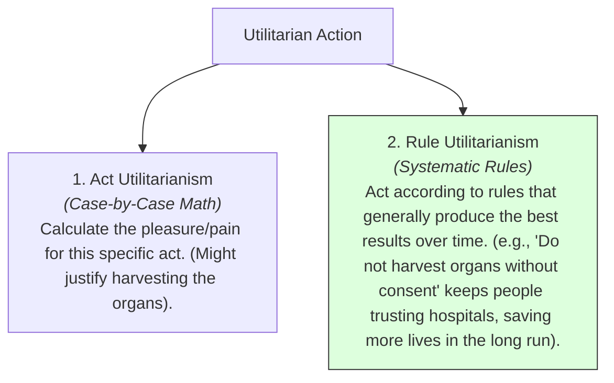

# Utilitarianism 101: The Math of Morality 🧮

Imagine a runaway train trolley hurtling down a track. Ahead, five workers are tied to the tracks. You are standing next to a lever. If you pull it, you can divert the trolley onto a side track where only one worker is tied down. 

Do you pull the lever? 
*   **If you pull the lever:** One person dies, but five lives are saved (Net gain: 4 lives).
*   **If you do nothing:** Five people die, but you did not actively choose to kill anyone.

For a **Utilitarian**, the decision is simple: you pull the lever. Minimizing deaths and maximizing survival is the only moral choice. In their view, **the end justifies the means**.

But what if a healthy patient walks into a hospital for a checkup, and a doctor realizes they can harvest their organs to save five dying patients? 

A strict calculation says: kill the one, save the five. Yet, our moral instincts recoil in horror. Why?

This tension is the focus of **Utilitarianism**. Utilitarianism is a consequentialist ethical theory (developed by Jeremy Bentham and John Stuart Mill in the 1800s) which argues that the morally correct action is the one that produces the **greatest happiness for the greatest number of people**.

---

## The Metaphor of the Moral Calculator 🧮

To understand utilitarianism, think of a moral agent not as a judge following laws, but as a **mathematician with a calculator**:

```
        ┌────────────────────────────────────────────────────────┐
        │                 THE MORAL CALCULATION                  │
        │                                                        │
        │        [ TOTAL HAPPINESS CREATED BY ACTION ]           │
        │        - Sensation of pleasure, health, freedom        │
        │                          MINUS                         │
        │        [ TOTAL PAIN / SUFFERING CREATED ]              │
        │        - Sensation of pain, death, restriction         │
        │                          EQUALS                        │
        │                 [ NET ETHICAL UTILITY ]                │
        └───────────────────────────▲────────────────────────────┘
                                    │
                            [ The Decision ]
                                    │
        ┌───────────────────────────▼────────────────────────────┘
        │   Action with the highest score is the RIGHT choice!  │
        └────────────────────────────────────────────────────────┘
```

Jeremy Bentham proposed a formal formula for this, called the **Hedonic Calculus**. When deciding what to do, you measure:
1.  **Intensity:** How strong is the pleasure or pain?
2.  **Duration:** How long will it last?
3.  **Certainty:** How likely is it to happen?
4.  **Propinquity:** How soon will it occur?
5.  **Fecundity:** Will it lead to further pleasures?
6.  **Purity:** Will it remain free from pain?
7.  **Extent:** How many people are affected?

If Action A scores +100 utility points and Action B scores +50, Action A is the objectively correct moral choice.

---

## Act vs. Rule Utilitarianism

To solve the organ-harvesting hospital problem, John Stuart Mill and later philosophers split the theory into two branches:



*   **Act Utilitarianism:** Apply the hedonic calculus to each individual case. (e.g., *"Will stealing this bread save a life right now?"*).
*   **Rule Utilitarianism:** Establish general rules that produce the best outcomes *if everyone follows them* (e.g., *"Do not steal,"* or *"Do not harvest organs without consent"*). Even if breaking the rule has a positive short-term result in one case, we keep the rule because a society with rules of trust has a much higher total utility in the long run.

---

## Why Utilitarianism Matters Today

1.  **Public Policy & Budgeting:** Governments are naturally utilitarian. When a health department decides how to spend a $10 million budget, they look for the treatments that save the most life-years (DALYs) per dollar. They cannot save everyone, so they maximize utility.
2.  **Self-Driving Car Algorithms:** Software engineers programming autonomous vehicles must code decisions for crash scenarios. They must use utilitarian rules: if a crash is inevitable, the car should choose the path that minimizes total casualties.
3.  **Animal Rights:** Jeremy Bentham was one of the first Western philosophers to argue for animal rights. He wrote: **"The question is not, Can they reason? nor, Can they talk? but, Can they suffer?"** If animals can feel pain, their suffering must be included in our moral calculators.

---

## Ready to Explore More?

*   **Compare the Systems:** Read [Ethics 101](Ethics101.md) to compare utilitarianism with Deontology (Kant's duty ethics) and Virtue Ethics.
*   **Stanford Encyclopedia of Philosophy:** Explore peer-reviewed academic articles on [Utilitarianism](https://plato.stanford.edu/entries/utilitarianism-history/) and [Consequentialism](https://plato.stanford.edu/entries/consequentialism/).
*   **Watch the Lectures:** Search for videos explaining John Stuart Mill's book *Utilitarianism* to see how he distinguished between "higher" pleasures (intellectual) and "lower" pleasures (sensory).
